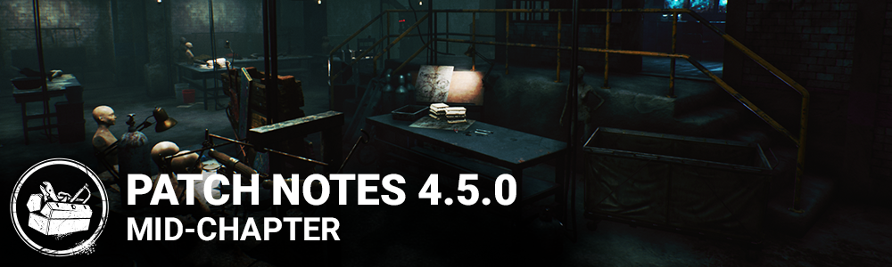

# 4.5.0 | PTB

## Features & Content

**New HUD Layout - Several HUD elements have been moved or updated.**

- The player status widget (player names, health states etc.) has been redesigned. Along with a number of graphical improvements to animations, the player status widget is now positioned on the left side of the screen. While this change was not made lightly, it was necessary in order to make the player names readable across all platforms and resolutions as well as make room for new HUD elements like the Hook Count.
- The objectives have been moved to the top center of the screen to give us more room to display detailed instructions.
- Score events and status effect alerts have been moved to the right side of the screen. This was primarily to bring the status effect alerts closer to the status effect indicators they reference.
- The number of visible score events has been increased when multiple events are triggered at the same time.

**New HUD Element - Hook Counts**

- Killers see a new widget which displays how many hooks they've earned during the match out of the possible total hooks. This is only visible to the Killer.
- Survivors see a new set of markers above each of the Survivor player's names. This lets the Survivor players know how many times each Survivor has been hooked. This is only visible to the Survivors.

**New HUD Element - Survivor Portraits**

- The healthy and injured health state icons have been replaced with each character's portrait.

**UI Scale Sliders**

- The Settings menu has been updated with two new slider settings that allow players to adjust the size of their UI. Players may adjust the size of the menus and HUD separately.

**New Survivor Locomotion Animations**

- Changed the pose for all survivor locomotion animations.
- Added Start/Stop transition animations and quick turn animations.
- Added ability to use Flashlight while crouching.
- Changed Crawling turn speed and added animation feedback for recovering.

**Visual Update:**

- Visual updates to maps in Gideon Meat Plant and Asylum.
- Removed walls from the top floor middle section of the Gideon Meat Plant to increase visibility in the map.
- Updated model, textures and VFX on 4 Nurse outfits.
- Update model and texture on the Clown base outfit.

## Balance

**Clown Gameplay Update**

**Power:**

- Clown now has two types of bottles: Tonic and Antidote.
- Tap Secondary Power to switch which will be thrown
- Hold Secondary Power to reload bottles
- Reload time is now 3 seconds (down from 5 seconds)

**Antidote bottles:**

- Release a gray cloud that activates and turns yellow after 2.5 seconds
- Antidote clouds last a total of 7.5 seconds and are smaller than Tonic clouds
- Overlapping Antidote and Tonic clouds causes both to disappear
- Survivors and The Clown gain the "Invigorated" status effect when they touch the Antidote cloud
- Invigorated grants 10% movement speed bonus for 5 seconds
- An Intoxicated Survivor touching a yellow Antidote cloud is no longer intoxicated
- Tonic clouds remain unchanged

**Addons:**

- Party Bottle: Thrown bottles emit confetti when shattering (was Ether 5 Vol%)
- Fingerless Parade Gloves: Bottles are thrown with a different arc that doesn't go as high but goes further
- Smelly Inner Soles: Greater move speed bonus when reloading (was Common, now Rare)
- Solvent Jug: Moderately increases the Invigorated effect duration
- Thick Cork Stopper: Smaller reload time reduction
- Spirit of Hartshorn: Moderately expands The Antidote cloud area (was Ether 10 Vol%)
- VHS Porn: Swaps yellow and purple color of Antidote and Tonic effects (was Rare, now is Common)
- Cigar Box: When any player becomes Invigorated, they see all other players' auras within a 16m radius
- Garish Makeup Kit: Considerably increases Invigorated Effect duration
- Tattoo's Middle Finger: Auras of Intoxicated or Invigorated survivors are revealed to you for 6 seconds

**The Trapper:**

- Escaping from a Bear Trap now has a 16.6% chance of succeeding on each attempt, but are capped at a maximum of 6 attempts
- Addons that reduce the chance of escape increase the maximum number of attempts as well as reducing the chance per attempt

**The Wraith:**

- While cloaked, the Wraith is completely invisible (no shimmer) to Survivors when more than 24m away
- As the Wraith gets closer, the shimmer increases from 0% at 24m to 100% at 16m

### Perks

**Hex: Undying:**

- While Hex: Undying is active, Survivors within 2/3/4 meters of any Dull Totem have their Aura revealed.
- When another Hex Totem is cleansed, that Totem's Hex transfers to the Hex: Undying Totem, deactivating Hex: Undying. Any tokens the transferred Hex had are transferred as well

**Fixated:** Now works while injured

**Iron Maiden:** Effect lasts 30 seconds

**Second Wind:** Durations now 28/24/20 seconds

**~~Pebble~~ Diversion:**

- Now charges in 40/35/30 seconds
- Distance thrown now 20 meters at all tiers

**Deep Wound:**

- Deep Wound now always has a 20-second timer
- Frank's Mixtape and Stab Wound Study adjusted to have the same proportional impact on Survivors' Deep Wound timers
- Borrowed Time's tier adjustments are now the duration of the Endurance status effect at 10/12/15 seconds

**Miscellaneous:**

- Mangled status effect always lasts until fully healed
- Vigil no longer affects Mangled
- Begrimed Head: Removed repair speed debuff, added Hemorrhage status effect
- Rusty Attachments: Only applies Mangled to injured Survivors
- Prevent Victor from hiding under hooked survivors, which would make other survivors unable to destroy him.

## Bug Fixes

- Add-ons no longer show up on the Perk diamond shape when they are displayed as an external effect on the HUD. (The smaller icons to the left of the equipped perks.)
- Fixed a bug where the map name in the intro sequence could get stuck on screen.
- Fixed an issue where the HUD would sometimes be covered in a large red texture.
- Fixed an issue that may cause survivors to get stuck or launched when dropping a pallet in an area with multiple survivors.
- Fixed an issue that would cause the Deathslinger to move at reduced speed when stunned while shooting.
- Fixed an issue that may cause survivors to become stuck when they drop a pallet on the killer with the Power Struggle perk.
- Fixed an issue that caused survivors to perform a failed skill check animation when starting an interaction with a new object after failing a skill check during their previous interaction.
- Fixed an issue that may cause the Demogorgon to become stuck after using a portal.
- Fixed an issue that may cause survivors to become stuck when stepping on a bear trap at the same time as the Trapper picks it up.
- Fixed an issue that may cause survivors animation to become desynced, behaving as if carried by the killer, after being grabbed by the killer during a vault or from a locker while at the same time as exiting it.
- Fixed an issue that caused the Resurgence achievement not to gain progress when the user is at full health.
- Fixed an issue that caused Victor not to be destroyed when landing on a chest.
- Fixed an issue that caused Victor not to be present on the match result screen when the game finishes when he's being controlled.
- Fixed an issue that caused Victor to use survivor camera sensitivity settings.
- Fixed an issue that caused the camera to move by itself after pouncing on a survivor currently entering the hatch as Victor.
- Fixed an issue that caused Victor to briefly enter his dormant pause after being released.
- Fixed an issue that caused blinding Victor not to grant score events.
- Fixed an issue that Charlotte to not be blindable while waking up.
- Fixed an issue that caused the pounce indicator granted by the Twins' Cat Figurine add-on to be visible at the start of the trial.
- Fixed an issue that caused torment trails created by the Executioner when dropping into restricted zones to have the regular lifetime.
- Fixed an issue that caused the Nurse's Spasmodic Breath addon to last 40 seconds instead of 60.
- Fixed an issue that caused self interactions not to be usable when another interaction is available even when looking away from the interactable object.
- Fixed an issue that made it possible for survivors to be affected by the Mangled and Hemorrhage effects while healthy when combining the Padded Jaws and Serrated Jaws bear trap addons.
- Fixed an issue that caused a small bright red residue to appear on the madness gauge after snapping out of tier 3 madness.
- Fixed an issue that could cause some survivors passively falling asleep to not count towards the "Dream Master" achievement

Windows Store only:

- Fixed an issue when launching the game and navigating directly to Play as Killer/Survivor, the user's currency would display as 0-0-0 instead of the real values.

## Known Issues

- Add-ons displayed as external effects do not properly show the buff/debuff color
- When hitting Meg Thomas in the first step of the Killer Tutorial, the game crashes. If you pick her up and don't slash her, the game does not crash.
