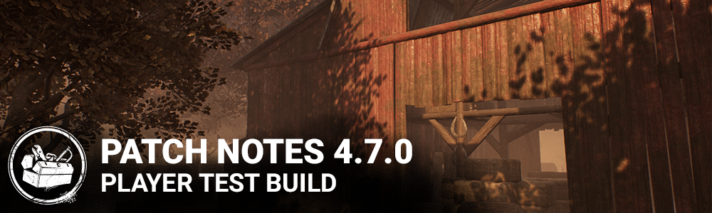

<!-- summary -->
## AI TL;DR

Settings now use ON/OFF steppers and a new analytics tool was added. HUD indicators behind survivor portraits were refreshed for the Doctor, Plague and Nightmare, and Coldwind Farm received a visual update. The Doctor’s VFX were optimized, and the Trickster received faster blade throws, reduced recoil and a clearer laceration meter. Demogorgon’s portal traversal became quicker with longer undetectable time and addon tweaks. Nightmare’s slowdown addons were removed and Dream World sound cues were amplified. The Huntress addon pass was overhauled and Live Design replaced hook struggles with skill checks while adjusting several survivor perks and shortening hatch open time.

Fixed floating cosmetics, escape-key lock, menu positioning and a rare Pyramid Head cage bug; footstep audio may still glitch.
<!-- /summary -->

<!-- nav -->
&larr; [4.6.0 | PTB](277-4-6-0-ptb.md) · [Player Test Build (PTB)](../../index.md#player-test-build-ptb) · [5.0.0 | PTB](285-5-0-0-ptb.md) &rarr;
<!-- /nav -->

# 4.7.0 | PTB

## Features

**Content**

- Settings menu: Replaced all checkboxes with text based steppers (with choices "ON"/"OFF") to be consistent with similar setting interactions.
- Added marketing analytics tool (more information about it [here](https://deadbydaylight.com/en/news/data-tracking))

**HUD** - Visual improvements to Killer Power indicators behind Survivor portraits:

- General: Bottom of these indicators are no longer covered by the Survivor portraits
- The Doctor: Madness levels now have a distinct visual for each level
- The Plague: Improved Sickness meter texture colours for colourblind players
- The Nightmare: Increased brightness of the Dream World indicator
- The Ghostface: Increased contrast on the Stalking meter
- The Coldwind Farm map has received a visual update

**Doctor Update**

- Optimization of the Doctor VFX to improve performance
- Reduce the intensity of the Glitch and madness screen effect

**The Trickster**

- Increased movement speed while in the throw state and while actively throwing Blades
- Decreased the recoil intensity and angle variation while throwing Blades
- Removed the spread while throwing Blades
- Decreased the Blade wind up time
- Increased the Blade wind down time
- Increased the time before the Laceration Meter begins decaying
- Increased Main Event movement speed
- Decreased Showstopper's cooldown after Main Event has ended
- Modified the Trickster's Laceration meter artwork so that it is more clear when the meter is full vs partially full

**The Trickster add-ons**

- Decreased the effects of movement speed addons to account for the baseline movement speed increases in the above section:
- Killing Part Chords from 0.054 m/s to 0.04 m/s
- Caged Heart Shoes from 0.13 m/s to 0.1 m/s
- Iridescent Photocard will now injure survivors at maximum laceration

**The Twins Post-Release Update**

With this update, we've tried to reduce the attractiveness of slugging everyone with Victor. Also, the Ultra Rare addons have been buffed since they were underperforming.

- Charlotte can now rotate while waking up
- Victor's failed Pounce cooldown is 5 seconds (was 3 seconds)
- Silencing Cloth grants Undetectable for 20 seconds (was 12 seconds)
- Iridescent Pendant inflicts Exposed for 30 seconds (was 12 seconds)

**The Demogorgon Gameplay Update**

The focus for the Demogorgon's changes is making portals more useful. A few of the addon adjustments that look like nerfs are needed to keep their level of power even considering the power changes. We will continue to monitor the performance of the addons and continue to adjust them in future patches as needed.

**Power**

- Traverse the Upside Down cooldown: 10 seconds (was 14 seconds)
- Normal Traverse the Upside Down velocity: 20 m/s (was 17 m/s)
- Undetectable lasts 3 seconds after Traversing the Upside Down (was 2 seconds)

**Addons**

- Black Heart: Reduces cooldown time after a successful Shred attack by 20%
- Rat Liver: +5% movement speed while charging Shred (was 9%)
- Rat Tail: +25% action speed while opening a portal (was 50%)
- Rotten Pumpkin: When traversing the Upside Down, the portal you enter is destroyed, bloodpoints earned
- Barb's Glasses: Slightly increases Shred recovery speed when breaking a pallet
- Rotten Green Tripe: Increases Killer movement Speed while traversing the Upside Down by 15% (was 25%)
- Sticky Lining: increases the radius in which Survivors can be detected by Of the Abyss by 2.5m (was 1.5m)
- Brass Case Lighter: Inflicts 60 seconds of Blindness (was 45 seconds)
- Deer Lung: Decreases Upside Down traversal speed by 30% (was 40%), now reduces portal count by 2
- Eleven's Soda: Shows yellow Auras for Generators being repaired while traversing the Upside Down
- Thorny Vines: Seal time +10% (was 14%), detection radius 1m (was 1.5m)
- Lifeguard Whistle: Survivors near activated Portals are indicated by Killer Instinct without having to charge Of the Abyss
- Unknown Egg: Reduces power recovery time after traversing the Upside Down by 1.5 seconds (was 2.5 seconds)
- Leprose Lichen: Survivor auras linger for 3 seconds after emerging from a portal
- Red Moss: When traversing the Upside Down, The Demogorgon emerges from the target portal silently but more slowly; also the subsequent Undetectable status lasts for 3 seconds instead of 2

**The Nightmare Gameplay Update**

The Nightmare has been overperforming for a while, and his game slowdown addons are frustrating to play against. We've made adjustments that should trim a bit off his power level while leaving the core gameplay experience intact. The slowdown addons are gone; we've replaced them with effects on the sounds Survivors make while in the Dream World.

**Power**

- Move speed now adjusted to 4.0 m/s while charging a Dream Snare
- Dream Snare charges reduced to 5 (was 8)
- Drean Pallet charges reduced to 7 (was 10)
- Using a Clock to wake up prevents going to sleep for 30 seconds; this effect includes when getting hit by Freddy
- Added a new Killer Power visual behind the Survivor portraits to indicate the 30 second sleep immunity timer

**Addons**

- Black Box: When a Gate is opened, the Entity blocks it for sleeping Survivors for 10 seconds
- Jump Rope: While Survivors are in the Dream World, the sounds of their grunts of pain are 50% louder
- Outdoor Rope: While Survivors are in the Dream World, the sounds of their generator repairs can be heard from 8 meters further away
- Swing Chains: While Survivors are in the Dream World, the sounds of their footsteps are 50% louder

**The Huntress Addon Pass**

Anna is the penultimate Killer with the wrong number of addons and the wrong rarity distribution of addons, so we've fixed that. Several addons have been altered to give more interesting effects. Last, but not least, her most controversial addon has been adjusted so it no longer allows carrying more than one Hatchet.

- Berus Toxin becomes Yellowed Cloth: +10% Hatchet flight speed
- Coarse Stone: The grunts of pain from hit targets are increased by 50% until they are fully healed
- Amanita Toxin: Hit target suffers from the Blindness status effect for 60 seconds (was 30 seconds)
- Leather Loop: Now Rare
- Deerskin Gloves: Now Rare
- Fine Stone becomes Weighted Head: Hit target suffers from the Incapacitated status effect for 10 seconds
- Yew Seed Brew is now Wooden Fox: Now Very Rare; grants the Undetectable status effect for 10 seconds after reloading
- Yew Seed Concoction is now Rose Root: +20% Hatchet flight speed
- Pungent Fiale is now Soldier's Puttee: Now Ultra Rare; The Huntress moves 4.6 m/s when she has no Hatchets
- Venomous Concoction: Inflicts Exhausted status for 5 seconds (was 90 seconds)
- Iridescent Head: Prevents carrying more than one Hatchet

**Live Design**

The most significant Live Design change in this update is the change to Survivor's Hook Struggle inputs. One of the motivating factors behind this update is to reduce the number of inputs per second in order to make the game more accessible to RSI sufferers. After the release of this mechanic for The Executioner's Cages and its positive reception by the community, we felt confident of making this change more broadly for all Sacrifice struggles.

We hope Solo Survivors will enjoy Small Game's new Totem-counting function, and Borrowed Time no longer triggers based on Terror Radius... it just *works*.

- Struggling during the second stage on a Hook is now a series of Skill Checks
- Failing to give any input for two successive Skill Checks will instantly complete the Sacrifice
- Missing a skill check will reduce the amount of time until the Entity claims the hooked Survivor
- Repairing while using a toolbox now increases the odds of getting Skill Checks by 5x (was 2x)
- When the Hatch is opened by a Key, it remains open for 10 seconds (was 30 seconds)
- Small Game: Gain tokens for each Totem any Survivor cleanses; tokens reduce cone size; no longer triggers for the Totem you are currently cleansing
- Lucky Break: Now hides scratch marks as well; duration reduced to 70/80/90 seconds
- Soul Guard: Now has a 30 second cooldown between activations
- Open-Handed: Increases aura reading range by 8/12/16 meters; Survivors may only be affected by one instance of Open-Handed
- Zanshin Tactics: Now always active and range increased to 24/28/32 meters
- Borrowed Time: No longer requires being in the Terror Radius to trigger; duration of Enduring status reduced to 8/10/12 seconds
- Object of Obsession: This perk has been redesigned.

Whenever your aura is revealed to the Killer, the Killer's aura becomes visible to you and you gain a 2/4/6% bonus to healing, repairing and cleansing speed.

If you are the Obsession, your aura is revealed to the killer for 3 seconds once every 30 seconds.

Increases your chances of being the Obsession.

## Bug Fixes

- Fixed an issue which caused the watch to be floating when equipping the David King's Harrington Jacket cosmetic.
- Fixed an issue which sometimes caused a soft-lock when spamming the Escape Key while transitioning to the Tally Screen.
- Changed the way characters are displayed in the menus so they don't seem to be floating above the ground.
- Fixed an issue that could cause a survivor to become stuck in Pyramid Head's Cage of Atonement if they were in the exact location the cage spawns

## Known Issues

- Survivor footstep audio may occasionally become corrupted when injured or hooked

<!-- nav -->
&larr; [4.6.0 | PTB](277-4-6-0-ptb.md) · [Player Test Build (PTB)](../../index.md#player-test-build-ptb) · [5.0.0 | PTB](285-5-0-0-ptb.md) &rarr;
<!-- /nav -->
