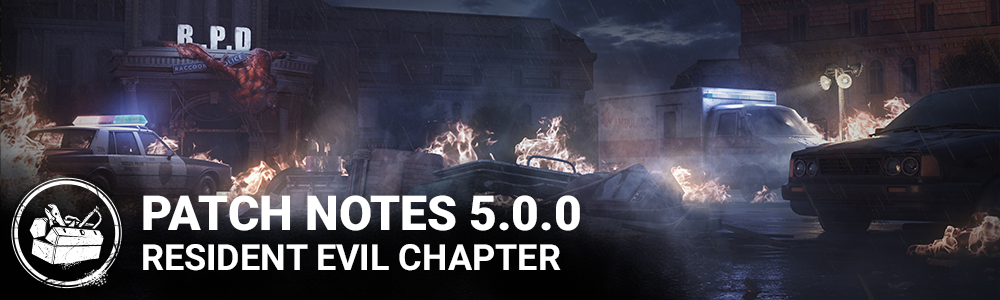

<!-- nav -->
&larr; [4.7.0 | PTB](279-4-7-0-ptb.md) · [Player Test Build (PTB)](../../index.md#player-test-build-ptb) · [5.1.0 | PTB](289-5-1-0-ptb.md) &rarr;
<!-- /nav -->

# 5.0.0 | PTB

## Features

- Added a new Killer - The Nemesis
- Added two new Survivors - Jill Valentine and Leon S. Kennedy
- Added a new map - Raccoon Police Department
- Improved Tutorials:
- New flow to make it easier to get into the Tutorial for new players
- New rewards for completing the Tutorial
- Tutorials now include single-player Tutorial Bot Matches to help teach the basics before venturing online!
- New players to the game will see more descriptive tooltips in the lobby and match results screens. Veteran players will continue to see the simplified tooltips. This can setting can be toggled on/off in the Settings menu.
- Settings Menu Update - Settings are now grouped in separate category tabs to make them easier to find.

## Content

- Trapper Update
- New Mesh and Textures for Circus Strongman Blast Furnace and Trapper Based outfits and their variants

## Bug Fixes

- Fixed an issue where players on the Tally screen would receive a "Disconnected from Host" message and would be sent to the initial interaction screen after being idle for 5 minutes.
- Fixed an issue where corrupted bloodweb would not regenerate corrupted nodes but fail to display the corrupted node, making it sometimes impossible to progress in that bloodweb.
- Fixed an issue where Victor can pounce on various objects inside the Thompson House

**Audio**

- Fixed an issue where survivors do not scream when stepping on a Bear Trap or when hit in the Tutorials or Bot match
- Fixed an issue where survivors can hear the Terror Radius when the Wraith is cloaked
- Fixed an issue where other Survivors hear the Demogorgon seal portal audio from anywhere on the map.
- Fixed an issue where the Trickster's melody does not seem to play at the appropriate distance from the killer

Xb1 & Xbox Series S|X only:

- Fixed an issue where player status of newly added users would not be displayed correctly.

## Known Issues

- Cracks materials on Haddonfield's ground seems bumpier
- Onboarding menu and Game Manual menu can be cut off on the sides on a 4:3 or less aspect ratio.
- Onboarding menu only localised in English for the PTB.
- The Nemesis - Players are able to use a Vaccine on dead survivors on the ground (mori / bleed out)
- The Nemesis - Nemesis's tentacle can sometimes glow depending of his position.
- The Nemesis - The zombies do not react to all types of loud noises or screams.
- The final reward for completing the tutorials is missing.

<!-- nav -->
&larr; [4.7.0 | PTB](279-4-7-0-ptb.md) · [Player Test Build (PTB)](../../index.md#player-test-build-ptb) · [5.1.0 | PTB](289-5-1-0-ptb.md) &rarr;
<!-- /nav -->
