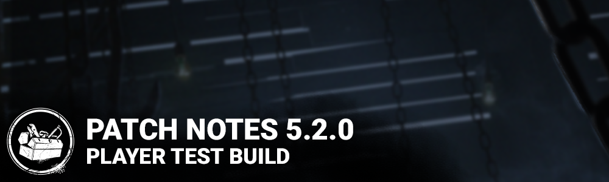

<!-- summary -->
## AI TL;DR

The Cenobite joins the killer roster, and a new match-results notice tells players limited items are consumed by The Entity when a trial ends. A Large Text HUD option improves readability, while Nemesis receives balance tweaks: Tier 3 Tentacle Strike speed up to 4 m/s, badge durations doubled, and the Ritual now triggers once at max mutation. Blood Lodge, Dead Dawg Saloon and The Game maps are re-enabled, survivor hair and facial cosmetics are updated, and performance fixes target Family Residence, Sanctum of Wrath and Midwich Elementary. The patch also bundles many bug fixes for animation, outfit clipping, perk sounds and HUD anomalies. Known issues remain with chain-binding glitches, Lament Configuration animations, out-of-bounds Cenobite gateways and several Claire Redfield visual bugs.
<!-- /summary -->

<!-- nav -->
&larr; [5.1.0 | PTB](289-5-1-0-ptb.md) · [Player Test Build (PTB)](../../index.md#player-test-build-ptb) · [5.3.0 | PTB](297-5-3-0-ptb.md) &rarr;
<!-- /nav -->

# 5.2.0 | PTB

## Features

- Added an new Killer - The Cenobite
- Match Results - When players leave a Trial with a Limited Item (Example: The Nemesis's Vaccine) they will now be notified that they do not get to keep it. It has been consumed by The Entity.
- Large Text Settings - The players can enable this option to enlarge all texts in the HUD, increasing readability.

## Content

The Nemesis Update:

- Movement speed while charging Tentacle Strike Tier 3 increased to 4.0m/s (was 3.8m/s)
- Shattered S.T.A.R.S. Badge effect duration increased to 60 seconds (was 30 seconds)
- Iridescent Umbrella Badge effect duration increased to 30 seconds (was 15 seconds, but was erroneously displayed as 12 seconds)
- Ritual of The Nemesis reduced to reaching maximum Mutation Rate one time (was 4)

Dev note: The Nemesis came out in a good state, but has been underperforming slightly in higher skill brackets. These players tend to hit Mutation Rate 3 more often, so a buff here should give him a slight boost at that level of play. Additionally, we have buffed two addons that were underperforming to make them more viable, and made the associated ritual less of a pain to complete.

- Various bug fixes and improvements to address performance issues on the Family Residence, Sanctum of Wrath and Midwich Elementary School.
- Blood Lodge, Dead Dawg Saloon and The Game maps are re-enabled
- Updated a variety of survivors hair and facial hair cosmetics.

## Bug Fixes

- Fixed an issue that caused The Executioner's rear to be too flat when having "The Corrupted" outfit equipped.
- Fixed an issue that caused a specific hook blocking navigation when a Survivor is hooked on it in Hospital map
- Fixed an issue that caused the killer to body block the basement when standing at the door frame in the main building of the Blood Lodge
- Fixed an issue that caused Meg "Jewel of the party" very rare outfit multiple clipping with her body
- Fixed an issue that caused Meg "Jewel of the party" very rare outfit skirt misshapen when performing various action
- Fixed an issue that caused female survivors to be missing an animation when stepping on a bear trap with the Calm Spirit perk equipped.
- Fixed an issue that caused survivors to perform the falling animation when walking down some stairs in the Raccoon City Police Station map.
- Fixed an issue that caused survivors to float and fall to the ground when cleansing some totems.
- Fixed an issue that caused the durability bar of toolboxes to appear red when sabotaging a hook.
- Fixed an issue that caused the walking animation of the Nemesis to be missing when in spectator mode in a custom game.
- Fixed an issue that caused Victor to be able to pounce on survivors while Dead Hard is being used.
- Fixed an issue that may cause survivors to remain stuck in a window when downed by the Trickster's knives while vaulting.
- Fixed an issue that caused the Doctor's Shock Therapy and Static Blasts not to negate the Oblivious effect.
- Fixed an issue that caused the sound notification for the Tinkerer perk to be too low.
- Fixed an issue that caused the Coup de Grace perk icon to remain lit until all generators are done instead of until all tokens are used.
- Fixed an issue that caused the hook count and the generator count to overlap each other when spectating a custom game.
- Fixed an issue that caused the pause menu to open and close constantly when holding the Escape key during a match.
- Fixed an issue that caused player names with a # symbol to get truncated in the HUD.
- Fixed an issue that caused save file problem.
- Fixed an issue that caused survivor to receive an incorrect benevolent emblem.

## Known Issues

- Sometimes, Survivors are bound by chains and are unable to remove them
- New Rank Crest images are part of the PTB. The new MMR system will not be active on PTB.
- Some animations are missing while solving the Lament Configuration
- The wrong animation plays when bound to the Lament Configuration after the Killer teleports to it while the Survivor is solving it
- The Lament Configuration breaks when a Survivor disconnects while holding it
- Chains are not removed from the match when a Survivor disconnects while they are bound by them
- The "Lament Guardian" score event is granted even if the Survivors escape with the Lament Configuration
- Survivors are awarded an incorrect amount of Bloodpoints when breaking free from multiple chains
- The Burning Candle and Torture Pillar add-ons do not stack as intended
- The Cenobite can place a gateway out of bounds in certain maps
- Items are not held in Claire Redfield's hands.
- Claire Redfield's camera clips in the ground when being mori'd.
- Claire Redfield's face is distorted in-game.

<!-- nav -->
&larr; [5.1.0 | PTB](289-5-1-0-ptb.md) · [Player Test Build (PTB)](../../index.md#player-test-build-ptb) · [5.3.0 | PTB](297-5-3-0-ptb.md) &rarr;
<!-- /nav -->
