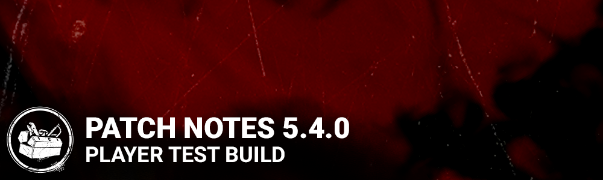

<!-- summary -->
## AI TL;DR

The Artist killer arrives with Grim Embrace, Scourge Hook: Pain Resonance and Hex: Pentimento, and Jonah Vasquez joins survivors with Overcome, Corrective Action and Boon: Exponential. The new Eyrie of Crows map, page-marked loadout menus, toggleable HUD subtitles and a New/Sale store badge also debut.

Add-on values for the Cenobite were tweaked, Spirit received performance optimizations, and character art and DLC pop-ups were updated. Numerous bugs were fixed, including tutorial manual tabs, Boon totem visibility, Legion vault hitches, Hag trap triggers, Nightmare dream snares, generator sound alerts, Afterpiece tonic placement, chain-hunt interactions, leader perk icons, Deathslinger tally sounds, achievement tracking and lobby camera alignment. Some visual issues remain, such as untranslated Trickster subtitles and missing Artist crow flock auras.
<!-- /summary -->

<!-- nav -->
&larr; [5.3.0 | PTB](297-5-3-0-ptb.md) · [Player Test Build (PTB)](../../index.md#player-test-build-ptb) · [5.5.0 | PTB](309-5-5-0-ptb.md) &rarr;
<!-- /nav -->

# 5.4.0 | PTB

## Features

- Added a new Killer - The Artist
  - Perks - Grim Embrace, Scourge Hook: Pain Resonance, and Hex: Pentimento
- Added a new Survivor - Jonah Vasquez
  - Perks - Overcome, Corrective Action, and Boon: Exponential
- Added a new map - Eyrie of Crows
- Loadout and Customization menus now have Page Markers
  - Markers include the number of the page
  - Markers can be directly selected to jump to the desired page
- Added Subtitles to the HUD
  - Can be toggled in the options
- Added a New/Sale badge to the Store
  - Only applies to in-game speech (just The Trickster at this time)

## Content

- Re-enabled location restriction when snuffing Boon totems
- Updated the character portraits for Meg, Dwight, Adam, and Laurie.
- Updated the character background images in the Character Info and Store menus for Quentin, Feng, Kate, David, Jake, Nea, Adam, Meg, and Dwight.
- Added input prompts for the Anti-Hemorrhagic Syringe, Styptic Agents, and Glass Beads add-ons
- The Store DLC Purchase Popup now specifies the character associated with exclusive items

### Cenobite Addon Update

- Liquified Gore: Decreased solving time modifier to 1 second (was 2 seconds)
- Torture Pillar: Decreased Chain Hunt activation time to 5 seconds (was 10 seconds)
- Larry's Remains: Decreased solving time modifier to 2 seconds (was 4 seconds)
- Chatterer's Tooth: Increased Undetectable status to 25 seconds (was 12 seconds)
- Engineer's Fang: When hitting an injured Survivor with a possessed chain, only 1 additional chain will spawn
- Iridescent Lament Configuration: Increased range to 24 meters (was 16 meters)

*Dev Note: The Cenobite has been overperforming since he came to DbD. These addon changes are intended to bring his five best performing addons more in line to reduce his overall power, accompanied with a buff to his worst performing addon.*

## Optimization

- Optimized The Spirit's performance

*Dev Note: The Spirit has the largest impact on performance of any Killer, technically speaking. These performance optimizations should help alleviate that on all platforms.*

## Bug Fixes

- Fixed the broken Game Manual tab on the Tutorial screen.
- Fixed an issue that allowed survivors to consume other survivor's Clairvoyance perk.
- Fixed in issue that caused Boon Totem vignettes to disappear when moving between overlapping Boon ranges.
- Fixed an issue that may cause the Boon Totem vignette to linger when the survivor who applied a Boon leaves the match.
- Fixed an issue that caused a hitch to occur at the end of vaults with the Legion.
- Fixed an issue that caused Hag traps set in the Asylum's entrance not to get triggered.
- Fixed an issue that let The Nightmare place Dream Snares which would not be seen from below on top of stairs.
- Fixed an issue that may cause the sound notification for the 4th generator completed not to trigger.
- Fixed an issue that may cause the Afterpiece Tonic gas not to match the affected area when the bottle explodes high above ground level.
- Fixed an issue that may cause survivors to be attacked by the Chain Hunt while they are solving the lament configuration.
- Fixed an issue that caused a placeholder icon to be seen when affected by another player's Leader perk.
- Fixed an issue that caused a gun SFX to be heard when entering into the tally screen as The Deathslinger.
- Fixed in issue that caused non-lethal interruptions not to grant progress towards the Quick Draw achievement.
- Fixed an issue where players could unlock achievements when playing on the PTB environment.
- Fixed an issue where sometimes the camera in the Killer lobby would be off center.

## Known Issues

- Some subtitles for The Trickster have not been fully translated into all languages.
- Doors powered by generators appear closed for the player(s) who did not complete the generator. (Visual only bug)
- Players are able to land on top of a generator inside the tower in the Eyrie of Crows map.
- Some facial animation issues for some Survivors when chained by the Cenobite.
- The auras of the Artist's crow flock is missing when the Artist is very close to the affected Survivor.
- Recovery speed stacks when between 2 Boon Totems affected by perk Boon: Exponential.

<!-- nav -->
&larr; [5.3.0 | PTB](297-5-3-0-ptb.md) · [Player Test Build (PTB)](../../index.md#player-test-build-ptb) · [5.5.0 | PTB](309-5-5-0-ptb.md) &rarr;
<!-- /nav -->
