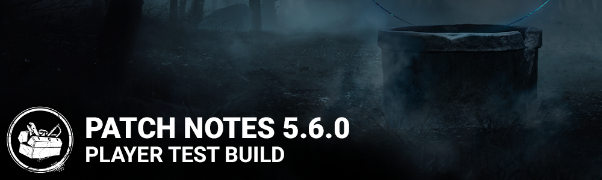

<!-- nav -->
&larr; [5.5.0 | PTB](309-5-5-0-ptb.md) · [Player Test Build (PTB)](../../index.md#player-test-build-ptb) · [5.7.0 | PTB](329-5-7-0-ptb.md) &rarr;
<!-- /nav -->

# 5.6.0 | PTB

## Important

Progress & save data information has been copied from the Live game to our PTB servers on **February 8th**. Please note that players will be able to progress for the duration of the PTB, but none of that progress will make it back to the Live version of the game.

## Features

- Added a new Killer - The Onryō
  - Perks - Scourge Hook: Floods of Rage, Call of Brine, Merciless Storm
- Added a new Survivor - Yoichi Asakawa
  - Perks - Parental Guidance, Empathic Connection, Boon: Dark Theory
- Forum and support links now redirect based on your selected language when applicable.
- Added new custom SFX Intros to all Maps.
- Added an option to lock viewport aspect ratio to 16:9.

- Improved detection of modified or corrupted game files.
- Daily Rituals will be reset the first time a player starts the game

*Dev Note: The tracking system for Daily Rituals has been reworked, which requires all rituals to be reset with this patch.*

## Bug Fixes

- Fixed an issue in the Loadout panel that when hovering over an add-on from a past event, the message "No longer available" was showing if the associated item was equipped.
- Fixed an issue with killer loading tips not displaying randomly after playing a few matches.
- Fixed an issue that may cause the Cenobite to remain stuck when interrupting a survivor at the same time as they get hit by a chain.
- Fixed an issue that caused the Spirit's Husk not to be destroyed when stunned by the Head On perk.
- Fixed an issue that caused survivors to be able to destroy Victor while inside a locker.
- Fixed an issue that may cause the Nemesis' zombies to be attracted to survivor in the dying state.
- Fixed an issue that caused the Distortion perk to consume tokens when standing inside Boon: Shadow Step's area.
- Fixed an issue that caused completed generators to be blocked by the Dead Man's Switch perk.
- Fixed an issue that caused the Broken status icon not to appear when under the effect of the Renewal perk.
- Fixed an issue that caused the Haste status icon not to appear when under the effect of the Guardian perk.
- Fixed an issue that allowed users to unlink unbreakable outfits in the store.
- Fixed an issue that caused Dwight's and the Trapper's loadout to be reset after playing a tutorial bot match.
- Fixed an issue that caused some of the Trickster's subtitles to disappear too early.
- Fixed an issue where pressing Alt+Tab in the keybinding menu would cause any further key remapping to not work properly. (Stadia only)
- Fixed an issue that sometimes caused a wrong cosmetic to be displayed after switching a killer's outfit in the store.
- Fixed an issue that caused survivors to keep breathing loudly when stopping to open a chest after running.
- Fixed an issue that caused the Chase Music for the Trapper to occasionally cut out during gameplay.
- Fixed an issue that allowed players to play the game with Stretched Resolution to gain an unfair advantage.
- Tentatively fixed an issue that causes players to disconnect during Steam maintenance.

## Known Issues

- Generator auras appear incorrectly when using the perks Hex: Ruin and Surveillance.
- The Brand New Part add-on triggers the Merciless Storm skill checks.
- The bonus Bloodpoints are missing when performing an Apparition or Transposition with the Videotape Copy add-on as the Onryō.
- The external perk icon for the Empathic Connection perk is missing.
- The Onryō is unable to be spun in a Custom Game lobby.
- Survivors jump at the start of any TV interaction.
- Survivors facial animations persists on their corpses when they are mori'd by certain Killers.
- Charms are misplaced when Survivors repair generators.
- The Haddonfield map and the Strode Realty Key offering remain disabled.
- The Nurse is disabled due to a bug.
- The AI controlled Meg fails to drop the pallet in the killer and survivor tutorials, making it impossible to complete them.

<!-- nav -->
&larr; [5.5.0 | PTB](309-5-5-0-ptb.md) · [Player Test Build (PTB)](../../index.md#player-test-build-ptb) · [5.7.0 | PTB](329-5-7-0-ptb.md) &rarr;
<!-- /nav -->
