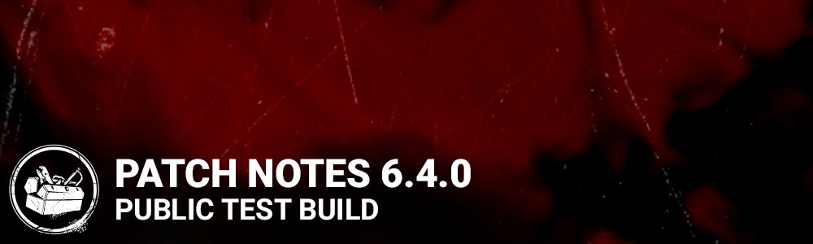

<!-- summary -->
## AI TL;DR

The Knight arrives as a new killer with three unique perks—Nowhere to Hide, Hex: Face the Darkness, and Hubris—while Vittorio Toscano joins survivors with Potential Energy, Fogwise, and Quick Gambit. The PTB also adds the Shattered Square map, a revamped Basement with wider stairs, updated pallet and door visuals, a flashlight blind rescue tweak, and the ability for custom-match hosts to add survivor bots. Most of the remaining changes are broad bug fixes addressing prestige displays, survivor audio, animation glitches, perk timers, and various UI and crash issues. Known issues focus on the Knight’s guards pathing, guard-related VFX and order visibility, and an unfinished survivor tutorial.
<!-- /summary -->

<!-- nav -->
&larr; [6.3.0 | PTB](353-6-3-0-ptb.md) · [Player Test Build (PTB)](../../index.md#player-test-build-ptb) · [6.5.0 | PTB](370-6-5-0-ptb.md) &rarr;
<!-- /nav -->

# 6.4.0 | PTB

## Important

- Progress & save data information has been copied from the Live game to our PTB servers on ***Oct 25***. Please note that players will be able to progress for the duration of the PTB, but none of that progress will make it back to the Live version of the game.

## Features

- New Killer - The Knight
  - New Perk - Nowhere to Hide
    - Whenever you damage a generator, reveal the aura of all survivors standing within 24 meters of your position for 3/4/5 seconds.
  - New Perk - Hex: Face the Darkness
    - When this Hex is inactive and you injure a Survivor, a Dull Totem becomes lit and hexes that Survivor. When the Hex is active, all other Survivors outside of your Terror Radius will have a chance to scream intermittently, revealing their positions and auras for 2 seconds. Other Survivors also see the aura of the cursed Survivor for 12/10/8 seconds. When the cursed Survivor is downed or returned to full health, the Hex is lifted, and the Hex Totem becomes unlit. Cleansing the Hex totem deactivates Hex: Face the Darkness permanently.
  - New Perk - Hubris
    - Whenever you are stunned by a Survivor, that Survivor suffers from the Exposed status effect for 10/15/20 seconds. Hubris has a cooldown of 20 seconds.
- New Survivor - Vittorio Toscano
  - New Perk - Potential Energy
    - After working on a generator for 12/10/8 uninterrupted seconds, press the Active Ability Button 2 to activate this perk. When this perk is active, repairing the generator will charge this perk instead of making the generator progress. For each 1.5% of generator repair, the perk will gain one token, up to 20 tokens. While this perk has at least one token and you are working on a generator, you can press the Active Ability Button 2 to consume all the tokens and instantly make the generator progress by 1% for each token. This perk then deactivates. If you lose a health state while this perk has at least 1 tokens, the perk will lose all tokens and deactivate. Missing a skill check will also result in some charges lost.
  - New Perk - Fogwise
    - Hitting a great Skill Check while repairing a generator reveals the aura of the Killer to you for 4/5/6 seconds.
  - New Perk - Quick Gambit
    - When you are chased within 24 meters of any generator, any other Survivor working on that generator receives a 6/7/8% speed boost to the repair action.
- Flashlight update
  - Finishing a flashlight blind of a Killer who is picking up a Survivor will succeed in rescuing the Survivor if it completes during the last 0.25 seconds of the pickup animation.
  - Killers are now immune to blindness while grabbing a Survivor out of a locker.
- Bots in Custom Matches
  - The host of a Custom Match can add Survivor bots to the game.

## Content

- New map - The Shattered Square
- Updated Basement
  - Wider stairs to address body-blocking issues
- Updated visuals for Pallets and Breakable doors

## Bug Fixes

- Fixed an issue that caused wrong prestige levels to be displayed in the end game tally screen.
- Tentatively fixed an issue that sometimes meant a survivor in dying state couldn't be healed whilst on stairs or slopes.
- Fixed an issue that caused letter casing in chat on WinGDK.
- Fixed an issue that caused female survivors to not make any sounds while falling.
- Fixed an issue that allowed killers to be able to body block the stairs to the basement in the Racoon City Police Station Map.
- Fixed an issue that caused survivors Infected with the T-Virus to not play their opening Exit Gate animation.
- Fixed an issue that caused The killer to not be stunned when the flashlight blind occurs at the end of the pickup animation.
- Fixed an issue that caused Survivor faces to be distorted when interacting or using emotes.
- Fixed an issue that caused The Cenobite's camera to appear lower than usual.
- Fixed an issue that caused the Survivors to not play the exit hatch animation from the Killer POV.
- Fixed a possible crash when clicking on the Current Tome button in the Archives.
- Fixed layout in the Settings menu where the match details tab could appears partially offscreen in a few languages.
- Fixed an issue that caused Pink Glyphs to fail to spawn in Trials when the Glyph Prowler challenge is selected.
- Fixed an issue that caused the timer of the perk "Inner Healing" to fail to update when grabbed by a Killer.
- Fixed an issue that caused Empathic Connection to remain active in the trial after the Survivor with the perk has died.
- Fixed an issue that caused the Demogorgon's Brass Case Lighter add-on to have a different duration from the the add-on description.
- Fixed an issue that caused Generators not to regress when being repaired by survivors when the Eruption perk is triggered.
- Fixed an issue that caused the progression bar to not light up when achieving Bronze in Unbroken.
- Fixed an issue that caused the Lethal Pursuer perk's additional time not to apply to the Aura reveal at the beginning of a Trial.
- Fixed an issue that caused the Lethal Pursuer perk to fail to increase the aura duration of the "Hex: Retribution" and "Object of Obsessions" perks.
- Fixed an issue that caused The Twins to sometimes be unable to move after switching between Charlotte or Victor.
- Fixed an issue that caused the Spirit's add-on 'Mother-Daughter Ring' to modify movement speed by the wrong amount.

## Known Issues

- Sometimes the Knights guards will path around window or pallet vaults instead of going through them during a hunt.
- A Survivor in a locker that gets hit by a guard will keep the Blindness status effect indefinitely.
- The Knight's Guards do not always correctly follow elevation changes.
- The Knight does not require line of sight on game objects to perform his Order action; will be fixed on later version.
- The Knight cannot be stunned by pallets or lockers while he is in Guard Summon mode.
- Survivors making a Loud Noise inside the Detection radius of a Guard does not get detected.
- VFX on Survivor when picking up a Guard's flag is missing, should last for the duration of the bonus effect.
- Active flag VFX becomes visible if a Survivor is hit by a Guard before the flag becomes active.
- The flags for the Knight's Guards dissolve inconsistently when a Guard despawns.
- The VFX for the Blight's Mori are missing.
- The loud noise notification from the No Way Out Perk is misaligned with the Exit Gate Switch Panel.
- The VFX for the Potential Energy perk, can be misaligned depending on the orientation of the Survivor when triggered.
- Survivor who are hunted by The Knight's Guards will sometimes noticed the Flag will not despawn, even if the Guard disappears.
- The Give Order VFX is not visible on breakable objects until the Knight uses his power once.
- Vittorio and the Knight Tier I perks are Common rarity.
- The Survivor Tutorial cannot be completed.
- Activating a Guard order on a Generator can sometimes injure a Survivor repairing the Generator. Survivors should only be forced off it

<!-- nav -->
&larr; [6.3.0 | PTB](353-6-3-0-ptb.md) · [Player Test Build (PTB)](../../index.md#player-test-build-ptb) · [6.5.0 | PTB](370-6-5-0-ptb.md) &rarr;
<!-- /nav -->
