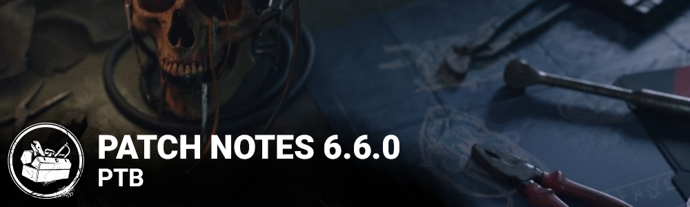

<!-- summary -->
## AI TL;DR

The PTB build adds the Skull Merchant killer, survivors Thalita Lyra and Renato Lyra with three new perk lines each, a Skull Merchant-themed Hunting Camp in Shelter Woods, and visual refreshes for Red Forest maps and character Haddie Kaur. It also introduces map-repeat mitigation, faster loading-timeout handling, lobby player-reporting, perk tweaks (Any Means Necessary cooldown removed, Eruption overhaul) and extensive bot upgrades for custom games. The update bundles numerous audio, character, map, UI and miscellaneous bug fixes, plus known issues like the Drone scan line glitch and kill-switched Autohaven Wreckers map. Progress on PTB is isolated from live accounts.
<!-- /summary -->

<!-- nav -->
&larr; [6.5.0 | PTB](370-6-5-0-ptb.md) · [Player Test Build (PTB)](../../index.md#player-test-build-ptb) · [6.7.0 | PTB](383-6-7-0-ptb.md) &rarr;
<!-- /nav -->

# 6.6.0 | PTB

## Important

- Progress & save data information has been copied from the Live game to our PTB servers on ***February 6th***. Please note that players will be able to progress for the duration of the PTB, but none of that progress will make it back to the Live version of the game.

## Content

### New Killer: The Skull Merchant

### Perks:

**Game Afoot:** While you are chasing the Obsession, this perk activates. Damaging Generators and destroying Breakable Walls and Pallets gives you a 5% Haste Status for 8/9/10 seconds. Whenever you hit the Survivor with the total most time in chase with a Basic Attack, they become the Obsession. The Killer can only be Obsessed with one Survivor at a time.

**THWACK!:** After hooking a Survivor, performing the break action on the next Breakable Wall or Pallet will make Survivors within 32 meters scream and reveal their Aura for 4 seconds. THWACK! is active for 45/60/75 seconds after the Survivor is Hooked.

**Leverage:** Each time you Hook a Survivor, gain 1 token, up to 10. When you Hook a Survivor, this perk activates. For each token, reduces the speed at which Survivors heal by 3/4/5% for 30 seconds.

### New Survivor: Thalita Lyra

### Perks:

**Cut Loose:** After performing a rushed vault in a chase, this Perk activates. While active, your rushed vaults are silent for up to 4/5/6 seconds, and successfully performing a rushed vault during that time resets the timer. This perk goes on cool-down for 45 seconds.

**Friendly Competition:** Whenever you finish Repairing a Generator with at least one other Survivor, this Perk activates. You and other Survivors who finished Repairing the Generator with you get 5% increased Repair progress speed for 45/60/75 seconds. Survivors can only have one instance of this Perk's ability active at once.

**Teamwork: Power of Two:** Whenever you finish healing another Survivor, you both move 5% faster as long as you stay within 12 meters of the Survivor you healed or until one of you loses a Health State. **Teamwork: Power of Two** can only trigger once every 180/160/140 seconds. Survivors can only be affected by one Teamwork: Power of Two effect at a time.

### New Survivor: Renato Lyra

### Perks:

**Background Player:** After you unhook another Survivor, break into a sprint at 150% of your normal running speed for 6 seconds and gain Exhaustion for 60/50/40 seconds. This Perk cannot be used while suffering from Exhaustion. Exhaustion prevents Survivors from activating other Perks that cause Exhaustion.

**Blood Rush:** This Perk activates once you are one Hook away from instant death. While healthy, running, and suffering from Exhaustion, press the Active Ability Button 1 to lose a Health State and recover from Exhaustion instantly and gain the Broken status effect for 28/24/20 seconds. You are automatically healed from injured to healthy after 28/24/20 seconds. Being put into the Dying State will cancel the healing effect. Activating Blood Rush will disable it for the remainder of the trial. Exhaustion prevents Survivors from activating other Perks that cause Exhaustion. Broken prevents Survivors from being healed.

**Teamwork: Collective Stealth:** Whenever another Survivor finishes healing you, you both leave no scratch marks as long as you stay within 12 meters of the Survivor who healed you or until one of you loses a health state. Teamwork: Collective Stealth can only trigger once every 180/160/140 seconds. Survivors can only be affected by one Teamwork: Collective Stealth effect at a time.

### Map Changes: Shelter Woods

Deep in the heart of the **Shelter Woods** lies The Skull Merchant’s Hunting Camp, where luxury and brutality coalesce. Many grotesque tools have been crafted within its walls. The high life indeed.

### Visual Update: Red Forest

We’ve taken a lengthy visit to the **Red Forest Realm**, which includes the Maps **Temple of Purgation** and **Mother’s Dwelling**. How about a nice, long walk in the woods?

### Visual Update: Haddie Kaur

- Visual improvement to eyes and hair.
- Hair shape and color adjusted to be more reflective of her lore.
- Added blood to Prestige hair.
- Visual update to her uncommon skin makeup.
- Icons and portrait updated.

## Quality of Life

### Map Repeat Prevention

This update improves the Map selection process. Now, the possibility that players in a Trial will see the same Map as their previous Trial has been reduced to near-zero. It’s also unlikely that they will be sent to a recently visited Map, though the likelihood will be a little higher than near-zero. This will not impact the efficacy of Map Offerings, nor will it affect Custom Games.

### Loading Timeout

After analyzing the data on our side, we have established a set of expected loading times for each of the steps while loading into a Trial. As a result, if any player crashes or hangs while loading, we will now be able to return everyone to the Tally much earlier.

### Reporting Players

We know that sometimes you may face unsportsmanlike behaviour even before a match. We have now added the option to report a player from the online lobby.

### Perk Changes

- Any Means Necessary: removed cooldown.
- Eruption: After kicking a Generator, its aura is highlighted in yellow. Whenever a Survivor enters the Dying State, every affected Generator explodes, losing 10% worth of current progress and starts to regress. Any Survivor repairing a Generator when it explodes will scream and reveal their aura 8/10/12 seconds. Eruption has a cooldown of 30 seconds.

## Bots in Custom Games

### Pre-game Improvements

- Bots are now assigned to specific slots in the Custom Match party lobby.
- Bots can now use a selection of Perks in Custom Games. Up to 4 Bot Perk loadouts can be saved.
- *Dev Note:* Not all options for loadout are currently supported by Bots. You may notice that some options of Perks, Items, Add-ons or Offerings are missing; these exclusions are intentional.

### In-game Improvements

- Bots respond better while in the Terror Radius on multi-floor Maps.
- Bots are more likely to pick up dropped Items.
- Bots will use the Haste Effect more effectively after being hit by the Killer.
- Bots are no longer overcome with existential dread when Broken and holding a Medkit.
- Bots no longer automatically know where their rekindled Hex: Pentimento Totem is located.
- Bots no longer automatically know the Perk associated with a Hex Totem.
- Bots should now make more strategically sound rescues in the Killer’s presence.
- Improved Bot decision-making while dodging ranged attacks and looping.
- Improved Bot pathing while obstructed by a teammate.
- Bots now prioritize gaining distance from the Killer over seeking a nearby loop.
- Bots react more accurately to sound, especially from Killer Powers.
- Injured Bots are now more effective at healing one another.
- When searching for the closest Locker, Bots are no longer confused by Lockers on a floor below or above.

### Killer-specific Improvements

- Bots are more willing to solve The Lament Configuration when playing against Pinhead.
- Bots no longer automatically know which Generator Freddy Krueger will emerge from while using the Class Photo Add-On.
- Bots no longer automatically know which Portal The Demogorgon will emerge from while using the Red Moss Add-On.
- Bots no longer fear approaching Charlotte while Victor is active.
- Bots now know to crouch to avoid triggering The Hag’s Phantasm Traps.
- Bots no longer attempt to blind The Demogorgon while it’s travelling in the Upside Down.
- Bots no longer automatically know which Pallets are fake when playing against Freddy Krueger or The Doctor.
- Bots more accurately react to the Terror Radius when the Obsession is affected by Dark Devotion.
- Bots are far more willing to disarm The Trapper’s Bear Traps when required.

**Bug Fixes**

## Audio

- Generator sounds are no longer muffled to those Repairing it.
- Reworked how Survivors scream when getting Hooked to make it sound more natural.
- Fixed an issue where, if ending a Trial as The Cenobite while in the Gateway, playing the next Trial as The Cenobite would cause the Killer's sounds to be muffled.

## Characters

- Updated The Nurse's Power description.
- The Dredge no longer becomes invisible when teleporting into a Locker at the same time a Survivor enters it.
- The Dredge no longer retains Bloodlust when teleporting to Lockers.
- The Dredge's Power, The Gloaming, can no longer be incorrectly cancelled while charging.
- Killer Instinct is no longer revealed on Survivors in Lockers from which The Dredge had previously teleported.
- Fixed an issue that cause injured female Survivor body to clips through The Wraith when being grabbed from a locker while he's cloaked.
- Fixed a rare crash after teleporting to a Portal as the Demogorgon.
- The Trickster can no longer see the impact effects of thrown blades when Blinded
- The Oni's Demon Dash progress bar no longer remains white when the Scalped Topknot Add-On is equipped.
- The Torment Trail is no longer applied to Survivors grabbed by The Executioner while doing another action.
- After vaulting but without moving as The Knight, Guardia Compagnia is no longer disabled until the Killer moves.
- After Summoning a Guard for an Order, The Knight's Guardia Compagnia Patrol Path now fades out in its entirety.
- The Knight's Guards are no longer spawning in mid-air in certain areas, such as near door frames
- During The Knight's Guardia Compagnia, it is no longer possible to see the Killer's Red Stain or Idle Crows spawned while in Guard Summon mode
- The Knight's Guards no longer trigger the hidden corpse jumpscare event when patrolling in the Midwich Locker Room.

## Perks

- The perk Deja Vu is no longer activated after the last Generator is completed.
- The perk Coup de Grace now correctly extends the distance of the first lunge when a token has been gained
- The Knight's Guardia Compagnia can now be cancelled by the perk Head-On.

## Maps

- The Killer shack loop in the **Garden of Joy Map** is no longer disrupted by debris.
- The Haddonfield Porch Lights will now operate as intended when the Generator is complete.
- The Killer will no longer be able to climb on top of (or get trapped in) the Eyrie of Crows Killer Shack Pallet.
- Pallets in the Decimated Borgo no longer fail to shake when kicked.
- Killers can no longer become desynched when standing in certain tiles in the Eyrie of Crows Killer Shack.

## UI

- Killer can now consistently open the character info menu while in the lobby.
- Corrected wrong character swap button prompts in the Lobby and the Store.

## Misc

- Players affected by a disconnection penalty should now see it correctly when returning to the lobby after a Match.
- Fixed a few cases where subtitles for voiceover lines would linger longer than the audio itself.
- Players are no longer stuck in an infinite loop when matchmaking fails while queueing for a Custom Match.
- The wiggle Skill Check check no longer becomes partly incompletable when picked up from a Generator.
- A Survivor self-Unhooking and running away no longer experiences a small rubber-banding issue.
- Generators blocked by the Entity no longer continue regressing and losing progress.
- The Exposed status effect no longer incorrectly displays a timed icon when the player is permanently Exposed.
- All Perks can now be bound to, and triggered by a mouse scroll
- Input bindings changed while being displayed by a button prompt no longer stay permanently displayed.

## Known Issues

- The Drone's scan lines can be seen through some Breakable Walls.
- The Autohaven Wreckers map "Azarov's Resting Place" is Kill Switched due to a placeholder bug.
- The Perk "Blood Warden" is Kill Switched due to a bug.

<!-- nav -->
&larr; [6.5.0 | PTB](370-6-5-0-ptb.md) · [Player Test Build (PTB)](../../index.md#player-test-build-ptb) · [6.7.0 | PTB](383-6-7-0-ptb.md) &rarr;
<!-- /nav -->
