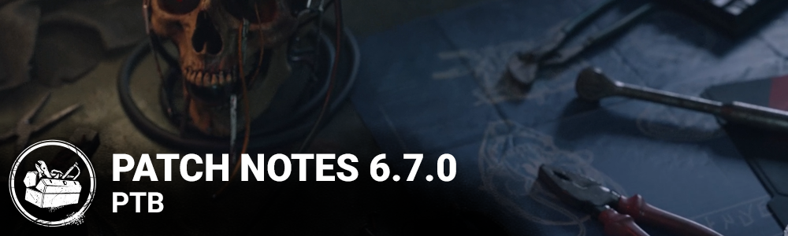

# 6.7.0 | PTB

## Release Information

**Estimated PTB start time:** 11AM ET

This update includes a variety of balance changes for Perks & Killers, improvements to the Bloodweb, a new Visual Terror Radius accessibility option, and more. For more details, check our March Developer Update:

[https://forums.bhvr.com/dead-by-daylight/kb/articles/382](https://forums.bhvr.com/dead-by-daylight/kb/articles/382)

## How to Access the Public Test Build

[https://forums.bhvr.com/dead-by-daylight/kb/articles/358-ptbs](https://forums.bhvr.com/dead-by-daylight/kb/articles/358-ptbs)

## Feedback & Bug Reports

Please keep any PTB related Feedback & Bug Reports in the correct sections.

PTB Feedback: [https://forums.bhvr.com/dead-by-daylight/categories/6-7-0-ptb-feedback](https://forums.bhvr.com/dead-by-daylight/categories/6-7-0-ptb-feedback)

PTB Bug Reports: [https://forums.bhvr.com/dead-by-daylight/categories/6-7-0-ptb-bug-reporting](https://forums.bhvr.com/dead-by-daylight/categories/6-7-0-ptb-bug-reporting)

## Important

- Progress & save data information has been copied from the Live game to our PTB servers on ***March 20***. Please note that players will be able to progress for the duration of the PTB, but none of that progress will make it back to the Live version of the game.

## Content

### Map Rework: Autohaven Wreckers - Blood Lodge and Gas Heaven

- Updated the layout to reduce the concentration of low line-of-sight tiles.
- Updated the placement of the main buildings.
- Updated the Maps' layouts.
- Updated the Car Piles tiles to be able to navigate through them.
- Added a variation of the Bus tile.
- Updated the maze tiles that had unsafe loops.
- Updated empty fence tiles with blockers and gameplay.
- Updated the Gas Station tiles to have a door open in the garage section.
- Updated loops inside the Gas Station.

### Light-Killer Interactions

We are removing Killer-specific light interactions.

- The Nurse can no longer be lightburned out of her Blinks.
- The Hag's Phantasm Traps are no longer removed by lights.
  - Survivors can now remove them by approaching them carefully and wiping them away.
- The Wraith can no longer be lightburned when cloaked.
- The Artist's crows are no longer affected by light.
  - Crow swarms cannot be removed by light.
  - Dire Crows cannot be removed by light.
- The Spirit
  - Can no longer burn The Spirits Husk

## Features

### Killer Tweaks

- **The Hillbilly**
  - Power
    - Less heat added on starting to rev the Chainsaw
    - Less heat added while revving the Chainsaw
    - More heat added during Chainsaw Sprint
  - Addons
    - Death Engravings
      - Chainsaw charge time +15% (was +12%)
      - Heat generated while charging the Chainsaw -10% (was -14%)
      - Sprint speed +10% (was +15%)
  - Doom Engravings
    - Chainsaw charge time +15% (was +12%)
    - Heat generated while charging the Chainsaw -10% (was -14%)
    - Sprint speed +15% (was +20%)
- **The Pig**
  - John's Medical File AddonHIncrease crouched move speed by 10% (was 6%)
- **The Onii**
  - Addons
    - Bloody Sash: Increases movement speed while absorbing Blood Orbs by 0.7 m/s (was 0.6 m/s)
    - Blackened Toenail: Increases movement speed while absorbing Blood Orbs by 0.4 m/s (was 0.3 m/s)
- **The Nightmare**
  - Addons
    - Sheep Block: Triggering Dream Snares or Dream Pallets inflicts Blindness for 60 seconds (was 30 seconds)
    - Unicorn Block: Triggering Dream Snares or Dream Pallets inflicts Blindness for 90 seconds (was 60 seconds)
  - **The Clown**
    - Redhead's Pinky Finger Addon: Start with 3 fewer bottles, and maximum bottles is decreased by 3 (was 2 and 2, respectively)
  - **The Cenobite**
    - The Lament Configuration will now teleport if the Cenobite stands on it for 5 seconds.
  - **The Executioner**
    - Scarlet Egg Addon
      - Increases the duration of Killer Instinct when triggered by Rites of Judgment by 3 seconds.

### Perk Updates

- **Scourge Hook: Pain Resonance**
- You start the Trial with 4 tokens. The first time each Survivor is hooked on a scourge hook, lose 1 token and the generator with the most progress explodes, instantly losing 11/13/15% progress, and will start to regress. Once you have no tokens, Pain Resonance deactivates for the rest of the Trial.
- **Gearhead**
- After a survivor loses a health state by any means, Gearhead activates for 30 seconds. While Gearhead is active, the every time a Survivor performs a good Skill Check while repairing, their aura is revealed to you for 6/7/8 seconds.
- **Boon: Circle of Healing**
- Any Survivors within the Boon Totem’s range gain a 40/45/50% healing speed bonus to healing others. Medkits do not stack with Boon CoH. Injured Survivors have their auras revealed to all other Survivors when inside the Boon Totem’s range.
- **Dead Hard**
- Dead hard activates after you have unhooked a Survivor safely or unhooked yourself. Press the Active Ability button 1 while running to gain the Endurance status effect for the next 0.5 seconds. Causes the Exhausted Status Effect for 60/50/40 seconds. Dead Hard then deactivates.
- **Overzealous**
- After cleansing or blessing any totem, this perk activates. Your generator repair speed is increased by 8%/9%/10%. This bonus is doubled if you cleanse/bless a Hex totem. This Perk deactivates when you lose a health state by any means.
- **Call of Brine**
- After kicking a generator this perk becomes active for 60 seconds. The generator regresses at 115%/120%/125% of the normal regression speed and you can see its aura in yellow. Each time a Survivor completes a good Skill Check on a generator affected by this perk, you receive a loud noise notification.
- **Overcharge**
- Overcharge a generator by performing the Damage Generator action. The next survivor interacting with that generator is faced with a difficult Skill Check. Failing the Skill Check results in an additional 2%/3%/4% loss of progress. Succeeding the Skill Check grants no progress but prevents the generator explosion. After Overcharge is applied to a generator, its regression speed increases from 85% of normal to 130% of normal over the next 30 seconds.

### General Healing

- Increase Survivor heal interaction seconds to charge from **16** to **24 seconds**.
- Decrease the bonus on successful Healing skill checks from **5%** to **3%**.

### Med-kit Update

- **Camping Aid Kit:** 24 charges. (was 16) Increases the speed that you heal others by 20%. (was 25%) Unlocks the self-healing action.
- **First Aid Kit:** 24 charges. (was 24) Increases the speed that you heal others by 25%. (was 35%) Unlocks the self-healing action.
- **Emergency Med-kit:** 24 charges. (was 16) Increases the speed that you heal others by 30%. (was 50%) Unlocks the self-healing action. (Self-healing buff removed)
- **Ranger Med-kit:** 24 charges. (was 32) Increases the speed that you heal others by 35%. (was 50%) Increases Skill Check success zone size by 10%. (was 14%) Increases Great Skill Check zones size by 10%. (was 15%) Unlocks the self-healing action.
- **All Hallows' Eve Lunchbox:** 24 charges. (was 24) Increases the speed that you heal others by 25%. (was 35%) Unlocks the self-healing action. Makes you considerably more visible.
- **Anniversary Med-kit:** 24 charges. (was 24) Increases the speed that you heal others by 25%. (was 35%) Unlocks the self-healing action.
- **Masquerade Med-kit:** 24 charges. (was 24) Increases the speed that you heal others by 25%. (was 35%) Unlocks the self-healing action.

### Med-kit Addons

- **Rubber Gloves:** Increases progression bonus for succeeding Great Skill Checks by 2%. (was 3%)
- **Butterfly Tape:** Increases healing speed by 3%. (was 5%)
- **Sponge:** Increases progression bonus for succeeding Great Skill Checks by 3%. (was 5%)
- **Needle & Thread:**Increases the chances of triggering a Skill Check by 10%. 100% Bonus Bloodpoints granted for succeeding Great Skill Checks. Increases healing speed by 10%. (was 15%)
- **Medical Scissors:**Increases healing speed by 12%. (was 15%)
- **Gauze Roll:**Adds 10 charges to the Med-kit. (was 12 charges)
- **Surgical Suture:** Increases the chances of triggering a Skill Check by 15%. 150% Bonus Bloodpoints granted for succeeding Great Skill Checks. Increases healing speed by 10%. (was 15%)
- **Gel Dressings:** Adds 14 charges to the Med-kit. (was 16 charges)
- **Abdominal Dressing:** Increases healing speed by 20%. (was 25%) Decreases Med-kit charges by 12. (was 8 charges)
- **Styptic Agent:** Press the Secondary Action button while healing with the Med-kit to use the Styptic Agent. When the Styptic Agent is used on an injured Survivor, they gain Endurance for 5 seconds. (was 8 seconds) Consumes the Med-kit on use.
- **Anti-hemorrhagic Syringe:** Press the Secondary Action button while healing with the Med-kit to use the Anti-Hemorrhagic Syringe. The affected Survivor will passively gain a health state 24 seconds after use. (was 16 seconds) The time required is modified by perks, items and add-ons that affect Healing Speeds. This effect is canceled when the affected Survivor changes health state or is picked up. Consumes the Med-kit on use.
- **Refined Serum:** Increases your Movement speed by +5% for 15 seconds. (was 20 seconds) Creates a Blight trail behind the affected Survivor. Can be used on other Survivors or yourself. Consumes the Med-Kit on use.

### Bloodweb Improvements

You asked for it for a long time, and it's finally here: using the Bloodweb has been made much simpler!

- By default, nodes can now be claimed by pressing on them rather than holding. If you want to revert to the old behaviour, a setting in the Accessibility tab allows you to toggle between Press and Hold behaviour.
- Hovering the cursor over any node in the Bloodweb that is not currently purchaseable shows a red outline of a path of nodes leading up to it and displays the total Bloodpoints needed to buy all those nodes.
- Pressing/holding on any such node automatically purchases all the nodes one-by-one on the hovered path. This may not complete if purchasing all nodes becomes limited by your Bloodpoint total or the Entity consuming nodes on the way.
- After reaching Prestige 1 with a character, the Bloodweb for that character will contain a new center node. Pressing/holding on it will automatically claim as much as possible of the whole Bloodweb level. The automation will prioritize Perks first and attempt to spend the minimum amount of Bloodpoints second. This will stop if you run out of Bloodpoints, but will continue with Entity consuming nodes.

### Misc

- Heartbeat Visual Support: Displays a visual indicator for Survivors being affected by a Terror Radius or a Lullaby. Can be toggled ON/OFF in the Accessibility tab of the Settings.
- Cinematic video files are now stored in Bink format.

## Bug Fixes

### Bots

- Bots in the Tutorial now have their names correctly localized.
- Bots are less likely to drop a pallet while standing still on the same side as the Killer.
- Bots no longer slow down while traversing the area of a Skull Merchant's Drone if inside the Terror Radius.
- Bots are less likely to run into a Killer while attempting to evade them.

### Gameplay

- The Knight can no longer enter a broken state when ordering a guard to destroy a Pallet that is also being destroyed by the Dissolution perk.
- The Huntress’ Wooden Fox Add-On now properly grants the Undetectable effect while reloading.
- The Killer Instinct VFX is now properly displayed when equipped with the Mother’s Glasses or Dried Cherry Blossom Add-Ons when playing as the Spirit.
- The Kinship perk no longer activates when reaching the Struggle Phase while in the Executioner’s Cage of Atonement.
- The auras of Survivors standing near the Exit Gates when the Blood Warden Perk activates are now properly shown.
- The Perks of the Skull Merchant, Thalita Lyra and Renato Lyra now appear in the correct order in the Character Info screen.

### UI

- The Chase activity indicator is now properly removed if players disconnect while in chase.
- The Killer’s HUD reappears properly when survivors disconnect as they are being Moried.
- The remaining time text in the Shrine of Secrets is no more cut-off in certain languages.
- Fixed localization issues in some of the system error messages.
- Title texts on AI Bot Loadout popup is consistent with Loadout menu.

### Maps

- Fixed an issue in Red Forest where The Blight slid off trees.
- Fixed an issue in Raccoon City Police Station where the zombies would get stuck in a door frame.
- Fixed multiple issues where the drones of The Skull Merchant would clip in the door frames.
- Fixed an issue where the Bear Traps would clip into the ground on the Autohaven bus.
- Modified the placement of the generators in Haddonfield.
- Fixed an issue where the Bear Trap would appear under a generator in Lerys Memorial Hospital.

### Misc

- The Yellow Glyph Skill Checks can now be properly completed.
- Equipping Cosmetics that have unique voice lines should now have the subtitles always in sync.

## Known Issues

- The in-game description of Overzealous is not correct
- Using the Hold interaction in the Bloodweb and pressing the center button may lead to a soft-lock with a low amount of Bloodpoints owned.
- Claiming a chain node too fast after leveling a character can cause menus to break. Restarting the game will fix this issue.
