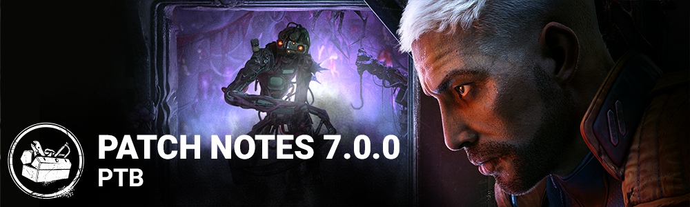

<!-- nav -->
&larr; [6.7.0 | PTB](383-6-7-0-ptb.md) · [Player Test Build (PTB)](../../index.md#player-test-build-ptb) · [7.1.0 | PTB](398-7-1-0-ptb.md) &rarr;
<!-- /nav -->

# 7.0.0 | PTB

## Release Information

#### Estimated PTB start time:** 11AM ET

This update includes a new Survivor (Gabriel Soma), a new Killer (The Singularity), a new map (Dvarka Deepwood - Toba Landing), a variety of balance changes for Perks & Killers, a Search Bar feature for loading & customization screens, and more.

## How to Access the Public Test Build

[https://forums.bhvr.com/dead-by-daylight/kb/articles/358-ptbs](https://forums.bhvr.com/dead-by-daylight/kb/articles/358-ptbs)

## Feedback & Bug Reports

Please keep any PTB related Feedback & Bug Reports in the correct sections.

PTB Feedback: [https://forums.bhvr.com/dead-by-daylight/categories/7-0-0-ptb-feedback](https://forums.bhvr.com/dead-by-daylight/categories/7-0-0-ptb-feedback)

PTB Bug Reports: [https://forums.bhvr.com/dead-by-daylight/categories/7-0-0-ptb-bug-reporting](https://forums.bhvr.com/dead-by-daylight/categories/7-0-0-ptb-bug-reporting)

## Important

- Progress & save data information has been copied from the Live game to our PTB servers on ***May 17th***. Please note that players will be able to progress for the duration of the PTB, but none of that progress will make it back to the Live version of the game.

## Content

### New Killer: The Singularity

### Perks:

**Genetic Limits:**When a Survivor finishes the healing action, they suffer the Exhausted status effect for 24/28/32 seconds.

**Forced Hesitation:**When a Survivor is put into the dying state by any means, all other Survivors standing within 16/16/16 meters around them suffer the hindered Status effect for 10/10/10 seconds, reducing their Movement speed by 15%. This perk goes on cooldown for 60/50/40 seconds.

**Machine Learning:**After performing the damage generator action, Machine Learning activates.While this perk is active, the next generator you damage will be compromised until it is completed. The generator is highlighted in Yellow. When the compromised generator is completed, you become undetectable and gain 7% Haste for 20/25/30 seconds. Then, Machine Learning deactivates. If you break a gen while another generator is compromised, the compromised generator moves to the latest one kicked.

### New Survivor: Gabriel Soma

### Perks:

**Troubleshooter:**When you are chased by the Killer, this perk activates. You see the aura of the Generator with the most progress. You see the aura of the Killer for 4/5/6 seconds after dropping a Pallet. The effect lasts for 6/8/10 seconds after being in chase, then deactivates.

**Made for This:**This perk activates while you are in the injured state. You run 1/2/3% faster. After you finish healing another Survivor, gain the endurance status effect for 6/8/10 seconds. Made for This cannot be used when suffering from Exhaustion, but does not cause the Exhausted Status Effect.

**Scavenger:**While you are holding an empty toolbox, this perk activates. Succeeding a great skill check while repairing gives the perk 1 token, up to 6/5/4. When you reach maximum tokens, lose all tokens automatically recharge the toolbox to full. Scavenger is disabled for the remainder of the Trial after recharging a toolbox. This perk grants the ability to rummage through an opened chest once per Trial and will guarantee a basic Toolbox.

### New Map: Dvarka Deepwood - Toba Landing

### Map**:

**The Landing was a promise for** humanity to rebuild on a new planet. The climate resources were ideal to start anew, until all went wrong, and a new lifeform takes over and it has no connection to humanity. The environment is split in two distinct biomes. A rocky and bare area that will give players a more open space to explore. A destroyed vehicle incased on spiky rocks serves as a testament of a fierce battle and can now serves as a landmark. On the opposite side of the map a lush and busy jungle will give the players a claustrophobic feeling even outside. The vegetation although menacing can be used by the survivors to hide and wait for the real threat to pass by.

Between the two biomes the Toba Landing, now a desolate remnant of what was once a second chance of life is now a carcass of advance technology. Players will be able to explore every level from underneath, all the way to the top of the structure.

This planet looks wild and untouched, but the more you look around, it is possible to notice a civilization once thrived and left evidence of its presence on some familiar elements, such as the shack and the exit gate.

Wild life is present in the environment and a good guide to help players find their way around. Enigmatic blue flowers seem to feed on the energy of the entity and light up when source of energy like generators and exit gates are around.

## Killer Tweaks

- **The Artist**
  - Ink Egg
    - Increase the maximum capacity of Dire Crows by 1. Decreases the time Dire Crows stay idle before disintegrating by 2 seconds (was 4 seconds).
  - Vibrant Obituary
    - Increases the length of time a Dire Crow’s Killer Instinct reveals Survivors by 3 seconds (was 1.5 seconds).
- **The Nemesis**
  - Damaged Syringe
    - Increases time it takes Survivors to use a Vaccine by 3 seconds (was 2 seconds). Increases length of Killer Instinct when Survivors use a Vaccine by 3 seconds (was 2 seconds).
  - Tyrant Gore
    - Increases mutation rate when destroying zombies with Tentacle Strike by 75% (was 50%). Decreases zombie respawn time by 7.5 seconds (was 5 seconds).
  - Zombie Heart
    - Increases mutation rate when destroying zombies with Tentacle Strike by 75% (was 50%).
- **The Trickster**
  - Lucky Blade
    - Increase the duration of Main Event by 0.3 seconds (was 0.2 seconds) for each Blade hit while it is active.
  - Waiting For You Watch
    - Increases the duration of Main Event by 0.4 seconds (was 0.3 seconds) for each Blade hit while it is active.
- **The Ghost Face**
  - Power
    - Movement speed while crouched: 3.8 m/s (was 3.6 m/s).
    - Night Shroud recharge time: 20 seconds (was 24 seconds).
    - Killer Instinct duration after being revealed: 4 seconds (was 2 seconds).
  - Knife Belt Clip
    - Reduces the Terror Radius by 12 meters (was 8 meters) while crouching.
  - Night Vision Monocular
    - A Survivor that reveals The Ghost Face is inflicted with Exhausted for 10 seconds (was 5 seconds).
- **The Executioner**
  - Power
    - When hitting a Survivor with Punishment of the Damned, that Survivor is inflicted with Torment.

## Perk Updates

- **Pop Goes the Weasel**
  - After hooking a Survivor, the next generator you damage instantly loses 30% (was 20%) of its current progress. Normal generator regression applies after the Damage Generator action. Pop Goes the Weasel is active for 35/40/45 seconds after the Survivor is hooked.
- **Déjà Vu**
  - We have noticed growing concerns surrounding excessively long matches caused by 3-genning (Killer defending a cluster of three generators). We are working on a long term solution for a future update to limit how effective this strategy can be. However, we recognize that Survivors need more options at their disposal right now to combat 3-genning. With this in mind, some adjustments have been made to Déjà Vu: The perk will now reveal the auras of 3 generators which are in close proximity to one another**indefinitely** (previously for 30/45/60 seconds at the start of the trial and everytime a generator was completed) and grant a **4%/5%/6% repair speed bonus** on the revealed generators (previously 3%/4%/5%).
- **Flashbang**
  - After completing 70%/60%/50% progress on any generator, Flashbang activates. Enter a locker and press the Active Ability Button 1 to craft a flash grenade. (No longer requires being empty-handed)

## Features

### Search Bar

Yes, it's the moment you've been waiting for: the loadout and customization screens finally have a search bar. You can now filter your Items, Add-ons, Offerings, Perks, Cosmetics, Outfits and Charms using this textbox.

**The following text parts can be searched for:**

- Name
- Description / flavor text
- Rarity
- The Collection name of a Cosmetic
- The Outfit name of a Cosmetic
- The Item that an Add-on attaches to
- For teachable Perks, the name of the character that unlocks it

### Item Rules Rework

- Items are now divided into categories:
  - **Survivor Item**
    - These can return to a player's inventory at the end of a match
    - e.g. Toolbox, Firecracker, etc
  - **Special Item**
    - Items related to playing against specific Killers
    - e.g. Lament Configuration, VHS Tape, etc
  - **Temporary Item**
    - Items that do not return to a player's inventory at the end of a match
    - e.g. the White Glyph's Pocket Mirror, Flashbang

## Misc

- Added an update popup requiring players to back out to the splash screen when a backend update is deployed. This may happen with a Kill Switch change, release of new store items, or other similar changes. This popup will only appear in the Main Menu, in the Store, or before queueing as a Killer.
- Added protection against hackers using characters they do not own.
- Error messages produced by a disconnection, a timeout from the server, or a kick are now distinct and clearer.

## Bug Fixes

## Archives

### Audio

- Fixed an issue where survivors could hear the Terror radius when affected by the Oblivious status during a chase.
- Fixed an issue where The Wraith's Coxcombed Clapper addon also muted the sound when The Wraith uncloaks.

### Bots

- Bots can now use the following Perks:
  - Background Player
  - Blood Rush
  - Potential Energy
  - Power Struggle
  - Reassurance
  - Urban Evasion
- Bots are more likely to run out of the Basement after wiggling off the Killer while in the Basement or on its stairs.
- Bots no longer attempt to use Dead Hard when the Killer is unable to hit them (for example, when chased by a Demanfested Onryo).
- Bots no longer drop held Items after wiping a Hag's Phantasm Trap.
- Bots no longer have trouble with one window on the Rancid Abattoir Map.
- Bots no longer make the horror trope decision to run away from a chasing Killer into the Basement.
- Bots no longer stubbornly stay in a flee loop when there are important goals available (e.g. escape through opened gates).
- Bots now avoid dropping an unsafe pallet when separated from the Killer by a small wall.
- Bots playing against Freddy Krueger can now use Alarm Clocks.
- Bots playing against Pyramid Head can now crouch whilst attempting to cross a Trail of Torment while crouching.
- Bots playing against The Dredge now lock Lockers near Generators they are working on.
- Bots playing against The Knight no longer consider a loop to be safe if a Guard is chasing alongside the Killer.
- Bots playing against The Trapper have learned to avoid Bear Traps set at pallets.
- Bots playing against The Twins are more likely to run up to and kick Victor.
- Bots playing against The Twins can now use the Shove Door or Push interaction to remove Victor from a locker.
- Multiple Bots no longer attempt to sabotage the same hook at the same time.

### Characters

- The Frumious Jabberwock skin for The Artist no longer causes FPS spikes after completing a game.
- Fixed an issue where, when playing as the Executioner, survivors who were rescued from a Cage of Atonement while the Killer was looking away from their location resulted in the rescued Survivor being displayed in their caged animation for the remainder of the Trial, but only for the Killer.
- Fixed an issue where the Pig's hand would move unnaturally when mainly moving sideways to the left.
- Fixed an issue where Cenobite appeared to be sliding around instead of walking.
- No longer showing an extra placeholder mesh of The Cenobite in every map
- Survivors affected by the Oblivious status effect can no longer hear the Terror radius during a chase
- A Survivor's Flashlight no longer remains visible to The Spirit if turned off during a Phase Walk
- The game no longer crashes if a Zombie falls out of bounds
- Legion is no longer able to vault on top of the bus in Autohaven Wreckers during Feral Frenzy
- Correctly display scream noise indicator when a Survivors screams from The Knight's Healing Poultice add-on
- Fixed Knight Guards being unable to patrol in various locations
- The Plague can no longer infect breakable walls and Exit gates
- The Milk'n'Cookies achievement can no longer be advanced more than once per trial
- Using The Cenobite's power during a chase now correctly resets Bloodlust
- Scratch marks are no longer visible for a short period of time when switching from Charlotte to Victor

### Environment

- Fixed issues related to the placement of the Singularity in Door frames
- Fixed an issue where Victor would not dissolve in Badham Preschool

### Perks

- Multiple survivors with "Any Means Necessary" cannot all raise the same pallet, preventing the ability to climb elevated collision
- Adrenaline is now triggered in a way that is compatible with Sprint Burst
- Adrenaline is now correctly triggered when being unhooked or self-unhooking when the exit gates become powered
- Survivors who receive the Oblivious status by way of the Nemesis perk now maintain it for the full 60 seconds even if the Obsession is changed.
- The Potential Energy perk can no longer be activated for a short duration after being grabbed from a Generator by the Killer
- The Distortion perk now correctly hides auras when caught in a bear trap

### Platforms

### UI

- Disconnecting a controller while transitioning to the Tally Screen no longer hardlocks the UI.
- Fixed a soft-lock that could occur when changing role while in the Characters menu.
- Fixed a potential crash when quitting the Game.
- Fixed an issue in the Settings menu where some settings were not reset properly after selecting the "Reset to Default" option.
- Fixed an issue where the character name could sometimes overlap with the preset buttons in the Lobby.
- Fixed an issue in the Bloodweb where players' Bloodpoints show 0 when pressing on the prestige button while having less Bloodpoints than the required amount.
- Trimmed extraneous space entered in the Promo code input text.

### Misc

- Black bars around the screen no longer appear in the Main Menu when using an unexpected aspect ratio.
- Cosmetics accessories such as hair and cloths should now be correctly in sync.
- Multiple players with the same display name within the same lobby no longer body-swap to each other's characters.
- Outlines now correctly display when playing the Tutorials on a "Core Chunk"/"Ready to Play" partial installation on consoles.
- The loadout is correctly reloaded after re-enabling parts of it in the Custom Game match settings.

<!-- nav -->
&larr; [6.7.0 | PTB](383-6-7-0-ptb.md) · [Player Test Build (PTB)](../../index.md#player-test-build-ptb) · [7.1.0 | PTB](398-7-1-0-ptb.md) &rarr;
<!-- /nav -->
