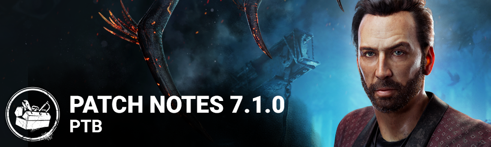

<!-- summary -->
## AI TL;DR

Nicolas Cage joins the roster as a new Survivor with the Dramaturgy, Scene Partner and Plot Twist perks, while The Onryo receives major power tweaks to Projection, Cursed Tapes and Demanifestation, and its hook-grab mechanic is removed. Bots now replace disconnected Survivors and can use the new Dramaturgy and Plot Twist perks; UI adds earlier consent pop-up, fresh character portraits and store flag visuals. Numerous killer and survivor perks (Coup de Grace, Claustrophobia, Prove Thyself, Blast Mine, Wiretap, etc.) are rebalanced, and level layouts on Fractured Cowshed, Rancid Abattoir and Coldwind Farm are adjusted. The update also bundles extensive bug fixes for map collisions, character animations, console trophies, HUD issues and achievement unlocking.
<!-- /summary -->

<!-- nav -->
&larr; [7.0.0 | PTB](389-7-0-0-ptb.md) · [Player Test Build (PTB)](../../index.md#player-test-build-ptb) · [7.2.0 | PTB](402-7-2-0-ptb.md) &rarr;
<!-- /nav -->

# 7.1.0 | PTB

## Release Schedule

PTB Begins: July 5, 11AM ET

## Important

- Progress & save data information has been copied from the Live game to our PTB servers on ***26th June 2023***. Please note that players will be able to progress for the duration of the PTB, but none of that progress will make it back to the Live version of the game.

## July Developer Update

For more detail on many of the changes in this update, check out our July Developer Update:

[https://forums.bhvr.com/dead-by-daylight/kb/articles/397](https://forums.bhvr.com/dead-by-daylight/kb/articles/397)

## Feedback & Bug Reports

Please keep any feedback and bug reports pertaining to the PTB in the correct sections. We'll be monitoring these sections throughout the test.

Feedback: [https://forums.bhvr.com/dead-by-daylight/categories/7-1-0-ptb-feedback](https://forums.bhvr.com/dead-by-daylight/categories/7-1-0-ptb-feedback)

Bug Reports: [https://forums.bhvr.com/dead-by-daylight/categories/7-1-0-ptb-bug-reporting](https://forums.bhvr.com/dead-by-daylight/categories/7-1-0-ptb-bug-reporting)

## Features

### Bots

- Disconnected Survivors will be replaced with Bots
- Added support for new perks for Bots: Dramaturgy and Plot Twist.

### UI

- Consent popup now shows earlier.
- Added new Character Portraits for Survivors and Killers.
- New visuals for Store flags (limited time items) and New Items across all menus.

## Content

### New Survivor: Nicolas Cage

**Perks:**

**Dramaturgy:** Activates while you are healthy. While running, press the Active Ability Button 2 to run with knees high for 0.5 seconds and then gain 25% Haste for 2 seconds, followed by an unknown effect (one of the following).

- Exposed for 12 seconds;
- Gain 25% Haste for 2 seconds;
- Scream, but nothing happens;
- Gain a random rare item in hand with random add-ons and drop any held item.

*The same effect cannot happen twice in a row. C*auses exhaustion for 60/50/40 seconds. Can't be used while exhausted.

**Scene Partner:** Activates when you are in the Killer's Terror Radius. Whenever you look at the Killer, scream, then see the Killer's aura for 3/4/5 seconds. *There is a chance you will scream again, if you do, you will see the Killer's aura for an additional 2 seconds. Scene Partner* then goes on cool-down for 60 seconds.

**Plot Twist:** Activates when you are injured. Press the Active Ability Button 2 while crouched and motionless to silently enter the dying state. When using Plot Twist to enter the dying state, you leave no blood pools, make no noise, and you can fully recover from the dying state. When you recover by yourself using Plot Twist, you are fully healed instantly and you gain 50% Haste for 2/3/4 seconds. *This perk deactivates if you recover by yourself by any means. The perk re-activates when the exit gates are powered.*

### Updated Killer: The Onryo

Projection:

- Projecting to a TV now applies ¾ of a stack of Condemned to all Survivors not carrying a Cursed Tape (was 1 stack to nearby Survivors).
- The time a TV is disabled after The Onryo Projects to it has been reduced to 70 seconds (was 100 seconds). This can be further reduced using Add-ons.
- The time a TV is disabled after a Survivor removes the Cursed Tape has been increased to 90 seconds (was 60 seconds).
- Projection now has a 15 second cooldown. Since there is no longer a range limit on the Condemned effect, a limit is required for how frequently this can happen.

Cursed Tapes:

- Getting hit with a Basic Attack while carrying a Cursed Tape will apply one stack of Condemned
- When a Survivor carrying a Cursed Tape is hooked, all other Survivors gain one stack of Condemned and the Tape is destroyed
- Holding a Cursed Tape no longer passively builds Condemned
- Cursed Tapes can now be placed in any TV other than the one they were retrieved from

Demanifestation:

- The Onryo can no longer be stunned while Demanifested
- Chases are prevented when Demanifested, making it more difficult to keep track of The Onryo’s position
- Demanifesting now removes Bloodlust, similar to other Killer Powers

### Hook Grabs:

Grabs from unhooking Survivors have been removed. This means that the awkward mindgame when unhooking has been eliminated, helping to improve the gameplay flow. You still aren't safe whilst unhooking however, as the Killer will still be able to hit you twice before you can escape.

### Toolbox Add-On Updates:

- Brand New Part - new functionality:
  - Toolbox Repair action is replaced with Install Brand New Part.
  - During the installation, you will be faced with a difficult Skill Check.
  - Upon succeeding the Skill Check, the generator's required charges are reduced by 10.
  - *This add-on is consumed after use*

### Killer Perk Updates:

- **Coup de Grace:**
- Each time a generator is completed, Coup de Grâce grows in power. Gain 2 tokens, with a maximum of 5 tokens at one time. Consume one token to increase the distance of your next lunge attack by 70%/75%/80%.
- **Claustrophobia:**
- Every time a generator is completed, all windows and vault locations are blocked for all Survivors for the next 20/25/30 seconds. You see the aura of the vault locations blocked by Claustrophobia for the duration.
- **Hangman's Trick → Scourge Hook: Hangman's Trick:**
- Gain a notification when someone starts sabotaging a hook. While carrying a Survivor, see the aura of any Survivor within 8/9/10 meters of a scourge hook.
- **Territorial Imperative:**
- Unlocks potential in one's aura reading ability. Survivors' auras are revealed to you for 4/5/6 seconds when they enter the basement and you are more than 24 meters away from the basement entrance. *Territorial Imperative* can only be triggered once every 45 seconds.
- **Remember Me:**
- Each time your Obsession loses a health state, gain a token. Each token increases the opening time of the exit gates by 6 seconds up to a maximum of 12/18/24 additional seconds. The obsession is not affected by *Remember Me*.
- **Hex: Crowd Control:**
- The Entity blocks a window for 40/50/60 seconds after a Survivor performs a rushed vault through it. *The Hex effects persist as long as the related Hex Totem is standing.*
- **Trail of Torment:**
- After kicking a generator, you become Undetectable until the generator stops regressing. During this time, the generator's yellow aura is revealed to survivors. This effect can only trigger once every 80/70/60 seconds.

### Survivor Perk Updates:

- **Prove Thyself:**
- For every other Survivor working on a generator within a 4 meter range, gain 6%/8%/10% repair speed bonus. This same bonus is also applied to all other Survivors within range. Survivors can only be affected by one Prove Thyself effect at a time.
- **We're Gonna Live Forever:**
- Adjusted description to indicate that it works for ALL blinds, not just flashlights.
- **Blast Mine:**
- Blast Mine activates after completing a total of 50% worth of repair progress on generators. After repairing a generator for at least 3 seconds, press the *Active Ability Button 1* to install a trap which stays active for 100/110/120 seconds. Affected generators will be revealed to all Survivors by a yellow aura. Only one trap can be active on a generator. When the Killer kicks a trapped generator, the trap explodes, stunning them and blinding anyone nearby. Blast Mine is then deactivated.
- **Wiretap:**
- *Wiretap* activates after completing a total of 50% worth of repair progress on generators. After repairing a Generator for at least 3 seconds, press the *Active Ability Button 1* to install a spy trap, which stays active for 100/110/120 seconds. Affected generators will be revealed to all Survivors by a yellow aura. Only one trap can be active on a generator. When the Killer enters within 14 meters of the trapped generator, their aura is revealed to all Survivors. Damaging the generator destroys the trap.
- **Saboteur:**
- See hook auras in a 56-meter radius from the pickup spot if a Survivor is being carried. Scourge Hooks are shown in yellow. Unlocks the ability to sabotage hooks without a toolbox. Sabotaging a hook without a Toolbox takes 2.3 seconds. The sabotage action has a 70/65/60-second cooldown.
- **Clairvoyance:**
- Clairvoyance activates whenever you cleanse or bless a Totem. When empty-handed, hold the Ability button to unlock your full aura-reading potential. For up to 8/9/10 seconds, you see the auras of exit gate switches, generators, hooks, chests and the Hatch within a 64-meter range.
- **Breakout:**
- When within 5 meters of a carried Survivor, you gain the Haste status effect, moving at 5%/6%/7% increased speed. The carried Survivor’s wiggle speed is increased by 25%.
- **Buckle Up:**
- While healing a Survivor in the dying state, you both can see the Killer's aura. When completing healing a Survivor from the dying state to injured, both you and the healed Survivor gain Endurance for 6/8/10 seconds.
- **Smash Hit:**
- After stunning the Killer with a pallet, break into a sprint at 150% your normal running speed for 4 seconds. Causes the Exhausted status effect for 30/25/20 seconds. This perk cannot be used while Exhausted.
- **Spine Chill:**
- Get notified when the Killer within a 36-meter range. If the Killer is within range and is looking at you with a clear line of sight, your speed while repairing, sabotaging, healing, unhooking, cleansing, blessing, opening exit gates and unlocking is increased by 2%/4%/6%. The effects of *Spine Chill* linger for 0.5 seconds after the Killer looks away or is out of range.

### Killer Tweaks

**The Executioner:**

- If he comes within 10 meters of a cage, it will disappear and reappear elsewhere on the map (used to be 5).

**The Spirit:**

- Mother-Daughter Ring - the movement speed bonus has been reduced to 25% (was 40%)
- Dried Cherry Blossom - the Killer Instinct range of Dried Cherry Blossom has been reduced to 3 meters (was 4 meters)
- Yakuyoke Amulet, Shiawase Amulet and Kaiun Talisman - these Add-ons will no longer cause Yamaoka’s Haunting to recharge faster
- Origami Crane - Origami Crane now increases the recovery rate of Yamaoka’s Haunting by 20% (was 10%)
- Rusty Flute - Rusty Flute now increases the recovery rate of Yamaoka’s Haunting by 40% (was 25%)

**The Hag:**

- Waterlogged Shoe - the movement speed boost has been increased to 7.5% (was 4.5%)
- Mint Rag - the teleport cooldown has been reduced to 10 seconds
- Half Egg Shell and Cracked Turtle Egg - Half Egg Shell now increased Phantasm Trap duration by 45% (was 30%), and Cracked Turtle Egg now increases Phantasm Trap duration by 55% (was 35%)

### Level Design

- Rebalance on the Fractured Cowshed and Rancid Abattoir maps
  - Modified the layout of the map
  - Modified the main building access
- Globally changed the content on the Coldwind Farm Realm including more gameplays in the fence tiles
- Coldwind Farm Realm has received updated the corn tiles with added detail

## Bug Fixes

- Fixed an issue where blockers would prevent players from navigating in the Mothers Dwelling map
- Fixed an issue in the Raccoon City Police Station where zombies would get stuck
- Fixed an issue where a survivor would clip through the doors of a locker in the Torment Creek map
- Fixed an issue in the Fractured Cowshed where the Clown's gas clipper through the walls
- Fixed a collision issue on the Torment Creek Map
- Fixed a collision issue around the barn in the Fractured cowshed map
- Fixed an issue where shows wrong error message of "Host unreachable".
- Fixed an issue where shows corrupted data error popup unproperly.
- Fixed an issue that caused loadout sometimes are equipped in Trials when all Match Management settings are set to None in custom game.
- Tentatively fixed an issue that some players aren't able to unlock Adept achievements when meeting the requirements.

## Bots

- Fixed an issue where bots keep getting caught in the same trap if a pallet is not broken.
- Fixed an issue that cause survivor bots repeatedly restart the use of their flashlight when attempting to Blind a Killer.

## Console

- Fixed an issue that caused trophies to not get updated properly when changing device of PS4 or PS5.
- Fixed an issue where Auric Cells expired at an incorrect time in Japan on Xbox.
- Fixed an issue that caused the trial to be seen when entering tally screen by disconnecting the controller, waiting a short time then reconnecting.
- Fixed an issue that cause Attack on Titan charms to not being given on Switch.
- Tentatively fixed an issue which caused error 8,001 happens on Windows Store.
- Fixed an issue which caused the subtitle "On" setting to be disabled when restarting the game.

## Characters

- Fixed an issue that caused many killers to not follow the rule of looking down after successfully hitting a survivor.
- Fixed an issue that caused some killers to not follow the rule of looking down when damaging a generator.
- Fixed an issue that caused Ghost Face to fail to play the attack animation and instead play the standing-up animation when performing a basic attack while crouched.
- Fixed an issue that caused The Clown's Afterpiece bottle in his left hand to become invisible during the reload animation when reloading bottles as The Clown.
- Fixed an issue that caused the VHS tape model to remain in Survivors' hands even after they inserted it into a TV.
- As The Wraith, the lingering undetectable status effect icon is correctly displayed when Uncloaking with "The Ghost - Soot" add-on equipped
- The Knight has a more robust strategy to prevent becoming stuck in Orb Patrol on top obstacles
- Survivors no longer get stuck with a Lament Configuration when they get downed while picking it up
- The HUD no longer can disappear after triggering the Shape's standing mori
- The Demogorgon's Shred is no longer cancelled when pressing the Esc key
- When throwing an Afterpiece Antidote close to an obstacle, the emanation will no longer incorrectly become an Afterpiece Tonic.
- The charge bar now correctly visibly depletes on Items dropped by Franklin's Demise until the player leaves and returns to the dropped item
- Skill Checks which hit the edge of the success zone during the Merciless Storm are no longer handled as fails
- Survivors can no longer see the Red Stain or hear the Terror Radius when the Demogorgon uses a portal
- The Deathslinger's projectile is no longer cancelled when a survivor performs a rushed action
- The Black Ward now works correctly when controlling Victor at the end of the trial
- Adept achievements are now correctly unlocked in all cases when meeting the requirements
- The Medkit bonus progression on a great skill check now have the correct values
- When Wesker performs a Virulent Bound on a fully-infected survivor vaulting a pallet or window, the survivor will no longer incorrectly be grabbed and slammed
- Hex: Face The Darkness no longer incorrectly affects Survivors on hooks
- The Hindered Status effect from the "Waterlogged Shoe" Hag add-on no longer persists indefinitely when two Survivors trigger the Phantasm Trap and remain inside the radius
- The Cannibal no longer takes too long to reach maximum max speed when using the Carburetor Tuning Guide
- The Nurse can no longer start holding the Killer Power button when a Blink is not currently charged to be able to Blink once it becomes charged
- The Shape is no longer returned to level 1 of Evil Within if someone disconnects during the standing mori

## UI

- Fixed an issue where the loadout page is reset when the host changed the match management setting.
- Fixed an issue which prevented adding a 4th bot due to player lists overlapping the button.
- Fixed an issue where icons that should not be visible are visible while observing other players.
- Fixed an issue where the challenge tracker is dismissed too fast.
- Fixed an issue where the currency tooltip is behind survivor names in the lobby.

<!-- nav -->
&larr; [7.0.0 | PTB](389-7-0-0-ptb.md) · [Player Test Build (PTB)](../../index.md#player-test-build-ptb) · [7.2.0 | PTB](402-7-2-0-ptb.md) &rarr;
<!-- /nav -->
