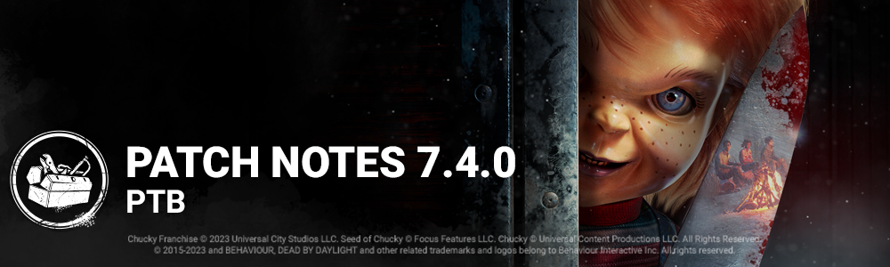

<!-- summary -->
## AI TL;DR

The Good Guy arrives as a new Killer with Normal and Hidey-Ho modes, a fixed overhead camera, fading footprints and abilities to become invisible, sprint with a Slice & Dice charge, and scamper through pallets, plus three unique perks. The Trickster receives speed, recoil, and blade-throw upgrades along with major Main Event rebalancing and several add-on tweaks. Mother’s Dwelling, The Temple of Purgation and The Garden of Joy are resized for consistent navigation, and FSR 1.0 support launches across all platforms. A new Player Profile screen shows level, grades and customizable cards, while extensive audio, bot, character, map, perk, UI and crash fixes polish the PTB experience.
<!-- /summary -->

<!-- nav -->
&larr; [7.3.0 | PTB](410-7-3-0-ptb.md) · [Player Test Build (PTB)](../../index.md#player-test-build-ptb) · [7.5.0 | PTB](428-7-5-0-ptb.md) &rarr;
<!-- /nav -->

# 7.4.0 | PTB

## Important

- Progress & save data information has been copied from the Live game to our PTB servers on ***Oct 30***. Please note that players will be able to progress for the duration of the PTB, but none of that progress will make it back to the Live version of the game.

## Content

### New Killer - The Good Guy

#### Killer Power

The Good Guy has two separate modes he can switch between; Normal Mode and Hidey-Ho Mode. Due to his short height, The Good Guy also has a fixed third-person camera positioned above and behind him, giving the player a better view of his surroundings. He is also much shorter than other Killers making him very stealthy, however he leaves fading footprints behind as he walks.

#### Special Ability: Hidey-Ho Mode

Press the Active Ability button to enter Hidey-Ho Mode for 14 seconds. While in this mode, the Killer has no Terror Radius, and "distraction" footprints and audio are spawned all across the map.

#### Special Attack: Slice & Dice

While in Hidey-Ho Mode, press and hold the Special Attack button to charge up a Slice & Dice Attack. When charged, sprint forward at high speed, triggering an attack at the end (or whenever the Special Attack button is released).

#### Special Ability: Scamper

While in Hidey-Ho Mode, when you are near a vault or pallet, press the Interaction button to scamper through it quickly without breaking it.

#### Perks

- **Hex: Two Can Play**
- Anytime you are stunned or blinded by a Survivor 4/3/2 times, if there is no Hex Totem associated with this Perk, a Dull Totem becomes a Hex Totem. While the Hex Totem stands, Survivors who stun or blind you get blinded for 1.5 seconds.
- **Friends 'Til the End**
- When you hook a Survivor that is not the Obsession, the Obsession becomes exposed for 20 seconds and reveals their aura for 6/8/10 seconds. When you hook the Obsession, another random Survivor screams and reveals their position and becomes the Obsession.
- **Batteries Included**
- When within 12 meters of a completed Generator, you have 5% Haste. The movement speed bonus lingers for 1/3/5 seconds when you are no longer in range.

### Killer Updates - The Trickster

- Movement speed increased from 4.4 m/s to 4.6 m/s.
- Removed recoil for throwing knives.
- Blade-ready movement speed: removed per-throw movement speed reduction.
- Increase the blade throw speed.
- Increase laceration meter from 6 to 8.
- Main Event Updates:
  - Decrease the number of Blades required to access Main Event from 30 to 6 Blades.
  - Decrease Main Event duration from 10 sec to 5 sec.
  - Pressing the Active Ability button within 0.3second of activating Main Event does not cancel it.
  - Add 0.5second to the next Main Event for each combo score level reached.
  - Combo Score Levels (consecutive hits with thrown blades increases the combo):
    - E: base time + 0.5 sec
    - D: base time + 1 sec
    - C: base time + 1.5 sec
    - B: base time + 2 sec
    - A: base time + 2.5 sec
    - S: base time + 3 sec

### Trickster Add-on Updates

- **Memento Blades**
- Increases throw speed by 5% *(new functionality)*
- **Inferno Wires**
- Increases duration of *Main Event* by 40% *(was 25%)*
- **Ji-Woon's Autograph**
- Decreases the number of Blades required to reach Main Event by 1 *(new functionality)*
- **Tequila Moonrock**
- Increases duration of *Main Event* by 60% *(was 50%)*
- **Fiz-Spin Soda**
- Decreases the number of Blades required to reach Main Event by 2 *(new functionality)*
- **Waiting for You to Watch**
- Increases the duration of *Main Event* by 0.25 second for each Blade hit while it is active *(was 0.4 seconds)*
- **Iridescent Photo Card**
- For each consecutive Blade hit, gain a stackable \[1\]% Haste status effect, up to a maximum of \[7\]%. This bonus is lost when missing a Blade or when putting a Survivor into the dying state. *(new functionality)*

### Perk Updates

- **Made For This**
- This perk activates while you are in the injured state. after you finish healing another Survivor, gain the endurance status effect for 6/8/10 seconds. While affected by Deep Wound, you run 3% faster. *(added deep wound condition for haste effect)*

### Map Updates

The largest Maps in the game, **Mother's Dwelling** and **The Temple of Purgation** of the Red Forest Realm, have been reduced in size. This will help both roles enjoy a play area that is consistent with the other maps. While we were making adjustments to the Red Forest Realm, we also did a pass on the gameplay of the tiles and improve the navigation and the readability of the map.

**The Garden of Joy** also benefited from a gameplay pass. The house has been revisited to find a better combination of obstacles and reduce the strength of some of the windows. A pass on the tiles has also been done, since the visibility was making it hard for players to enjoy a better navigation in the map and bring the focus on the chase, loops and all interactions. The Killer Shack was also very crowded around the walls and made the collisions known through all realms hard to run consistently, we have cleared the area.

## Features

### Graphics Update

- Added support for FSR 1.0 on all platforms.

### Player Profile and Customizable Player Cards

Players can now expect to find their level and grades on a new screen - their Player Profile! Select the badge in the top right (of most menus) to open it.

Players now have a Player Card in the Profile screen and can earn collectable banners and badges to customize it! New banners and badges come in a variety of rarities and appearances and can be earned from Tome and Archive rewards as well as Events. Players will be able to see their new customized player cards in a variety of menus including the end-of-match tally screen where they can show them off to other players.

*Note: during PTB, players will only have access to the default "empty" badge and banner.*

## Bug Fixes

### Audio

- Specific voice lines' subtitles should now match the audio more accurately.
- Fixed an issue that caused the sound to be missing when switching back in a disabled pod as The Singularity.
- Survivor's screams are now properly being stop during The Knight's Mori.

### Bots

- Bots are better at handling the Undetectable status of a Killer.
- Bots no longer struggle to repair a Generator on a specific tile on The Game.
- Fixed multiple crashes that could occur when playing with Bots.
- Bots in the Tutorials have been slightly nerfed to improve new player experience.
- Bots have figured out how to access a particular corridor of the Hawking National Laboratory.
- Bots have figured out how to access a particular corridor of the Raccoon City Police Station.
- Bots have figured out how to fall off a specific ledge on Lampkin Lane.
- When a Killer approaches while being healed by another player, Bots are now more willing to run away.

### Characters

- Fixed an issue that caused the animation for grabbing a Survivor from a Locker to not play properly when playing as The Nurse in a Trial.
- Fixed an issue that caused Mikaela Reid's book to appear broken during menu idle animation.
- The Undetectable icon is now correctly displayed when Michael Myers is in Tier 1 of Evil Within.
- When The Singularity switches back to a disabled pod, the residual sounds now play correctly.
- VFX for The Knight's power is now no longer spawned in the corner of certain maps.
- The survivor activity HUD now correctly shows a survivor has escaped when escaping after having been marked by Ghostface.
- Pools of blood hidden when The Spirit begins charging a Phase Walk will reappear if cancelling or exiting the Phase Walk
- The Doctor's Illusionary Red Stain is no longer visible on a survivor after being mori'd
- The Xenomorph's Control Stations no longer incorrectly block flashlight beams
- The Cenobite cannot target a Survivor with more chains once they have started solving the Lament Configuration
- The Cenobite's Chain Hunt is no longer reset when Survivors are interrupted during certain actions
- The Ghost Face and The Pig can now remain crouched when activating Hex: Pentimento
- The Nightmare is no longer able to set Dream Snares across walls or out of bounds
- As The Clown, swapping bottles while one is thrown no longer changes the type of the thrown bottle
- The effects of the Unicorn Block and Sheep Block no longer only apply to one affected Survivor

### Environment/Maps

- Fixed an issue where players would not be able to interact with one side of a Generator in the Hawkins National Laboratory.
- Fixed an issue where The Hag could place her traps in illegal areas of the Suffocation Pit main building.
- Fixed an issue where the Killer's navigation would get blocked on the Suffocation Pit map.
- Fixed an issue where The Nightmare was not able to place Dream Snares in a section of the Suffocation Pit main building.
- Fixed an issue where the dark mist would not appear properly in the Raccoon City Police Department.
- Fixed an issue in Eyrie of Crows where an extended collision would block the players navigation.
- Fixed an issue where The Pig could not pick up a Survivor near a Jigsaw Box in Midwich Elementary School.

### Perks

- The Hooked Survivor is now correctly able to see the aura of the killer when the Kindred perk is equipped
- The Dramaturgy Perk is no longer incorrectly displayed as available when vaulting a window with the Sprint Burst Perk equipped.
- When a Survivor breaks a Pallet due to the Dissolution Perk, the Thwack! Perk is no longer triggered
- The Blast Mine perk's explosion now correctly deafens the killer who triggers it, instead of the Survivor who installed
- The Perks Ultimate Weapon and Darkness Revealed are no longer incorrectly activated when a Survivor interacts with a Locker that has a Survivor in it

### Platforms

- Fixed an issue with purchasing Auric Cells on the Microsoft Store version of the game.
- Fixed a crash that could occur on PS5 while in menus.

### UI

- Buying a node on the Bloodweb for an "item" that is part of the active preset right before the beginning of a match will lead to that "item" to being correctly consumed and shown on the Tally screen.
- Legendary Cosmetics Killers with a unique name (such as The Trapper's Naughty Bear) will now have that name correctly display across all menus.
- Players can switch between Archives visual lore entries while in fullscreen.

### Misc

- Killswitched Cosmetics can no longer be brought into a Trial.
- Fixed a crash that could occur when starting a Trial with an empty loadout.
- After the Pocket Mirror disappears upon crossing the exit gates, an item taken from a chest during the Trial now correctly appears in the survivor’s hand.
- Hooks previously shown in a loud noise notification bubble no longer appear in subsequent loud noise notifications.
- A recently hooked survivor will now no longer see their hook obscuring a completed generator's loud noise notification.
- Survivors now receive Blood Points when being interrupted from searching a chest
- Survivors can no longer activate the Glass Bead map Add-on without cooldown
- Dismantle achievement now correctly gains progress with Breakdown's trigger.
- Performing a fast vault immediately after falling from an elevated footing will no longer cancel the fall stagger
- When carrying a Survivor as any Killer, the "Carrying Survivor" icon no longer blocks the button prompt for the drop action.
- A pallet's break animation is now correctly in sync when broken by a Killer having the Orange Glyph status effect
- The Green glyph now spawns correctly after the requirements for the "Glyph Pursuer" Challenge are completed
- A Survivor's right arm no longer appears unnaturally bent when performing a self-unhook while holding certain items
- When the Killer disconnects, Survivors no longer start running in place before reaching the tally screen.

## Known Issues

- Survivors can stay on the floor until the end of the pickup animation when picked up by The Good Guy

<!-- nav -->
&larr; [7.3.0 | PTB](410-7-3-0-ptb.md) · [Player Test Build (PTB)](../../index.md#player-test-build-ptb) · [7.5.0 | PTB](428-7-5-0-ptb.md) &rarr;
<!-- /nav -->
