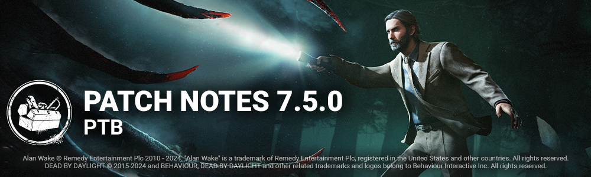

<!-- summary -->
## AI TL;DR

7.5.0 PTB introduces a new Field-of-View slider for killers (except The Good Guy) and revamps the generator system by capping regression events at eight per generator, adjusting kick regression rates and changing Hex: Ruin behavior. New survivor Alan Wake joins with three original perks, while The Hillbilly receives faster Chainsaw Sprint, reduced cooldowns and new Overdrive scores, and The Onryo gets an extended Demanifested invisibility, removed cooldowns and revamped VHS tape mechanics. Mount Ormond’s layout is refined for better loops. The build also ships extensive bug fixes covering character interactions, animation, audio, map collisions, bot AI, UI/UX and perk functionality.
<!-- /summary -->

<!-- nav -->
&larr; [7.4.0 | PTB](419-7-4-0-ptb.md) · [Player Test Build (PTB)](../../index.md#player-test-build-ptb) · [7.6.0 | PTB](435-7-6-0-ptb.md) &rarr;
<!-- /nav -->

# 7.5.0 | PTB

## Important

- Progress & save data information has been copied from the Live game to our PTB servers on **2nd January**. Please note that players will be able to progress for the duration of the PTB, but none of that progress will make it back to the Live version of the game.

## Developer Update

[https://forums.bhvr.com/dead-by-daylight/kb/articles/427](https://forums.bhvr.com/dead-by-daylight/kb/articles/427)

## Accessing the PTB

[https://forums.bhvr.com/dead-by-daylight/kb/articles/358-ptbs](https://forums.bhvr.com/dead-by-daylight/kb/articles/358-ptbs)

## Features

### Field of View Settings

There is a new settings option in DbD! Players now have the ability to adjust their FOV, or field-of-view, with a slider in the Settings Menu. This allows players with a first-person-camera (killers, with the exception of The Good Guy) to adjust their field-of-view, reducing motion-sickness and other accessibility issues. This feature is initially in the Beta Tab while we allow for thorough testing."

#### FOV Perk Updates

- **Shadowborn**
- When blinded by any means, gain a 6/8/10% Haste status effect for 10 seconds *(new functionality)*
- **Monitor and Abuse**
- While in a chase, your terror radius is increased by 8 meters. Otherwise, your terror radius is decreased by 8 meters *(FoV clause was removed)*

### Generators System Update

The 3-gen strategy (identifying the closest 3 generators and defending only them) has become very strong, especially on certain killers. This can lead to very long games and frustrations. To help prevent such situations, the following now applies:

- Each generator can only suffer 8 regression events maximum
- After the max has been reached on a generator, that generator can no longer be regressed by the Killer (including kicks, addons, and perk-related regressions)
  - Number of regressions per generator is indicated by increasing VFX after 3 or more regression events
  - Gens at max regression events cannot regress by the Killer (including kicks, addons, and perk-related regressions)
- Survivors failing skill checks still regress generators normally and do not count as regression events
- Killer kick regression is increased from 2.5% to 5%
- "Gen tapping" is no longer possible. To stop a generator from regressing, a Survivor must repair 5% of the generator
  - Regression does not occur while repairs are in progress

#### Perks Affected

- **Hex: Ruin**
  - All generators are affected by *Hex: Ruin*. While a generator is not being repaired by a Survivor, it will immediately and automatically regress repair progress at 50%/75%/100% of the normal regression speed. *(no longer deactivates when a survivor is killed)*
- **Surge** and **Scourge Hook: Pain Resonance**
  - *Does not create a loud noise notification if no progress is lost on the generator*
- **Oppression**
  - *Only causes a regression event on the generator that was kicked*
- **Overcharge**
  - *Only the initiating kick counts as a regression event*

## Content

### New Survivor - Alan Wake

Dead by Daylight welcomes a new famous survivor into the fog - Alan Wake!

#### Perks

- **Champion of Light**
- While you are holding a flashlight, this perk activates. When you are shining a flashlight, you have 50% Haste. When you successfully blind the Killer, they also gain 20% Hindered for 6 seconds. This effect cannot stack with itself. Then, this perk goes on cool-down for 80/70/60 seconds.
- **Boon: Illumination**
- Press and hold the *Ability button 1* near a Dull or Hex Totem to bless it and create a Boon Totem. Soft chimes ring out in a 24 meter range. Survivors inside your boon totem’s range see the aura of all chests and all generators in blue. If you have a lit boon totem, you cleanse or bless totems 6/8/10% faster. You can only bless one Totem at a time. All equipped boon perks are active on your Boon Totem.
- **Deadline**
- This perk activates when you are injured. Skill Checks appear 6/8/10% more frequently when repairing or healing and appear in random places. The penalty for missing skill checks is reduced by 50%.

### Killer Update - The Hillbilly

#### Killer Power

Press and hold the Power button to break into a Chainsaw Sprint. Survivors hit during a Chainsaw Sprint are put into the dying state. Revving the chainsaw, and sprinting with the chainsaw each cause the Overdrive meter to increase. The meter decreases when the chainsaw is not in use. When the meter is full, the chainsaw goes into Overdrive.

#### Base changes

- Increased Chainsaw Sprint movement speed to 10.12 m/s *(was 9.2 m/s)*
- Decreased the Chainsaw hit cooldown to 2.7 seconds *(was 3 seconds)*
- Decreased the Chainsaw miss cooldown to 2.5 seconds *(was 3 seconds)*
- Increased movement speed during the Chainsaw miss cooldown to 2.3 m/s *(was 1.38 m/s)*
- Decreased the size of the Chainsaw's collision to improve navigation during a Chainsaw Sprint
- Disconnected the Chainsaw's sensitivity from controller sensitivity
  - Baseline sensitivity was set to 100% of the controller sensitivity

#### Special State: Overdrive

While in Overdrive, the chainsaw is enhanced. Chainsaw Charge and Sprint speeds are increased, and Chainsaw Sprint cooldowns are reduced. Overdrive lasts for 20 seconds.

#### Base Overdrive stats

- Chainsaw charge speed increased by 5%
- Chainsaw Sprint movement speed increased to 13 m/s
- Chainsaw cooldowns reduced by 10%

#### Misc.

- Added a new loading tip regarding the Overdrive meter
- Added new score events when using the Chainsaw:
  - Curve: When turning a minimum of 80 degrees within 1 second of using the Chainsaw
  - Curve Hit: When hitting a Survivor with the Chainsaw within 2 seconds of getting the Curve score event
  - Overdrive: When Overdrive triggers
  - Overdrive Hit: When hitting a Survivor with the Chainsaw when in Overdrive mode
  - Sprinter: When performing a Chainsaw Sprint that is 4 seconds or longer
  - Sprint Hit: When hitting a Survivor with the Chainsaw after travelling more than 32 meters

### Killer Update - The Onryo

#### Demanifested State

- While Demanifested:
  - The Onryo can gain Bloodlust as usual
  - The Onryo can enter chases as usual
- When Demanifesting:
  - Bloodlust is no longer lost
- Increase Demanifested state invisibility duration from 1 to 1.2 second

#### Killer Power

- Cooldown from previous update removed
- Condemned gained from teleports increased to 1 full stack
- Teleporting applies Condemned to Survivors within 16 meters of the TV where The Onryo projected or any other powered TV
- Powered TVs:
  - Now have VFX showing range at all times (when powered)
  - Are revealed to Survivors within 16 meters
- Hooking a Survivor locks in their Condemned progress, making it impossible to remove

#### VHS Tapes

- No longer grant protection from gaining Condemned
- Survivors no longer gain Condemned if hit while holding a tape
- Survivors no longer lose their tape when attacked
- Survivors must bring their tape to the furthest TV
  - Highlighted in yellow
- Retrieving a tape now takes 1 second *(was 2)*
- Inserting a tape in a TV now takes 1 second *(was 2)*

#### Addons

- **Videotape Copy**
- Increases the range at which Survivors gain Condemned from Projection by 2 meters *(new functionality)*
- **Reiko's Watch**
- Increases the invisibility duration while Demanifested by 25% *(was 33%)*
- **Ring Drawing**
- When hooking a Survivor carrying a tape, other Survivors gain 1 Condemned stack *(new functionality)*
- **Tape Editing** **Deck**
- Each Survivor starts the trial with a tape in their possession, and their target TV is the furthest from their location *(no change)*
- Survivors that insert their tape are revealed for 6 seconds *(new functionality)*
- **Iridescent Videotape**
- Projection does not turn off TVs, and does not apply Condemned *(new functionality)*
- TVs turned off by Survivors take 20% longer to turn back on *(new functionality)*

### Killer Addon Updates - The Blight

- **Blighted Rat**
- Increases Rush speed by 2% for each consecutive Rush *(was 4%)*
- **Blighted Crow**
- Increases Rush speed by 3% for each consecutive Rush *(was 6%)*
- **Adrenaline Vial**
- Increases maximum Rush tokens by 2.
- Increases maximum Rush look angle by 20 degrees.
- Decreases Rush turn rate by 55%.
- *(adjusted functionality)*
- **Alchemist's Ring**
- Increases Rush duration by 20% for each consecutive Rush *(new functionality)*
- **Compound Thirty-Three**
- Increases Rush turn rate by 33% for each consecutive Rush that travels at least 4 meters *(new functionality)*
- **Iridescent Blight Tag**
- Enables Rush to be performed without spending tokens.
- Rush bonuses are capped after 3 consecutive rushes.
- Blighted Corruption goes on cooldown for 20 seconds after a successful Lethal Rush attack.
- *(new functionality)*

### Perk Updates

- **Quick Gambit**
- When you are chased by the Killer, see the auras of gens within 36 meters.
- Survivors working on highlighted generators receives a 3/4/5% speed boost to the repair action.
- *(new functionality)*
- **Save the Best for Last**
- You become obsessed with one Survivor.
- Earn a token for each successful basic attack that is not dealt to the obsession.
- Each Token grants a stackable 4% *(was 5%)* decreased successful basic attack cooldown, you can earn up to 6/7/8 tokens. *(was 8 tokens)*
- When the Obsession loses a health state by any means, lose 2 tokens. You cannot gain tokens as long as the Obsession is sacrificed or killed. *(adjusted damage source and tokens lost)*
- **Grim Embrace**
- Each time a Survivor is hooked for the first time, gain a token, then when you leave a 16 meter range of that hook, all generators are blocked for 8/10/12 seconds. *(new functionality)*
- Upon reaching 4 tokens, when you leave a 16 meter range of that hook, The Entity instead blocks all generators for 40 seconds. The Obsession's aura is revealed to you for 6 seconds. *(Increased times, added proximity clause)*
- Then, this perk deactivates.

### Maps

- **Mount Ormond updates**

We made some changes to the map. The layout and main building stays the same, but we decided to address the fact that the front of the Building representing an entrance, had no gameplay or interesting loop. It was a big pile of rocks and not much else. So we went through to update the gameplay and make it more fluid and fitting with the loops and to actually add gameplay. The art team went through as well to make things look nice.

In the back of the building we had a couple of tiles that were simple loops, but that didn't have interesting gameplay, we went around to update this and improve the quality there as well.

## Bug Fixes

### Archives & Events

- Fixed an issue where the "Back-to-Back" Survivor Master Challenge would void completed progress if the Survivor later succeeded on a good skill check or failed any skill check in the same match.

### Characters

- Fixed an issue that caused The Left Arm of the Naughty Bear to appear broken when placing down a Bear Trap.
- The Trapper can now pick up Bear Traps rightg after placing them without having to first move away.
- The Blight’s power no longer starts to recharge during the Rush cooldown animation.
- Fixed an issue that caused the screen to turn black after teleporting to the Lament Configuration when spectating The Cenobite.
- The Nemesis’ Zombies now lose collision after infecting a survivor to prevent being unable to leave the area and getting hit a second time.
- The Knight can now start an order on a Survivor’s position.
- Survivors now cough and scream when exiting a locker or vaulting into one of The Clown’s Afterpiece Tonic clouds.
- Fixed an issue that caused Survivors to be teleported to a random part of the map after landing on one of The Hag’s Mud Phantasms.
- The Drop Pallet interaction now has priority over Crush Victor when a Survivor is near a Pallet with The Twins’ Victor on their back.
- The Executioner can now properly create a Torment Trail when going up stairs.
- The Mastermind can no longer change the final direction in which a Survivor grabbed by Virulent Bound is thrown by moving the camera during the Bound.
- The Nurse can now buffer blinks during her Fatigued state.
- The Cenobite can no longer see hiding Survivors when passing through Lockers when teleporting to a Gateway.

### Animation

- Fixed an issue that caused some animations to be missing for female Survivors when repairing one side of a generator.

### Audio

- Fixed issues where menu sounds were not playing correctly.
- Fixed an issue where the perk "Territorial Imperative" did not triggered the sound.
- Fixed an issue where survivors did not scream or cough if they slow vault or exit a locker while inside the Clown's Afterpiece tonic.
- Fixed issues where the sounds of the tab in the Friends menu were not playing.
- Fixed an issue where the sound when the player clicked ready in the custom game lobby was not playing.

### Bots

- Bots now seek to solve Condemn using a percentage of non-locked condemn stacks.
- Bots now close Televisions at a distance of 16m to their generator in all difficulties.
- Bots can use Blast Mine, Wiretap and Repressed Alliance without issue.
- Bots no longer reveal Ghostface without looking in his direction while outside of chase.
- Bots now avoid running directly into the map corner.
- Bots are now affected by Darkness and don't detect a Killer beyond the visible range through their Sight sense.
- Bots now have a reaction time to attacks depending of Killer and bot difficulty level.
- Bots are in general more brave while doing objectives, especially if the Killer is already busy in a chase.

### Environment/Maps

- Fixed an issue in Red Forest where the front side of the Generator on top of the hill was not accessible to players.
- Fixed an issue in the Treatment Theatre where the items are clipping in the ground.
- Fixed an issue in Underground Complex where the Xenomorph Tail attack gets blocked.
- Fixed an issue in the Treatment Theatre where players could not interact on one side of a Generator.
- Fixed an issue in the Lampkin Lane where the player would get stuck after leaving the repair of a Generator behind a house.
- Fixed an issue in the Garden of Joy where items could be hidden under the ground.
- Fixed an issue where The Underground Complex was missing in the Match Management of Custom Game mode.
- Fixed issues in the Mount Ormond Resort where foliage was clipping through multiple chests.
- Fixed an issue in the Mount Ormond Resort where there were some seams visible on the ground of the shack.
- Fixed an issue in the Mount Ormond Resort where a plan was clipping inside a mazewall mesh.
- Fixed an issue in the Mount Ormond Resort where a chest was clipping with a fence.
- Fixed an issue in the Mount Ormond Resort with the collision around the snowcat.
- Fixed an issue in the Mount Ormond where the end game collapse failed to appear on the stairs of the chalet.
- Fixed an issue in the Mount Ormond where a chest was clipping with a rock.
- Fixed an issue in the Mount Ormond where survivors could climp rocks leading up the hill.
- Fixed an issue in the Mount Ormond with the windows of the chalet level of detail popping.
- Fixed an issue in the Mount Ormond with the snowpiles level of details had to be adjusted.
- Fixed an issue in the Mount Ormond where some part of a tree was missing.
- Fixed an issue in the Mount Ormond where a tree was removed because it was too low quality.

### Gameplay

- Fixed an issue that may cause a Toolbox that was previously equipped by another Survivor to hold inifinte charges.

### Perks

- Fixed an issue that caused the audio cue to not always play when a Survivor enters the Basement when equipped with the Territorial Imperative perk.
- Fixed an issue that caused the Survivor to scream even when trapped in a Bear Trap after using the Dramaturgy perk.
- Decisive Strike now properly triggers when grabbed by the Mastermind’s Virulent Bound.
- Open Handed now increases Empathic Connection’s aura reading range.
- Going into the dying state with Plot Twist perk while holding the Lament Configuration no longer causes it to be solved.

### UI

- Fixed an issue where a popup message displays an option to buy Auric Cells when the item cannot be purchased with Auric Cells.
- Fixed an issue where the menu buttons when selecting a survivor appear too small in the custom game lobby.
- Fixed an issue where the reward node status was not updated when collecting it.
- Fixed an issue where FSR SHARPNESS appears 1% lower when reopening the option after increasing it.
- Fixed an issue where character info can be opened during the offering screen.
- Fixed an issue that caused the hook vignette to remain visible on screen in smaller scale while Survivors are being sacrificed.
- Fixed an issue that caused Survivors to be sacrificed a little before the End Game Collapse’s progression bar becomes empty.
- Fixed an issue that caused the Blight’s Rush input prompt to flicker when looking up.
- Fixed an issue that caused the Demogorgon’s Open Portal bar to remain white when equipped with the Rat Tail Add-On.
- Fixed an issue that caused the progress bar of nearby Generators, Totems or Chests not to be displayed when equipped with a Key or Map.

### UX

- When the Skull Merchant's drones cannot detect you as a Survivor, their beams lighter in appearance and color. Change only seen by the Survivor that will not be detected.
- The viewport is now constrained when controlling a Biopod as The Singularity with the 16:9 Aspect Ratio option activated.
- Targeting a Biopod when multiple are lined up no longer requires aiming a little below the desired pod.

**Known Issues**

- The Knight remains disabled due to an ongoing issue
- The Perk Nowhere to Hide is also disabled

<!-- nav -->
&larr; [7.4.0 | PTB](419-7-4-0-ptb.md) · [Player Test Build (PTB)](../../index.md#player-test-build-ptb) · [7.6.0 | PTB](435-7-6-0-ptb.md) &rarr;
<!-- /nav -->
