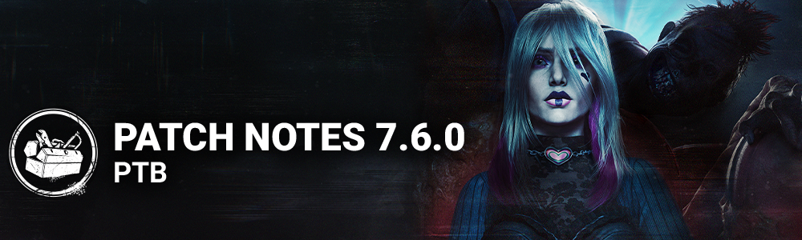

# 7.6.0 | PTB

## Content

### New Perk Type: Invocation

Invocations are a new type of Survivor Perk. Invocations require Survivors to activate a salt circle in the Basement; on activation, a penalty is paid in exchange for a large boost.

### New Survivor - Sable Ward

**Perks**

- **Invocation: Weaving Spiders**
- When in the Basement near the circle, press the ability button 1 to begin the Invocation.
- Invocations take 120/120/120 seconds. Other Survivors will see your aura during this and can join an ongoing interaction, increasing the speed by 50/50/50% each. If they have an Invocation Perk equipped, they increase it by 100/100/100% instead.
- Once the Invocation is completed: *You become injured and Broken for the rest of the Trial, and all Generators instantly gain 9/12/15 charges.*
- Completing the Invocation disables that Perk for all Survivors.
- **Strength in Shadows**
- When in the basement, this Perk activates.
- Unlocks the *Strength in Shadows*ability, which allows you to heal without a Med-Kit at 60/60/60% normal healing speed.
- When you finish a heal in the basement, you see the Killer's aura for 6/8/10 seconds.
- **Wicked**
- *NOTE: The PTB features an older version of the Perk which has since been replaced. The effects listed below are how the Perk functions on the PTB, but this effect will be changed before the update goes live.*
- This Perk starts with 1 Token, up to a maximum of 5/5/5 Tokens.
- For each Token, you recover from Mangled 20/20/20% faster.
- For each 15/15/15 seconds spent in the basement, gain 1 Token.
- While affected by the Cursed Status Effect, you heal 8/9/10% faster.

### New Killer - The Unknown

#### Killer Power

Press the Power button to charge UVX. Once ready, press the Attack button to launch UVX, a bouncing Projectile which creates a Blast Area upon impact. Survivors become Hindered if touched by UVX while airborne. Survivors touching the Blast Area become Weakened. Weakened Survivors lose health states if touched by Blast Area. Survivors lose Weakened by successfully Staring Down The Unknown.

**Special Ability: Hallucinations**

The Unknown will intermittently create Hallucinations. Hallucinations cannot be created while charging UVX, performing interactions, or in proximity to map objects like hooks. Whenever Survivors are touched by Blast Area or otherwise become Weakened, the next Hallucination's spawn time decreases by 10 seconds.

**Special Ability: Teleport**

The Unknown can teleport to Hallucinations, leaving behind a temporary Decoy. Survivors can remove Hallucinations from the Trial with the Dispel ability. Weakened Survivors take longer to Dispel. If Dispel is not completed, Survivors become Weakened and trigger Killer Instinct.

**Perks**

- **Unbound**
- This perk activates for 24/27/30 seconds after a Survivor becomes injured by any means.
- After vaulting a window, you gain 5% Haste for 10 seconds. This effect cannot stack with itself.
- **Unforeseen**
- When you perform the Break action on a Generator, your Terror Radius transfers to the Generator for 22/26/30 seconds and its radius is set to 32/32/32 meters.
- You gain Undetectable for that duration.
- Then, this Perk goes on cool-down for 30/30/30 seconds.
- **Undone**
- When a Survivor misses a healing or repair Skill Check, gain 3 Tokens, up to a maximum of 18/24/30 Tokens.
- When you perform the Break action on a Generator, if you have any Tokens, consume all of them. For each Token consumed, the Generator loses 1% total progress and then becomes blocked for 1 second.
- Then, once the Generator is unblocked, it starts regressing.
- This Perk goes on cooldown for 60 seconds.

### New Map - Greenville Square

A new section of the Withered Isle has opened up to the players. The Greenville Square is a very different environment from what was previously seen from that Realm. It features a brand new set of tiles, including a new main building, The Theater. Make sure to explore all its layers! Look out for the Statue where two familiar friends would meet up and leave their mark. What does it mean and where will it bring us next? *No one ever came back to tell us.*

### Mangled Update

Mangled up until now has required Survivors to heal in order to remove the effect, while also slowing down healing speeds. To create more meaningful player choice, we'll be adding a timer to every source of Mangled in the game, allowing players to choose to heal through it, or wait it out.

**Affected Perks**

- Blood Echo
- Sloppy Butcher
- Scourge Hook: Gift of Pain

**Affected Addons**

- Defaced Smiley Pin (Legion)
- Diagnostic Tool (Singularity)
- Rusted Spike (Deathslinger)
- Begrimed Chains (Hillbilly)
- Blind Warrior - White (Wraith)
- Broken Hilt (Knight)
- Fragile Wheeze (Nurse)
- Grisly Chains (Cannibal)
- Honey Locust Thorn (Deathslinger)
- Cain's Helmet (Xenomorph)
- Powdered Glass (Skull Merchant)
- Rusted Jaws (Trapper)
- Rusty Attachments (Pig)
- Unity Blades (Pig)
- Rusty Head (Huntress)
- Sulphuric Acid Vial (Clown)
- Thorny Nest (Artist)
- Begrimed Head (Huntress)
- Straight Razor (Good Guy)
- Tilling Blade (Dredge)
- Cat Block (Nightmare)
- Z Block (Nightmare)
- Crimson Ceremony Block (Executioner)

### Killer Updates

#### The Blight

**Add-Ons**

- **Compound Thirty-Three:**
- Rush cannot be performed more than 3 times *(was 2).*
- Increases Rush turn rate by 33%.
- Increases Rush duration by 33%.

#### The Clown

**Basekit**

- Increased Afterpiece Antidote duration to 6 seconds *(was 5).*
- Decreased Afterpiece Antidote activation delay to 2 seconds *(was 2.5).*
- Increased number of bottle to 6 *(was 4).*
- Decreased the visual effect intensity when a Survivor is affected by the Afterpiece Tonic.

#### The Demogorgon

**Basekit**

- Decreased Shred successful hit cooldown to 2.7 seconds *(was 3).*
- Decreased Shred pallet break cooldown to 1.8 seconds *(was 2).*

**Add-Ons**

- **Black Heart:**
- Decreases Shred hit cooldown by 10% *(was 15%).*
- **Barb's Glasses:**
- Decreases Shred pallet break cooldown by 10% *(was 15%).*

#### The Doctor

**Basekit**

- Increased Shock Therapy range to 12 meters *(was 10.7).*
- Decrease Shock Therapy detonation delay to 0.8 seconds *(was 1).*

**Add-Ons**

- **"Discipline" - Class III:**
- Decreases the detonation delay of Shock Therapy by 15% *(was 20%).*
- **"Discipline" - Carter's Notes:**
- Decreases the detonation delay of Shock Therapy by 20% *(was 30%).*

#### The Hag

**Basekit**

- Increased Phantasm Trap teleport range to 48 meters *(was 40).*
- Decreased Phantasm Trap setting time to 0.9 seconds *(was 1).*
- Increased triggered Phantasm Trap duration to 6 seconds *(was 5).*
- Decreased Phantasm Trap trigger range to 2.7 meters *(was 3).*
- Increased the time it takes to wipe away traps to 4 seconds *(was 3.5).*

**Add-Ons**

- **Bloodied Mud:**
- Decreases Phantasm Trap trigger range by 30% *(was "Increases").*
- **Bloodied Water:**
- Decreases Phantasm Trap trigger range by 20% *(was "Increases").*
- **Bog Water:**
- Decreases Phantasm Trap trigger range by 10% ***(was "Increases").***
- **Cracked Turtle Egg:**
- Increases triggered Phantasm Trap duration by 20% *(was 55%).*
- **Cypress Necklet:**
- Increases Phantasm Trap setting speed by 15% *(was 20%).*
- **Dead Fly Mud:**
- Increases teleportation range by 10% *(was 20%).*
- **Dragonfly Wings:**
- Increases teleportation range by 12.5% *(was 25%).*
- **Dried Cicada:**
- Increases teleportation range by 15% *(was 30%).*
- **Half Eggshell:**
- Increases triggered Phantasm Trap duration by 15% (*(was 45%).*
- **Powdered Eggshell:**
- Increases triggered Phantasm Trap duration by 10% *(was 25%).*
- **Rope Necklet:**
- Increases Phantasm Trap setting speed by 10% *(was 15%).*
- **Swamp Orchid Necklet:**
- Increases Phantasm Trap setting speed by 20% *(was 25%).*

#### The Huntress

**Basekit**

- Increased Hatchet count to 7 *(was 5).*
- Increased The Huntress' movement speed while holding a Hatchet to 3.54 m/s *(was 3.08).*
- Decreased The Huntress' Hatchet wind up speed to 0.9 seconds *(was 1).*

#### The Pig

**Basekit**

- Increased Ambush attack duration to 2.3 seconds *(was 2).*
- Decreased Ambush attack successful hit cooldown to 2.7 seconds *(was 3).*
- Decreased Ambush attack miss cooldown to 1.5 seconds *(was 2).*
- Increased The Pig's movement speed while crouched to 3.8 m/s *(was 3.6).*
- Decreased the time it takes for The Pig to crouch to 1 second *(was 1.3).*
- Increased the Reverse Bear Trap's timer to 180 seconds *(was 150).*
- Removed The Pig's ability to see Jigsaw Boxes.
- Increased the amount of Bloodpoints earned for Ambush Dash hits to 850 BP *(was 500).*
- Increased the amount of Bloodpoints earned for setting a Reverse Bear Trap to 1000 BP *(was 500).*

**Add-Ons**

- **Combat Straps:**
- Increases crouching and uncrouching speed by 10% *(was 30%).*
- **Shattered Syringe:**
- Decreases Ambush attack miss cooldown by 10% *(was 25%).*
- **Workshop Grease:**
- Increases Ambush attack charge speed by 50%.
- Decreases Ambush attack miss cooldown by 10% *(was 25%).*

## Features

### Copyrighted Music

A separate toggle has been added to the Audio section of the Settings menu to enable or disable copyrighted music. This setting is no longer bound to Anonymous Mode.

### UX

- **Bloodweb Improvements**
- The auto-purchase center node gets unlocked for all Characters after at least one of them have been Prestiged.
- Level up pop-ups can be skipped by pressing:
- Controller's A button
- Mouse's left button
- Any keyboard key
- Added loading wheel animation when data is being loaded.

## Locked Outfit Discount Tag Removal

For outfits that cannot have its pieces purchased individually, a discount tag will no longer be shown for buying the entire set.

## Bug Fixes

### Audio

- Certain Character sounds in menus should now correctly match changes incurred by the equipped customizations.
- Fixed a missing voiceline between Ellen Ripley and Jonesy in the menus.

### Bots

- The Nemesis' Zombies no longer attempt to navigate towards vaults as they cannot vault.
- Bots playing on The Underground Complex Map are better at avoiding dead-ends in certain tiles.

### Characters

- The Cenobite's camera no longer points upwards when hit by a Possessed Chain.
- The Blight no longer has 3 Tokens when equipping both C33 and Iridescent Tag Add-Ons.
- The Hillbilly’s Chainsaw no longer reappears late when dropping a carried Survivor after being Blinded or Stunned.
- When crouched, The Pig no longer plays the wrong vaulting animation.
- Downing a Survivor affected by the Afterpiece Antidote no longer fails to give progression to the Ailing Annihilator Archive Challenge.
- The Singularity's Biopods can now properly lock on to Survivors when on a 21:9 aspect ratio and the 16:9 aspect ratio setting is set to ON.
- The Knight's Guards now correctly detect Survivor loud noises.
- The Hillbilly’s achievement The Grind now correctly counts Chainsaw hits.
- Core Memory: Disturbing Notions: On the Ormond Map, Memory Shards may spawn in the ground and cannot be collected by the Survivor.
- Globally, The Trapper’s Bear Traps will appear to be floating when placed near a Pallet.
- Certain Killer Perks no longer provide progression to the Ailing Annihilator Archive Challenge without giving a Status Effect to the Survivors.
- The Dredge's Abduction now counts correctly as downing for the Ailing Annihilator Challenge.
- Hubris no longer enters cooldown after intentionally dropping a Survivor when they are past 75% wiggle progress.
- Survivors can get stuck inside Lockers if they slowly enter the Locker or under poor networking conditions.
- The Plot Twist Perk no longer activates the Dissolution Perk.
- Survivors can no longer place traps on regressing Generators.
- Survivors now correctly receive the Killer Stun scoring event when using Blast Mine.
- M2 attacks are no longer considered basic attacks when Blinded.
- The Blight's Rush action no longer fails to activate when a Trial lasts very long.
- Killers no longer jump when the damage actions are cancelled.
- The Thwack! Perk no longer fails to activate after destroying a breakable wall.
- The Knight can no longer teleport by performing interactions from far away, using his power Guardia Compagnia.

### Environment/Maps

- Improved performance globally when decorations are used on Maps.
- Fixed and issue for the bot navigation on the Combine Harvester
- Fixed an issue where the dark mist would not appear everywhere in the Greenville Square
- Fixed an issue in the Greenville Square where the Blight could not bounce off blockers
- Fixed an issue in RPD where the Xenomorph turrets could should through the walls

### UI

- Fixed an issue where the active state of the tab in the player profile is not resetting properly.
- Fixed an issue where the player profile is displayed on the offering screen.
- Fixed not being able to open Options and Daily Rituals during the last 5 seconds before the Trial starts.
- Fixed an issue where some player cards do not appear in the search results.
- Fixed a potential crash in the main menu when entering Killer lobby on PS4/PS5.

### Misc

- Black bars no longer appear around the screen in menus and transitions, in resolutions other than 16:9.

## Known Issues

- The Withered Isle Offering will not bring players to the new map, Greenville Square.
