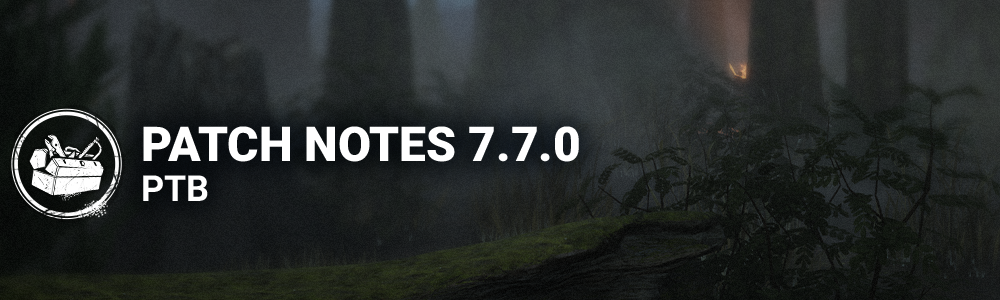

# 7.7.0 | PTB

## Important

- Progress & save data information has been copied from the Live game to our PTB servers on ***2024/04/01***. Please note that players will be able to progress for the duration of the PTB, but none of that progress will make it back to the Live version of the game.

## Features

**New Store**

Note: In order to test out the new Store, players will receive 6K Auric Cells on the PTB Build. Both Auric Cells and purchases made on the PTB Build will not transfer to the Live Build.

- New Store available, replacing the previous one
- Featured Page: Latest releases and Chapters, and the addition of the Weekly Gift feature.
- Weekly Gift: Allows players to claim free rewards during multiple weeks, if activated. Rewards are renewed per week, meaning that unclaimed ones are discarded when the week is reset.
- Specials Page: A dedicated page to show all special offers currently available in the game.
- Collections Page: Houses all Collections that exist in the game, and shows their content. Players can also unlock Cosmetics directly from there!
- Bundles Page: Showcases special bundles available for unlocking, Chapter bundles (previously known as DLC Chapters), and the new DLC Packs. Bundles can be opened to review their content before unlocking them, although not yet in the case of DLC Packs.
- Killer and Survivors dedicated Wardrobes: New separated independent pages for Killers and Survivors that allow for quick Mix and Matching of Characters and their Cosmetics.
- **Mix and Matching specifics:**
- Players can now select Characters and Cosmetics without having to equip them immediately.
- Clicking on an option allows players to preview the Character or Cosmetic.
- Selecting the Character or equipping the Cosmetic confirms their choice.
- Being able to preview allows players to preview pieces from different locked and unlocked Cosmetics, mix and matching options to be able to "try them out" before unlocking them.
- Players can now filter their Cosmetics with different options, and are able to show all options that are currently unavailable!
- Previewing Perks, Powers and Moris:
- Players now can open a little section that displays the Power and Perks of any Character that is currently selected, allowing for a smoother way to review and compare their Characters' gameplay.
- Players can now preview every Killer's Mori, including with the Mix and Match Outfits! This way players can check out how their Cosmetic choices are going to look during the Mori!
- Visceral Outfits are going to show their own version of their Character's Mori.
- **Bio pages for Characters:**
- These were made a part of the Characters' Wardrobes.
- They showcase the Characters' lore, height, speed and Terror Radius size. Power and Perks were moved to the Power and Perks window.
- **Commons:**
- Unlocking is now done with a press and hold mechanic to allow for a confirmation process free of pop ups.
- The section for getting more Auric Cells can now be accessed through the Store, and it can also be accessed by clicking the Auric Cells counter on the top right corner of the screen.
- Kill switched options are going to be available for unlocking, yet we are making sure to communicate it with a pop up for players to confirm they still want to proceed.
- Search bars have been included in most sections to allow finding Characters, Collections, and Cosmetics easier.
- Added a celebration pop up to better communicate that players have unlocked content or earned a reward at the Store.
- **Shrine of Secrets:**
- The Shrine was taken out of the Store and placed in the Characters' lobbies, to be closer to the loadout and Bloodweb.
- The layout was updated to be easier to read and use, providing key information without the need to hover on any Perk option.

**Match's DetailsMenu**

- The Match Details Menu now allow players to review Perks.
- During a match, when opening the Match Details window (Escape on computers), players can see their equipped Perks.
- Hovering on Perks and Offerings allow players to see the tooltips and read their description.

## Content

### Killer Update - The Twins

- Victor’s Pounce no longer latches onto Healthy Survivors. *(NEW)*
- Victor can no longer be kicked after successful Pounce attacks which do not latch onto a Survivor. *(NEW)*
- Victor’s Pounce now latches onto Survivors when they are put into the dying state. While Victor is attached, the Survivor cannot return to the Injured state. Other Survivors can crush Victor during this time to help the dying Survivor. Victor automatically returns to Charlotte after 20 seconds. *(NEW)*
- While Victor is attached to a Survivor or holding a Survivor in a locker, Charlotte gains a 10% Haste effect. This bonus is lost when hitting a Survivor. *(NEW)*
- The Visual Terror Radius accessibility setting will now include Victor’s grunts. *(NEW)*
- Victor will now glow red whenever he is vulnerable to being crushed and white when is not vulnerable to being crushed. *(NEW)*
- Added the ability to recall Victor at any point while he is unbound. *(NEW)*
- Added the ability to switch between Victor and Charlotte near a hooked Survivor, at a slower rate. *(NEW)*
- Added a new icon to represent the moment when Victor can be recalled. *(NEW)*
- Victor no longer reveals Survivors with Killer Instinct while he is latched on. *(NEW)*
- Decreased the time it takes to switch back to Charlotte to 1.5 seconds. *(was 3 seconds)*
- Decreased the time it takes to unbind Victor to 0.75 seconds. *(was 1 second)*
- Decreased the time it takes to charge Victor’s Pounce to 0.85 seconds. *(was 1 second)*
- Increased the cooldown for Victor to come back after being crushed to 10 seconds. *(was 6 seconds)*

**Add-Ons:**

- **Tiny Fingernail:**  
   Decreases Victor’s Unbind time by 33%. *(was 50%)*
- **Toy Sword:**  
   Decreases Pounce charge time by 10%. *(was 20%)*
- **Rusted Needle:**  
   Pounce attacks inflict Hemorrhage until healed. *(Rework)*
- **Sewer Sludge:**  
   Decreases the Survivor’s crawl speed by 25% when Victor is attached to them. *(Rework)*
- **Silencing Cloth:**Now triggers when Victor is crushed *(Adjustment)*
- **Weighty Rattle:**  
   Pounce attacks inflict Broken for 60 seconds. *(Rework)*
- **Iridescent Pendant:**  
   Each time Victor injures a Survivor with a Pounce attack, increase Victor and Charlotte’s movement speed by 2%. This can only reach a maximum of 8%. This effect is lost when putting a Survivor in the dying state. *(Rework)*

### Killer Update - The Blight

- Improved collision detection to reduce cases where The Blight slides off objects.

**Add-Ons:**

- **Shredded Notes:**Decreases time to recharge a Rush token by 0.33 seconds. *(Removed downside)*
- **Summoning Stone:**Increases the initial Rush duration by 1 second. *(Rework)*
- **Soul Chemical:**Increases the initial Rush speed by 10%. *(Rework)*

### Perk Updates

**Ultimate Weapon**

- Now activates for 15 seconds (was 30 seconds).
- Now reveals Survivor auras for 3 seconds instead of causing them to scream and show their position.
- Increased cooldown to 80/70/60 seconds (was 40/35/30 seconds).

**Decisive Strike**

- Increased the Stun duration to 5 seconds (was 3 seconds).
- Added a new stabbing animation when Decisive Strike is used successfully (NEW).

**Adrenaline**

- Burst of speed now lasts 3 seconds (was 5 seconds).
- Adrenaline no longer activates if you are hooked or carried when the Gates are powered.
- Adrenaline no longer causes you to wake up when facing The Nightmare.

### Environment/Maps

**Haddonfield - Lampkin Lane**

The map has been difficult for the players to enjoy. We made the decision to update it, prioritizing gameplay quality. The length of the street was reduced, line of sight blockers have been added in the street, removed any closed houses, reduced the amount of tiles in the map, added gameplay and blockers on the border tiles. added openings in the main house to improve the navigation and the gameplay. and the park tiles have also been revisited.

## Gameplay Mechanics

- The Unhook interaction may no longer be cancelled partway to avoid being able to keep someone on the hook maliciously.
- The Generator Damage interaction has been reviewed so that the Generator is actually damaged closer to the point where the hit lands to prevent accidentally letting go of the input early.

## Bug Fixes

### Audio

- Fixed an issue that caused Pod breaking SFX being heard by the Killer at any distance.

### Environment/Maps

- Fixed an issue with the Crashed Bus where the Characters could not vault.
- Fixed an issue with the shack on Greenville Square where the Killer could hit through a visual blocker.
- Fixed an issue in Lampkin Lane where the Zombies of The Nemesis could not navigate part of the map.

### Bots

- Guard will no longer get stuck on stairs.

### Characters

- Fixed an issue that caused Survivors to have to aim higher than Victor’s head to blind it.
- Fixed an issue that caused the Exit Gate Entity spikes to disappear if Victor leaps on a Survivor near the Exit Gate while Charlotte is also near.
- Fixed an issue that caused the Killer Instinct aura to show during The Twins Mori if Victor is nearby.
- Fixed an issue that caused Victor and The Nemesis' Zombies not to be destroyed by the Head On Perk.
- Fixed an issue that caused the Punishment score event to be granted when hitting a hooked Survivor with the Punishment of the Damned attack.
- Fixed an issue that caused Bear Traps to float when placed under Survivors.
- Fixed an issue that caused Killers to play the normal vault animation and start falling too early when vaulting into a drop.
- Fixed an issue that caused Killers to fail to be Blinded by Firecrackers and Flashbangs when a downed Survivor is in front of the Killer.

### UI

- Fixed an issue where Killers could see a random Grade displayed in their scoreboard in the tally screen.

### Perks

- Fixed an issue that caused the Scourge Hook: Gift of Pain Perk to fail to apply more than once.

### Misc

- Fixed an issue where players would not disconnect from their party when closing the game.
- Fixed an issue where players could not block other players.

## Known Issues

- Placeholders are present on the Grisly Bear Skull Mask (including its variant).
