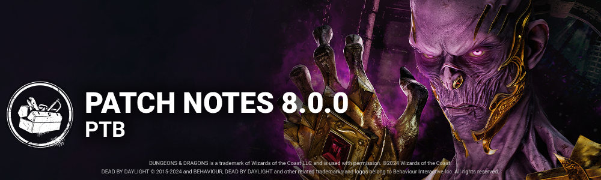

<!-- nav -->
&larr; [7.7.0 | PTB](442-7-7-0-ptb.md) · [Player Test Build (PTB)](../../index.md#player-test-build-ptb) · [8.1.0 | PTB](456-8-1-0-ptb.md) &rarr;
<!-- /nav -->

# 8.0.0 | PTB

**Important**

- Progress & save data information has been copied from the Live game to our PTB servers on ***May 6th***. Please note that players will be able to progress for the duration of the PTB, but none of that progress will make it back to the Live version of the game.

**Note**: Players will once again receive 6K Auric Cells on the PTB Build to explore Outfits and Characters in the Store. Both Auric Cells and purchases made on the PTB Build will **not**transfer to the Live Build.

## Content

## New Survivor - Aestri Yazar

### New Survivor Perks

- **Mirrored Illusion**This perk activates after completing a total of **50%** worth of repair progress on generators.  
   Press the ability button 2 when next to a totem, chest, generator or exit gate to spawn a static illusion that lasts for **100/110/120 seconds.**Then, the perk deactivates.
- **Bardic Inspiration**Press the ability button 1 while standing and motionless to enter the "performance" interaction that lasts up to **15 seconds**and empowers Survivors within **16 meters.** Roll a d20. This effect lasts for **60 seconds** if the performance is completed.  
   When the ability is cancelled or the performance completes, it goes on cooldown for **90/75/60 seconds.**  
  **1**| You scream, but nothing happens**2-10**| skill checks give +1% progress**11-19**| skill checks give +2% progress**20** | skill checks give +3% progress
- **Still Sight**After standing still for **6/5/4 seconds,** this perk activates.  
   Until you start moving, you see the aura of the Killer as well as all generators and chests within **18 meters**.

## New Killer - The Lich

### Killer Power

Bound with the skin and flesh of men, the Book is packed with spells both forbidden and wicked.  
 To select a Spell, hold the Ability Button to open the Spell selection. The Lich has access to 4 different Spells:

- Mage Hand: Creates a magical hand that lifts a downed pallet or blocks an upright pallet for 4 seconds.
- Flight of the Damned: Conjures 5 flying spectral entities that can pass through obstacles and injure Survivors.
- Dispelling Sphere: Casts a moving invisible sphere that reveals Survivors and temporarily disables their Magic Items.
- Fly: Gain a flying speed for a short period of time, allowing you to travel a long distance quickly and move over vaults and pallets.

**SPECIAL ITEM: MAGIC ITEMS**

Treasure Chests found around the map can contain Magic Items. Each Survivor can equip up to two Magic Items at once: one pair of Boots and one pair of Gauntlets. These Magic Items are each connected to a specific Spell, and activate when The Lich casts that spell.

- Boots/Gauntlets of the Interloper: The Survivor sees the aura of pallets affected by Mage Hand and gains Haste for 3 seconds.
- Boots/Gauntlets of the Nightwatch: The Survivor can see the auras of the spectral entities conjured by Flight of the Damned.
- Boots/Gauntlets of the Archivist: The Survivor can see the Dispelling Sphere.
- Boots/Gauntlets of the Skyguard: The Survivor can see The Lich's aura during Fly and for a few seconds after.

**SPECIAL ITEMS: HAND & EYE OF VECNA**

Rarely, Survivors can instead find the Hand or Eye of Vecna in a Treasure Chest. When picked up and used, Survivors gain a special ability while at full health. Using one of these special abilities costs the Survivor a health state and reveals their location with Killer Instinct for 3 seconds.

- Hand of Vecna: When doing a Fast Locker Entry, the Survivor is teleported to a further locker.
- Eye of Vecna: When doing a Fast Locker Exit, the Survivor cannot be seen by The Lich and gains Haste for 12 seconds.

### New Killer Perks

- **Weave Attunement**When any item becomes depleted for the first time each match, it is dropped. You see the auras of dropped items.  
   Survivors within **8 meters** of dropped items have their auras revealed to you.  
   When a Survivor picks up a Survivor item, they suffer the Oblivious status effect for **20/25/30 seconds.*Oblivious prevents Survivors from hearing or being affected by the Killer's Terror Radius.*
- **Languid Touch**When a Survivor within **36 meters** of you scares a crow, they gain the Exhausted status effect for **6/8/10 seconds.**This perk has a **20-second** cooldown.  
  *Exhausted prevents Survivors from activating exhausting perks.*
- **Dark Arrogance**Increases the duration you are blinded and the duration of pallet stuns by **25%.**Increases regular vault speed by **16/18/20%.**

## Killer Perk Updates

- **Deadlock**Decreased the block duration to 15/20/25 seconds. *(was 20/25/30 seconds)*
- **Grim Embrace**  
   Decreased the block duration before reaching 4 tokens to 6/8/10 seconds. *(was 8/10/12 seconds)*
- **Pop Goes the Weasel**  
   Decreased the amount of progress lost to 20%. *(was 30%)*
- **Scourge Hook: Pain Resonance**  
   Decreased the amount of progress lost to 10/15/20%. *(was 15/20/25%)*

## Survivor Perk Updates

- **Background Player**Decreased the movement speed bonus to 150%. *(was 200%)*Decreased the Exhaustion duration to 30/25/20 seconds. *(was 60/50/40 seconds)*
- **Buckle Up**Both you and the healed Survivor gain Endurance for 6/8/10 seconds. (*Removed)*The healed Survivor breaks into a sprint at 150% of their normal Running Movement speed for 3/4/5 seconds and leaves no scratch marks during this time. *(New functionality)*
- **Invocation: Weaving Spiders**  
   Decreased the time it takes to complete the Invocation to 60 seconds. *(was 120 seconds)*Increased the time it takes for an Invocation to completely regress to 90 seconds. *(was 6 seconds)*
- **Decisive Strike**Decreased the stun duration to 4 seconds. *(was 5 seconds)*

## Killer Updates

### The Blight - Addons

- **Compound Thirty-Three**Increases Rush turn rate by 11%. *(was 33%)*Increases Rush duration by 11%. *(was 33%)*
- **Iridescent Blight Tag**  
   Increases Rush speed by 10%. *(was 20%)*

### The Cannibal - Basekit

- Decreased the obstruction collision size while using the Chainsaw to 10 cm.*(was 17.5 cm)*
- Decreased the base Tantrum duration to 3 seconds. *(was 5 seconds)*
- Increased the base Chainsaw Sweep duration to 2.5 seconds. *(was 2 seconds)*
- Increased the base Chainsaw Sweep movement speed to 5.35 m/s. *(was 5.29 m/s)*

### The Cannibal - Addons

- **Award-Winning Chili**Increases maximum Chainsaw Sweep duration by 0.2 seconds per charge spent. *(was 0.5 seconds)*
- **Chainsaw File**Decreases tantrum duration by 0.25 seconds. *(was 0.5 seconds)*
- **Chili**Increases maximum Chainsaw Sweep duration by 0.15 seconds per charge spent.***(was 0.25 seconds)***
- **Homemade Muffler**Decreases tantrum duration by 0.5 seconds. *(was 1 second)*
- **Knife Scratches**Increases Chainsaw Sweep movement speed by 1.5%. *(was 2%)*Increases time required to charge the Chainsaw by 10%. *(was 12%)*
- **The Beast's Marks**Increases Chainsaw Sweep movement speed by 2%. ***(was 3%)***Increases time required to charge the Chainsaw by 12%. *(was 14%)*

### The Deathslinger - Basekit

- Decreased the stun duration when a Survivor breaks free to 2.7 seconds. *(was 3 seconds)*
- Increased the reel speed to 2.76 m/s. *(was 2.6 m/s)*
- Increased movement speed while reloading to 3.08 m/s. *(was 2.64 m/s)*

### The Deathslinger - Addons

- **Bayshore's Cigar**Decreases the stun duration when Survivors break free by 0.75 seconds. *(was 1 second)*
- **Bayshore's Gold Tooth**Increases the Speargun's reeling speed by 5%. *(was 9%)*
- **Chewing Tobacco**Decreases the stun duration when Survivors break free by 0.25 seconds. *(was 0.5 seconds)*
- **Snake Oil**Increases the Speargun's reeling speed by 2.5%. *(was 5%)*

### The Mastermind - Basekit

- Decreased the Hindered penalty when reaching maximum infection to 4%. *(was 8%)*
- The Uroboros infection now resets to 1% upon being hooked. *(was 50%)*

### The Good Guy - Basekit

- Scamper is now only available while performing a Slice & Dice.
- Hidey-Ho Mode cooldown reduced to 12 seconds. *(was 18 seconds)*
- Scamper time reduced to 1.3 seconds.*(was 1.4 seconds)*
- Added a 1 second cooldown after cancelling a Slice & Dice charge up.

### The Good Guy - Addons

- **Strobing Light**  
   Decreases Terror Radius by 8m when Hidey-Ho Mode is in cooldown. *(was 4m)*
- **Pile of Nails**  
   Upon manually exiting Hidey-Ho Mode, Chucky remain Undetectable for 3 seconds. *(was 5 seconds)*
- **Yardstick**  
   Performing a Scamper reveals Survivor auras within 16 m distance for 3seconds. *(was 12m / 5 seconds)*
- **Hard Hat**  
   Removed "and exits Hidey-Ho Mode." from description.

## Toolbox Updates

- **Toolbox**Increases sabotage speed by 15%. *(was 10%)*
- **Mechanic's Toolbox**Increases sabotage speed by 25%. *(was 10%)*
- **Commodious Toolbox**Increases sabotage speed by 50%. ***(New functionality)***
- **Engineer's Toolbox**Increases sabotage speed by 10%. *(was Decreases by 25%)*
- **Alex's Toolbox**18 charges. *(was 24 charges)*Increases sabotage speed by 100%. *(was 50%)*
- **Festive Toolbox**Increases sabotage speed by 50%. *(New functionality)*
- **Anniversary Toolbox**Increases sabotage speed by 50%. ***(New functionality)***
- **Masquerade Toolbox**Increases sabotage speed by 50%. ***(New functionality)***

**Toolbox Addons**

- **Cutting Wire**Increases the Toolbox's sabotage speed by 20%. *(was 15%)*
- **Grip Wrench**Hooks sabotaged using the Toolbox take an extra 20 seconds to respawn.*(was 15 seconds)*
- **Hacksaw**  
   Increases the Toolbox's sabotage speed by 30%. *(was 20%)*

## Map Updates

### New Map - Forgotten Ruins

A new Map comes to the world of Dead by Daylight, found in The Decimated Borgo Realm. A tower standing tall alone, but what is above ground hides a new world underground. A prison area where Vittorio Toscano was thrown in for some time. On the other side of the dungeon, the Alchemist room is found, where a scholar can learn secrets of the world, or the dimensions that surround the universe of the Entity.

### Decimated Borgo Realm Update

The red lighting was a big issue in the realm of The Decimated Borgo. The art and lighting team took care to make the realm more accessible to all players and bring a different ambiance to the maps.

## Features

## UX

- **Started adding search tags for Charms**Only "Perks" and "Birds" for the moment.
- **New Item Preview Window**Regular and Special Items will now display a short description of their effect inside a Trial by using a new item previewer window.

  **Bug Fixes**

## Archives

- Archive challenges requiring killers to complete a Trial with no more than X Survivors living should now correctly update throughout the match as Survivors die off.

## Audio

- Fixed an issue that caused some of The Good Guy's voice lines to be cut in the Mori Preview.
- Fixed an issue that caused the Nightmare's Jump Rope add-on to fail increasing Survivors grunts volume.

## Bots

- The names of the Bots that appear following a player disconnection have been corrected.

## Characters

- Fixed an issue that caused The Cannibal's Tantrum animation to sometimes not play after overcharging the chainsaw or hitting a collision.
- Fixed an issue that caused male Survivors to be dropped closer to Killer than female Survivors when escaping the Killer's grasp by any means.
- Fixed an issue that caused The Twin's Baby Teeth add-on not to inflict the Blindness status effect when attached to a Survivor.
- Fixed an issue that caused Victor's respawn animation to play on Charlotte before his cooldown finishes.
- Fixed an issue that caused Victor not to trigger the anti-camp meter when he was close to the hook.
- Fixed an issue that caused The Blight camera to pan down after breaking a pallet during Lethal Rush.
- Fixed an issue that caused Charles Lee Ray to be invisible during certain interactions.
- Fixed an issue that caused the Cenobite's camera to reset when turning while using his power.
- Fixed an issue that caused Survivors camera to snap back to the default position when exiting a locker.
- Fixed an issue that caused the Plague to lose Corrupt Purge when being stunned by any means.

## Environment/Maps

- Fixed an issue that caused the Nightmare to be able to hide Dream Snares under the floor at the top of Killer Basement staircase in the main building of the Ironworks of Misery map.
- Fixed an issue that caused the Nightmare to be able to hide Dream Snares under the floor at the top of the staircases in the Midwich Elementary map.
- Fixed an issue in the Underground Complex where two generators could spawn in the same room.
- Fixed an issue in the Underground Complex where a chest would spawn in rooms and clip with different elements of the environment.
- Fixed an issue in Lery's Hospital where an invisible collision was letting players walk over the stairs going down the basement in the Doctor's Office.
- Fixed multiple issues related to the Nurse blinking out of the Raccoon City Police Station map.
- Fixed an issue in the Eyrie of Crows map where a collision near the hill would prevent players from navigating.
- Fixed an issue in the Raccoon City Police Station map where Victor could climb on blockers.
- Fixed an issue in the Autohaven Wrecker's Realm where an obstacle blocked navigation for the Killer.

## Perks

- Fixed an issue that caused Victor to be unable to receive noise notifications from the Call of Brine perk.
- Fixed an issue that caused the Premonition perk to activate while being carried by the Killer.
- Fixed an issue that caused the Bamboozle perk to trigger when Killers used their power to vault through a window.
- Fixed an issue that caused the Bite the Bullet perk not to activate.
- Fixed an issue that caused the Deliverance perk to sometimes not activate.
- Fixed an issue that caused the Ultimate Weapon perk to sometimes not to activate the screaming animation from Survivor POV.

## UI

- Changing presets in the Loadout Menu will no longer rotate the character due to different charm layouts.

## Misc

- Kill-switched items should no longer appear in Bloodwebs.
- Fixed a crash that could occur while in a Trial when gaining Bloodpoints.
- Fixed a crash that could occur while loading between the Play as Survivor lobby and the pre-Trial lobby.
- Fixed a crash that could occur when a Survivor screams.
- Spamming the unhook button no longer causes the hooked Survivor's camera to swing around repeatedly.
- Fixed an issue that caused the Hatch Unlock progress to reset when cancelling the interaction.
- Fixed an issue that caused Survivors to be unable to unhook a teammate if that hooked Survivor had previously unhooked themselves just before reaching the struggle stage.

## Known Issues

**Characters**

- It is possible for The Dredge and a Survivor to get stuck in a locker if another Survivor tries to hide in the same locker before the teleportation.

**Perks**

- UI feedback is missing for some Perks (Languid Touch, Weave Attunement, Bardic Inspiration).
- Survivors' Auras are revealed when swapping an item held in hands with an Item inside a Chest with the Weave Attunement Perk.
- The Survivor screams and animation triggers before the result of the dice appears with the Bardic Inspiration Perk.
- Rarely there is no lute or dice animations when triggering the Bardic Inspiration Perk.
- When rolling a 1 with the Bardic Inspiration perk, the lute song will continue to play indefinitely until the perk interaction is attempted again.
- It is possible to spawn a second illusion when there is already one active with the Mirrored Illusion Perk.

<!-- nav -->
&larr; [7.7.0 | PTB](442-7-7-0-ptb.md) · [Player Test Build (PTB)](../../index.md#player-test-build-ptb) · [8.1.0 | PTB](456-8-1-0-ptb.md) &rarr;
<!-- /nav -->
