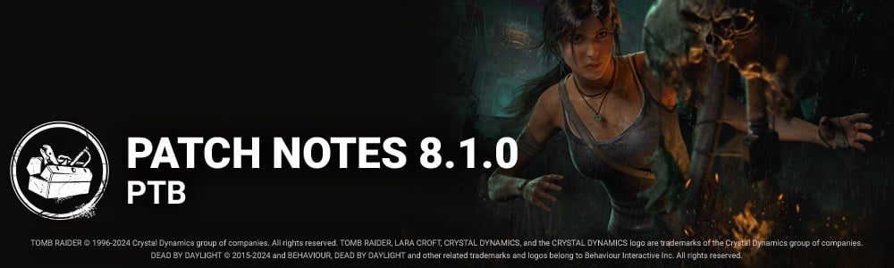

<!-- summary -->
## AI TL;DR

New survivor Lara Croft joins the PTB, bringing three brand-new perks—Finesse, Hardened and Specialist—that speed vaults, reveal the Killer on screams and reward chest openings. Killer-side changes include cooldown reductions and longer aura reveals for several perks, plus a major overhaul of The Knight’s base kit and addons, adding guard-cycling, patrol-length modifiers and detection tweaks. The Singularity gains smoother pod tagging, faster wake-up times and revised Slipstream mechanics, while several maps receive new variations and layout tweaks. Across the build, UI improvements, disconnect-bot spawning, hook respawn, and a host of audio, bot, character, map and perk bug fixes polish the experience.
<!-- /summary -->

<!-- nav -->
&larr; [8.0.0 | PTB](449-8-0-0-ptb.md) · [Player Test Build (PTB)](../../index.md#player-test-build-ptb) · [8.2.0 | PTB](465-8-2-0-ptb.md) &rarr;
<!-- /nav -->

# 8.1.0 | PTB

## Important

- Progress & save data information has been copied from the Live game to our PTB servers on **June 17th**. Please note that players will be able to progress for the duration of the PTB, but none of that progress will make it back to the Live version of the game.
- Players will once again receive 12,500 Auric Cells on the PTB Build to explore Outfits and Characters in the Store. Both Auric Cells and purchases made on the PTB Build will **not** transfer to the Live Build.

## Content

### New Survivor: Lara Croft

**New perk: Finesse**

- This perk activates while you are healthy. Your fast vaults are 20% faster. This perk goes on cooldown for 40/35/30 seconds after performing a fast vault.

**New Perk: Hardened**

- After you unlock a chest and cleanse or bless a totem, this perk activates. Anytime you would scream, reveal the Killer's aura for **3/4/5 seconds** instead.

**New Perk: Specialist**

- Each time you open or rummage through a chest, gain 1 token, up to 3/3/3. When you do a great skill check on a generator, consume all tokens. Then for each token consumed, reduce the maximum required generator progress by 2/3/4.

### Killer Perk Updates

- **Darkness Revealed:** Increased the duration of the aura reveal to 6/7/8 seconds. *(was 3/4/5 seconds)*
- **I'm All Ears:** Decreased the cooldown to 60/45/30 seconds. *(was 60/50/40 seconds)*
- **Trail of Torment:** Decreased the cooldown to 60/45/30 seconds. *(was 80/70/60 seconds)*
- **Oppression:** Decreased the cooldown to 60/50/40 seconds. *(was 120/100/80 seconds)*
- **Dragon's Grip:** Decreased the cooldown to 60/50/40 seconds. *(was 120/100/80 seconds)*
- **Machine Learning:** Increased the Undetectable and Haste duration to 40/50/60 seconds. *(was 20/25/30 seconds)*

### Survivor Perk Updates

- **Autodidact:** Decreased the initial progress penalty to 15%. *(was 25%)*
- **Empathic Connection:** Increased the speed at which you heal others to 30% faster. *(was 10%)*
- **Iron Will:** Increased the grunts of pain reduction to 80/90/100%. *(was 25/50/75%)*
- **Resurgence:** Increased the healing progress gained to 50/60/70%. *(was 40/45/50%)*
- **Solidarity:** Increased the heal conversion rate to 50/60/70%. *(was 40/45/50%)*
- **Babysitter:**  
   Increased the Haste bonus to 10%. *(was 7%)*  
   Increased the duration to 20/25/30 seconds. *(was 4/6/8 seconds)*

### Killer Updates

#### The Knight - Basekit

- Added the ability to cycle between guards using the *Secondary Ability* button.
- Decrease the camera push distance when entering path creation mode to 80 cm. *(was 160 cm)*
- The Knight must create a patrol path of *at least* 10 meters before being able to spawn a Guard. It's possible to cancel early by using the *Secondary Ability* button.
- Adjusted the Guards' detection to reduce the likelihood of being detected through walls.
- While The Knight is within 8 meters of a Guard that is actively hunting, the hunt timer will deplete at 3x the normal speed.
- While drawing a patrol path, its length applies a modifier on the base total hunt time:  
   1-15 meters: 1x  
   16-25 meters: 1.25x  
   26+ meters: 1.5x
- Decreased The Carnifex's hunt duration to 12 seconds. *(was 24 seconds)*
- Increased The Jailer's hunt duration to 24 seconds. *(was 12 seconds)*
- Decreased the time it takes for each Guard to perform the Order action:  
   Carnifex: 1.8 seconds *(was 2 seconds)*  
   Assassin: 5 seconds *(was 6 seconds)*  
   Jailer: 5 seconds *(was 6 seconds)*
- Increased each Guard's detection range:  
   Carnifex: 10 meters *(was 8 meters)*  
   Assassin: 10 meters *(was 8 meters)*  
   Jailer: 16 meters *(was 14 meters)*

#### The Knight - Addons

- **Map of the Realm:**  
   Increases the Guard's detection range by 2 meters. *(was 4 meters)*
- **Pillaged Mead:**  
   Decreases the Break or Damage action of Guards by 10%. *(was 15%)*
- **Battleaxe** **Head:**  
   Decreases the cooldown after calling upon The Carnifex by 20%. *(Rework)*
- **Treated Blade:** Decreases the cooldown after calling upon The Assassin by 20%. *(Rework)*
- **Cold Steel Manacles:** Decreases the cooldown after calling upon The Jailer by 20%. *(Rework)*
- **Sharpened Mount** *(was Chain Mail Fragment)*:  
   Increases the time it takes for the Standard to spawn by 15%. *(Rework)*
- **Grim Iron Mask:** When a Guard detects a Survivor during a Patrol, the Survivor suffers from the Blindness Status Effect for the next 75 seconds. *(was 60 seconds)*
- **Broken Hilt:** Guards inflict the Haemorrhage and Mangled Status Effects when damaging a Survivor. *(was only Mangled)*
- **Ironworker's Tongs:** If a Guard fails to damage a Survivor during a Hunt, the Survivor suffers from the Oblivious Status Effect for 60 seconds. *(was 20 seconds)*
- **Town Watch's Torch:** While a Guard is actively Hunting a Survivor, gain the Undetectable Status Effect. *(Rework)*
- **Blacksmith's Hammer:** Guards inflict the Broken Status Effect for 60 seconds when damaging a Survivor. *(Rework)*
- **Flint and Steel:** After summoning The Carnifex, the auras of all Survivors within 24 meters of any unbroken dropped Pallets are revealed for 8 seconds. *(was 5 seconds)*
- **Healing Poultice:** After summoning The Assassin, all Survivors within 8 meters of The Assassin's spawn location have their auras revealed for 8 seconds. *(Rework)*
- **Jailer's Chimes** *(was Lightweight Greaves)*:** After summoning The Jailer, Survivors that cross The Jailer's Patrol Path have their auras revealed for 8 seconds. *(Rework)*
- **Knight's Contract:** After giving an Order, the Guard will remain for an extra 8 seconds, triggering a Hunt should they detect a Survivor. *(Rework)*
- **Iridescent Company Banner:** Drawing a Patrol Path through Windows blocks them for all Survivors for 25 seconds after summoning a Guard. *(was 15 seconds)*  
   The Exit Gates are blocked by the Entity Spikes for the Hunted Survivor.  
   All Windows vaulted by the Hunted Survivor are blocked for all Survivors for the remained of the Hunt.

### The Singularity

- When tagging a Survivor from a Pod (and Slipstream is not completed), the Tagging progress goes down gradually over 0.5 sec *(was instant)*
- Tag depletion starts after 0.25 seconds after Slipstream has been accumulated (but not completed) *(was 0.3 seconds)*
- When taking over an inactive pod, the reticule will center on the closest Survivor in range and line of sight *(new)*
- When destroying a pod while controlling it, hold down M1-Attack Button for 1.25 sec to destroy it *(new)*
- New Killer Instinct Effect for 3.0 sec. on Survivors receiving Slipstream from another Slipstreamed Survivor or from a Bio-Pod
- Added Aim Assist effect when aiming at a Slipstreamed Survivor
- Decreased Tagging cooldown for Pods after Slipstreaming a Survivor to 3.0 sec *(was 3.5 - allows less downtime after shooting a Survivor)*
- Decreased distance that Survivor can see Supply Crate aura when not Slipstreamed to 28M *(was 32)*
- Added Hindered Icon to show the slow down when Survivors charge the EMP tool
- Killer Wake Up time after controlling a Pod decreased to 0.5 seconds *(was 1.0)*.
- Killer Wake Up time near a Hooked survivor decreased to 1.5 seconds *(was 5)* to account for the anti-camp feature*.*
- Increased the Lock-On time to Slipstream a Survivor while controlling a pod to 0.8 seconds *(was 0.6)*.
- Decreased World Detection of the aiming radius to reduce collisions and interference for shots.
- Overclock Duration no longer scales based on the number of Slipstreamed Survivors. Base value has been increased to 5.7 seconds *(was 4.7)*
- Increased readability of the Survivor-in-range indicator - Highlight is On = can be tagged / Highlight is Off = cannot be tagged
- After exiting a Pod, the aura of the last used Pod is displayed in yellow for 10.0 seconds *(was 5)*
- Soma Family Photo Addon +3% Haste effect for the duration of the Overclock is now base kit.
- UltraSonic Sensor Addon sound effect is now base kit. Killer can hear sounds through a controlled Biopod after 0.20 seconds by default.
- Made valid location target placement easier *(increased placement timing from 0.1 seconds to 0.2 seconds)*
- After using an EMP, Survivors are invincible to Slipstream for 1.0 second *(was 2.0)*
- EMP Range effect has been increased from 8M to 10M.
- EMPs stop printing when reaching 97%. Survivors now need to complete the last 3% manually. Supply Crate auras are shown in yellow when maximum progress has been reached.
- No longer forced to pick up EMPs after opening Supply Cases
- Perks: Blast Mine and Head-on now both apply the Overheat effect when affected by a stun during Overclock.

### Map Updates

- Added 2 new Map variations to the Mount Ormond Resort
- Added 1 new Map variation to the Family Residence from the Yamaoka's Estate Realm
- Added 1 new Map variation to the Sanctum of Wrath from the Yamaoka's Estate Realm
- Gameplay pass on the Forgotten Ruins map to add pallets on at the ground level
- Added variations to the maze tiles in the pool of tiles for the Coldwind Farm Realm
- Added lockers in the existing maze tiles in the Coldwind Farm Realm

## Features

### Disconnect Bots

- Disconnect Bots will now be able to spawn if a player disconnects during loading. This should allow for games that used to be cancelled for not having enough players to continue on.

### Hook respawn

- Hooks broken by a Sacrifice will now respawn after 60 seconds.

### UX - Knight Guard's Chase

- Added a visual feedback when you have successfully distracted a guard by passing near a Window or downed Pallet.

### UX - Lobby Update

- Cosmetics and Character selection are merged into a single section. As in the store, players can use subtabs to navigate between options, including Characters' bio pages.
- Perks widget is added to the Lobby, available when looking at the Characters Menu, allowing players to view Perks and Powers while selecting Characters.
- Filter option allows for players to show locked cosmetics if they want to do so.
- As long as players are not waiting for a match to start, they can unlock Characters and Cosmetics directly on the Lobby.
- Now Moris can be previewed in the Lobby.
- Merged certain functionalities of the Killer and Survivor lobbies to make it easier to maintain in the future.

### UX - Singularity's Podding and Controlling

- Biopod & Killer reticule was updated to better communicate states: **Green state:** Idle, Firing Biopod, Slipstreaming Survivor **Purple state**: Teleport to Survivor **Grey state:** On cooldown **Red state:** Destroying Biopod, Disabled Biopod
- Biopods will now indicate to Survivors when they are about to be reactivated

## Bug Fixes

### Audio

- The Voice-Over of the Lich is now correctly playing in the Mori Preview.

### Bots

- The Trapper Bot in the Survive with Friends Tutorial now correctly looks at the target it is chasing.
- The Trapper Bot in the Survive with Friends Tutorial should be better at not stepping into his own traps.
- Prevented multiple Bots in the same Trial to accidentally spawn with the same digits at the end of the name.

### Characters

- Fixed an issue that caused female survivors to remain stuck in the trapped position animation even after freeing themselves.
- The Good Guy’s Hidey-Ho Mode cooldown now begins at the end of a Slice & Dice attack.
- The Onryo’s intermittent invisibility when within 24 meters of the Killer now happens in sync between the Survivors’ and Killer’s POV.
- The path leading to the Highlighted Control Station can no longer be seen when outside of tunnels when playing as the Xenomorph.

### Environment/Maps

- Fixed an issue where players could get body blocked on the Forgotten Ruins in Decimated Borgo. The door frames have been updated.
- Fixed a collision issue in Toba Landing map
- Fixed an issue where the killer gets blocked on the Blood Lodge Map
- Updated the pallet count on the Forgotten Ruins map
- The Pig stays in Stealth when using the Passages in Forgotten Ruins.
- Players may no longer get stuck in Passages if multiple players try to use them at the same time.

### Perks

- Survivors no longer randomly fail Merciless Storm skill checks when hitting in the success zone.
- The Mirrored Illusion illusion correctly despawns when the Killer goes through it.
- The Trapper’s Bloody Coil Add-On, The Plague’s Vile Purge, and the Skull Merchant’s Claw Trap now activate the Dissolution perk.

### UI

- Fixed an issue where some perks' descriptions have an improper number format
- Fixed an issue where the account name is displayed in the main menu when turning on or off the "Hide your name" setting
- Fixed an issue where the Auric cell packs purchase screen can be accessible when starting the final countdown.

### Misc

- Fixed an issue that could soft-lock loading into a Trial due to a player's Loadout bringing an invalid Item.

 **Known Issues**

- The Knight can spawn a guard while another guard is already summoned.

<!-- nav -->
&larr; [8.0.0 | PTB](449-8-0-0-ptb.md) · [Player Test Build (PTB)](../../index.md#player-test-build-ptb) · [8.2.0 | PTB](465-8-2-0-ptb.md) &rarr;
<!-- /nav -->
