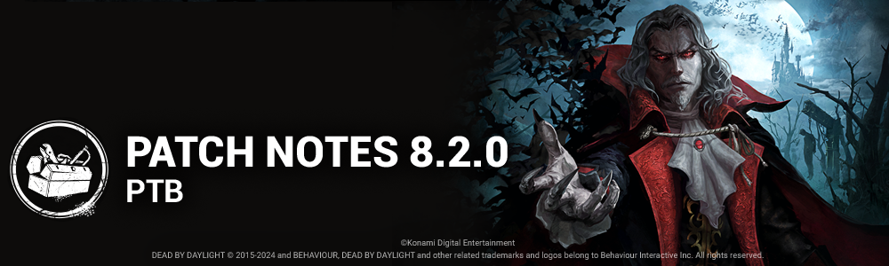

# 8.2.0 | PTB

## Content

### New Survivor - Trevor Belmont

**New Perk: Eyes of Belmont**

- When a generator is completed, the aura of the Killer is revealed to you for 1/2/3 seconds. Any time the Killer's aura is shown for a period of time, its duration is increased by **2/2/2 seconds.**

**New Perk: Exultation**

- Stunning the Killer with a pallet upgrades your held item rarity to the next tier, then recharges 25% of the item's maximum charges. *Rarity is not kept at the end of the trial.*This perk has a **40/35/30-second** cooldown.

**New Perk: Moment of Glory**

- This perk activates after you open or rummage through 2 chests. When you become injured, you become broken. Automatically heal 1 health state after **80/70/60 seconds.**Then, this perk deactivates.  
  *This effect is cancelled if you enter the dying state. This perk will not activate if you are already suffering from the Broken status effect*.

### New Killer - The Dark Lord

#### Killer Power

His dark power allows him to exact revenge on humans, taking many forms to terrorize and slaughter them.

The Dark Lord has access to three Forms and can freely change between them. Each Form has unique abilities and strengths.

- **Vampire Form** - In his default state, The Dark Lord can use the powerful Hellfire spell, which creates pillars of flame that travel ahead of him and can be cast across low obstacles.
- **Wolf Form** - In Wolf Form, The Dark Lord has access to several abilities that allow for more effective tracking. Movement speed is increased, blood pools and scratch marks are more apparent, and Survivors leave a trail of Scent Orbs behind them. The Dark Lord can collect these Scent Orbs to charge a powerful Pounce attack.
- **Bat Form** - While in Bat Form, The Dark Lord gains the Undetectable status effect. Additionally, he moves faster, ignores vault points, and can Teleport to any vault points within 32 meters. Survivors become invisible, but scratch marks can be seen.

#### Perks

**New Perk: Hex: Wretched Fate**

- After one generator has been repaired, a random dull totem becomes a hex totem and curses the Obsession. The Obsession has a **27/30/33%** repair speed penalty. They also see this Hex totem's aura when within **12/12/12 meters.*This effect persists until the Hex totem is cleansed.*

**New Perk: Human Greed**

- You see Unopened Chests auras and Survivor auras are revealed for 3 seconds when they enter a 8 meter range. You also gain the ability to kick chests to close them. This ability has a **80/70/60 second** cooldown. Survivors unlock these closed chests **50% faster.**

**New Perk: Dominance**

- The first time each totem and each chest is interacted with by a Survivor, that totem or chest is blocked by The Entity for 4/6/8 seconds. The auras of blocked totems and chests are revealed to you in white.

### Killer Updates

#### The Doctor - Basekit

- Static Blast's cooldown is now dynamic:  
   If no Survivor was caught in the Static Blast, the cooldown will be 30 seconds. *(NEW)*  
   If at least 1 Survivor was caught in the Static Blast, the cooldown will be 45 seconds. *(was 60 seconds)*
- Increased movement speed while charging Static Blast to 2.99 m/s. *(was 1.16 m/s)*

#### The Doctor - Addons

- **"Order" - Class II:**Decreases Static Blast cooldown by 2.5 seconds. *(was 4 seconds)*
- **"Order" - Carter's Notes:**Decreases Static Blast cooldown by 3 seconds.*(was 6 seconds)*

#### The Dredge - Basekit

- Decreased the volume of The Dredge's audio
- Increased movement speed while charging Reign of Darkness to 3.8 m/s. *(was 3.68 m/s)*
- Decreased Daytime cooldown to 10 seconds. *(was 12 seconds)*
- Increased Daytime teleport speed to 19 m/s. *(was 12 m/s)*
- Decreased time to exit locked Lockers to 2.25 seconds.*(was 3 seconds)*
- Increased night charges per injured Survivor to 1 charge per second. *(was 0.75 charges per second)*

#### The Dredge - Addons

- **Boat Key**Increases teleport speed during *Daytime*by 3 m/s. *(was 5 m/s)*
- **Haddie's Calendar**Decreases the time to exit a locked Locker by 0.4 seconds*. (was 1 second)*
- **Malthinker's Skull**Increases the charges gained per injured Survivor by 25%. *(was 66%)*
- **Ottomarian Writing**Decreases the cool-down time of *The Gloaming* by -2 seconds during *Daytime.(was -4 seconds)*

#### The Nemesis - Basekit

- Decrease the Mutation Rate 2 requirement to 5 Contamination Points. *(was 6)*
- Increase Hindered penalty duration from tentacle hits to 2 seconds. *(was 0.25 seconds)*

#### The Nemesis - Addons

- **Licker Tongue**Survivors are Hindered for an extra 3 seconds after being Contaminated. *(was 0.2 seconds)*
- **Marvin's Blood**Gain an extra 0.5 mutation for infecting a Survivor. *(was 0.75)*

### Survivor Perk Updates

- **Blast Mine**Activates after completing a total of 40% worth of repair progress on generators. *(was 50%)*
- **Chemical Trap**  
   Activates after completing a total of 20% worth of repair progress on generators. *(was 50%)*Stays active for 40/50/60 seconds. *(was 100/110/120 seconds)*
- **Dance With Me**Decreased cooldown to 30/25/20 seconds. *(was 60/50/40 seconds)*
- **Deception**Decreased cooldown to 30/25/20 seconds. *(was 60/50/40 seconds)*
- **Diversion**Activates after being in the Killer's Terror Radius while not in a Chase for 30/25/20 seconds. *(was 40/35/30 seconds)*
- **Flashbang**Activates after completing a total of 50/45/40% worth of repair progress on generators. *(was 70/60/50%)*
- **Mirrored Illusion**Activates after completing a total of 20% worth of repair progress on generators. ***(was 50%)***
- **Wiretap**Activates after completing a total of 40% worth of repair progress on generators.***(was 50%)***

### General Gameplay Updates

- Increase hook stage drain timer to 70 seconds. *(was 60 seconds)*

### Map Updates

#### Castle Vista

Dracula's castle will spawn in the sky of Dead by Daylight original Maps when playing against Dracula.

#### Midwich Gameplay Pass

The breakable walls have been removed in the bathroom section for both roles to use an extra set of stairs to navigate between floors.

## Features

### Graphics Option

- Added the support for Intel XeSS for PC.

### Live Data Reboot

As part of our Live operations, we occasionally deploy updates to the game without needing an update of the game application itself. These updates includes kill switches and new cosmetics, amongst other data. Starting from this release, when a critical data update is required to be downloaded by the game, you may see a popup asking you to return to the splash screen.

### UX

#### Lobby Controller Compatible Navigation

- Players can now toggle Rotation mode to use the R-stick to rotate the character preview, as in the Store, so they don't need to press A on top and use the joystick.
- Cosmetic subtab defaults to Outfits instead of Heads.

#### Settings Menu

- Disabled options are shown are greyed out, instead of having a black/transparent background.

### Misc

- The Prestige levels of other players is no longer visible within an Online Lobby (post-matchmaking).
- Upgraded EasyAntiCheat to new version.
- There is now a limit of 10000 of any Item, Add-on or Offering.

## Bug Fixes

### Audio

- Fixed an issue that caused the Long Grass to make no sound on collision.
- Fixed an issue where Season Grade Reset Rewards sounds triggered multiple times with no visual.

### Characters

- Fixed an issue that caused the Trapper to sometimes not pickup bear traps despite the animation playing while wearing the Naughty Bear outfit.
- Fixed an issue that caused placing a trap as multiple characters (Trapper, Hag, Nightmare) close to walls or other objects to sometimes be cancelled even though the placement indicator shows a valid location.
- The Survivor grab animation is now correctly aligned when the Dredge teleports to a locker at the same time as the Survivor enters it.
- The Demogorgon can no longer perform actions while travelling through a Tunnel and opening and closing the Match Details screen.
- Jittering should be reduced when spectating Killers. Some issues still remain on the Killer’s weapons and are being looked at.

### Maps

- Collision update pass on the map of Garden Of Joy
- Collision update pass on the realms of MacMillans Estates
- Fixed an issue in Greenville Park where the Parking tile doesn't spawn
- Fixed an issue in Toba Landing where invisible collisions hindered the navigation of the players
- Fixed an issue in Greenville Park where Victor would dissolve when jumping in the stairs

### UI

- If a player disconnects from a Trial due to network issues, they will no longer see the Killers' Loadouts or name.
- Fixed Player HUD text, font readability and health bar elements to their previous size.
- Fixed Tally buttons navigation misalignment.
- Fixed missing hair on The Good Guy default and prestige head cosmetics.
- Fixed an issue with the reward size on the Tutorials screen.

## Known Issues

- There are no indications in the Bloodweb when an item that has reached the 10,000 inventory limit is purchased.
- The Dark Lord and Trevor Belmont do not unlock the bloody cosmetic upon reaching prestige level 4 to 6.
- Dance with Me Perk icon does not correctly show the cooldown.
