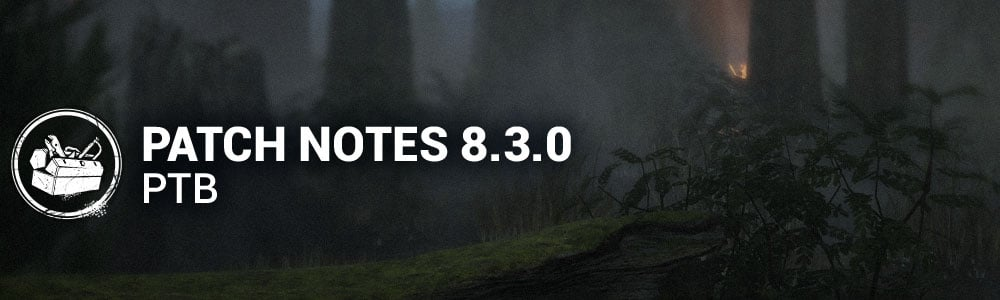

<!-- nav -->
&larr; [8.2.0 | PTB](465-8-2-0-ptb.md) · [Player Test Build (PTB)](../../index.md#player-test-build-ptb) · [8.4.0 | PTB Patch Notes](479-8-4-0-ptb-patch-notes.md) &rarr;
<!-- /nav -->

# 8.3.0 | PTB

## Important

- Progress & save data information has been copied from the Live game to our PTB servers on Sep 9. Please note that players will be able to progress for the duration of the PTB, but none of that progress will make it back to the Live version of the game.
- Players will once again receive 12,500 Auric Cells on the PTB Build to explore Outfits and Characters in the Store. Both Auric Cells and purchases made on the PTB Build will **not**transfer to the Live Build.

## Content

### Finisher Mori

The killer may now kill the last survivor by performing a Mori. Improvements have been made to the cinematic Mori camera to better highlight these end of trial kills.

- **Ebony Memento Mori:**Gain 30,000 Bloodpoints for performing any Mori on the last Survivor.
- **Ivory Memento Mori:**Gain 20,000 Bloodpoints for performing any Mori on the last Survivor.
- **Cypress Memento Mori:**  
   Gain 10,000 Bloodpoints for performing any Mori on the last Survivor.

### Killer Perk Updates

- **Blood Echo:**  
   When hooking a Survivor, all injured Survivors suffer from Hemorrhage and Exhaustion for **20/25/30 seconds.*(was 45 seconds)  
   Blood Echo* has a cooldown of 80/70/60 seconds. *(REMOVED)*
- **Dead Man'sSwitch:**  
   When hooking a Survivor, *Dead Man's Switch*activates. The first Survivor that stops repairing a generator calls upon the Entity to block it for **40/45/50 seconds**. *(was 35/40/45 seconds)*Dead Man's Switch cannot activate while it is actively blocking a generator. *(NEW)*
- **Deathbound:**  
   When a Survivor heals another Survivor, they scream and activate *Deathbound*. *(Removed the distance requirement)*  
   When the healer is further than **16/12/8 meters** from the Survivor they healed, they are **Oblivious**.  
   This lasts until the healer is hooked. *(was 60 seconds)*
- **Genetic Limits:**  
   Anytime a Survivor loses a health state, they suffer from the **Exhausted Status Effect**for **6/7/8 seconds**. *(was upon finishing the healing action, and 24/28/32 seconds)*
- **Hex: Crowd Control:**The last **3/4/5**vaults that Survivors rush vault are blocked by the Entity. *(was 14/17/20 seconds)*  
   This lasts until the hex totem is cleansed.
- **Leverage:**When a Survivor performs the unhook action, their healing speed is reduced by **30/40/50%**for **30 seconds.*(was token based, and 3/4/5%)*
- **Machine Learning:**When damaging a generator, it becomes **Compromised.** Only one generator can be **Compromised**at a time. *(Removed the requirement to activate the perk)*  
   When a **Compromised** generator is completed, you become **Undetectable** and gain **10% Haste**for **40/50/60 seconds.**  
   This effect cannot stack.
- **Predator:**  
   When a Survivor escapes a chase, reveal their aura for **6 seconds**. *(NEW)  
   Predator*has a **60/50/40-second**cooldown *(NEW)*
- **THWACK!:**  
  *THWACK*starts with **3 tokens*(NEW)*When breaking a pallet or breakable wall, consume a token. *(NEW)*  
   Survivors within **24 meters**scream, revealing their location for **3/4/5 seconds*(was 28/30/32 meters, and 4 seconds)*When hooking a Survivor, regain **1**token*(NEW)*
- **Zanshin Tactics:**When a Survivor is within **6 meters**of a dropped pallet within **16 meters** of your location, reveal their aura for **6/8/10 seconds.*(REWORK)*

## Survivor Perk Updates

- **Bloodrush:**After being unhooked, *Blood Rush* activates for the next **40/50/60 seconds.**  
   While suffering from **Exhausted**, press the Active Ability Button 1 to recover from **Exhausted** instantly.  
  *Blood Rush*deactivates when used or when performing a conspicuous action.  
  *Blood Rush*is disabled once the exit gates are powered.
- **Corrective Action:**You start the trial with **1/2/3**token(s) and gain a token, up to a maximum of **5**, for every Great Skill Check.  
   When a Survivor fails a Normal Skill Check within **8 meters**, 1 token is consumed and their failed Skill Check becomes a Great Skill Check.
- **Distortion:**When your aura would be read, hide your scratch marks and aura for the next **8/10/12 seconds.*(was 6/8/10)*  
  *Distortion* deactivates until the next time you are chased.
- **Inner Focus:**You can see other Survivors' Scratch Marks.  
   Whenever another Survivor loses a health state, the Killer's aura is revealed to you for **6/8/10 seconds**. *(Removed the range condition)*
- **Lucky Star:**When you hide a locker, make no grunts of pain.  
   After exiting the locker, you see the aura of the closest generator, all Survivors, and make no grunts of pain, nor leave blood pools for **30 seconds.*(was 10 seconds)**Lucky Star*goes on cooldown for **40/35/30 seconds*.*
- **Poised:**When first starting repairs on a generator, reveal the Killer's aura for **6 seconds**. *(NEW)*After a generator is completed, leave no scratch marks for **10/12/14 seconds**. *(was 6/8/10 seconds)*
- **Quick Gambit:**When you are being chased, see the aura of other Survivors. *(Removed the range condition)*  
   Survivors working on any generator gain **3/4/5%**repair speed boost. *(was 6/7/8%)*  
  *Quick Gambit*goes on cooldown for **60/60/60 seconds** when you lose a health state. *(NEW)*
- **Teamwork: Collective Stealth:**After being healed by another Survivor, you both leave no scratch marks as long as you stay within **8/12/16 meters**. *(Removed cooldown, was 12 meters)*  
   This effect lingers for **4 seconds** when leaving the range. *(NEW)*  
   This effect does not stack.
- **Teamwork: Power of Two:**When you finish healing another Survivor, you both gain **5% Haste** as long as you stay within **8/12/16 meters**. *(Removed cooldown, was 12 meters)*This effect lingers for **4 seconds**when leaving the range. *(NEW)*  
   This effect does not stack.
- **We're Gonna Live Forever:**When healing another Survivor in the dying state, your healing speed is increased by **150%.*(was 100%)*When completing the heal action, grant them the **Endurance Status Effect**for **6/8/10 seconds**. This effect has a **30-second** cooldown. *(Removed the list of conditions required to trigger this effect)*

### Killer Updates

**The Hillbilly - Basekit**

- Decrease Overdrive dissipation buffer to **8 seconds*(was 15 seconds)*
- Decrease Overdrive chainsaw sprint speed to **11.5 m/s*(was 13 m/s)*
- Decrease Overdrive charges gained when revving to **1.5/second*(was 2/second)*
- Decrease Overdrive charges gained when sprinting to **1.5/second*(was 2/second)*
- Increase the Chainsaw miss cooldown to **2.7 seconds*(was 2.5 seconds)*

**The Hillbilly - Addons**

- **Discarded Air Filter:**  
   Decrease rarity to Common *(was Rare)*
- **High-Speed IdlerScrew:**  
   Decrease rarity to Uncommon *(was Very Rare)*
- **Dad's Boots:**  
   Increase rarity to Rare *(was Common)*Increases the Chainsaw Sprint turn rate by **20%*(was 30%)*
- **Spiked Boots:**  
   Increase rarity to Very Rare *(was Uncommon)*  
   Increases the Chainsaw Sprint turn rate by **30%*(was 45%)*
- **Lo ProChains:**  
   Chainsaw hits within 5 seconds of breaking a pallet inflict Deep Wound on Injured Survivors *(instead of the Dying State)*

**The Skull Merchant - Basekit**

- Decrease the Hindered penalty when scanned while having a Claw Trap to **5%*(was 10%)*
- Drones are always in the active state *(NEW)*
- Drone scan lines are only visible within **16 meters*(NEW)*
- Decrease the number of scan lines to **1*(was 2)*
- The Skull Merchant no longer gains Haste from Survivors being scanned or from Survivors having a Claw Trap

**The Skull Merchant - Addons**

- **Expired Batteries:**All Survivors start the trial with a Claw Trap, which has **50%**normal battery life.  
   Claw Trap battery life increases by **10%** for each Claw Trap received, up to **150%**. *(Note: After the initial Claw Trap of 50%, the next Claw Trap starts at 100% battery life)*

**The Twins - Basekit**

- Increase the cooldown when Victor is crushed to **20 seconds*(was 15 seconds)*
- Increase the cooldown when Victor downs a Survivor to **3.2 seconds*(was 2.7 seconds)*

**The Unknown - Basekit**

- Decrease to Teleport movement speed Recovery to **1.4 seconds*(was 1.7 seconds)*
- Decrease to delay between charging UVX and movement speed penalty to **0.07 seconds*(Triggering movement speed penalty while charging UVX now happens faster upon pressing input, was 0.2 seconds)*
- Moved Survivor body texture effect from UVX Airborne Hits to successful UVX Weakened Hits *(Weakened Survivors should now have more visual information to track if they have become or are still afflicted by Weakened)*
- Updated sound effect for UVX Airborne Hit to sound more neutral overall

**The Unknown - Addons**

- **Blurry Photo:**  
   After Teleporting, regain full Movement Speed 15% faster *(was 50% faster)*
- **Vanishing Box**  
   Survivors who complete generators become Weakened against UVX  
   Increase Hallucination spawn time by 80%*(NEW)*

## Features

### UX

Gameplay

- Updated the Unknown's Killer Power Icon with new smaller icons to better surface mechanics and cooldowns

Rift Pass

- Players can Preview Mori's at the Rift Pass

## Bug Fixes

### Archives

- Fixed an issue that caused the "With Your Own hands" challenge not to gain progress when killing a Survivor with the Lich's Recover Artifact.

### Audio

- Fixed an issue that caused Slipknot's Theme to not play when swapping cosmetics.
- Dwight's Mr. Elf outfit is now producing short range SFX when crouching/uncrouching.
- Fixed an issue that caused Lara Croft to trigger VOs during a Mori.

### Bots

- Survivor Bots went through a grueling training on how to use Flashlights and are now much better at aiming them and using them mid-chase.

### Characters

- More Legendary Outfits for Killers now come with a custom name.
- Fixed an issue that caused the Nemesis' add-on Adrenaline Injector not to increase Killer Instinct duration.
- Fixed an issue that caused the Dark Lord's model to become distorted when spectating while the Killer shapeshifted forms.

### Environment/Maps

- Fixed an issue the map Sanctum of Wrath where the statues head would not rotate.
- Fixed an issue in Midwich Elementary school where a ground tile appeared in the corridors.
- Fixed an issue in the map Rancid Abattoir where a tree would clip through the exit gates.
- Updated the map tile generation to reduce chances of bugs in the future. You may see certain tiles appear more or less commonly than before.

### Perks

- Fixed an issue that caused the incorrect external perk icon to be shown when a Survivor is unhooked with Babysitter.
- Fixed an issue that caused Decisive Strike not to free the Survivor after being caught by the Lich mimic chest.
- Fixed an issue that caused the Eye of Belmont perk to behave inconsistently when paired with Object of Obsession perk.
- Fixed an issue that caused the Weave Attunement debuff icon to remain on a Survivor whilst no longer affected.

### Add-Ons

- Updated the Description to The Dark Lord's Magical Ticket add-on to reflect the correct value.

### Platforms

- Improved loading time during splash screen for Xbox Series X.
- Fixed a crash that could occur when Suspending the game on PlayStation consoles.

### Misc

- Fixed a crash that could occur when force-exiting the application with Alt-F4 during a Trial.
- Fixed a crash that could occur on servers while loading into a Trial.
- Fixed an issue that caused the White Ward Survivor Offering not to protect add-on when the Survivor dies with an upgraded item.

<!-- nav -->
&larr; [8.2.0 | PTB](465-8-2-0-ptb.md) · [Player Test Build (PTB)](../../index.md#player-test-build-ptb) · [8.4.0 | PTB Patch Notes](479-8-4-0-ptb-patch-notes.md) &rarr;
<!-- /nav -->
