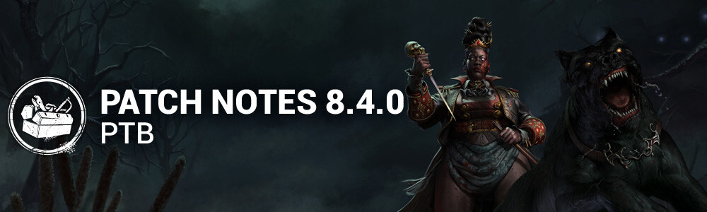

<!-- summary -->
## AI TL;DR

New content for the PTB includes the Houndmaster killer with her dog-controlled Chase and Search powers, the survivor Taurie Cain with three new perks, and the Ormond Lake Mine map for testing. Players’ Live progress and save data were transferred to PTB, and 12,500 Auric Cells are granted for the session (non-transferable).

The update also tweaks numerous killer basekits and addons—Dark Lord, Demogorgon, Ghost Face, Good Guy, Lich, Shape and others—and revises several survivor perks and chest interaction times. Across the board, the patch focuses on bug fixes: environmental collisions and textures (especially on the new map), UI crashes, bot locomotion, perk interactions, and miscellaneous issues such as platform-exclusive outfit visibility.
<!-- /summary -->

<!-- nav -->
&larr; [8.3.0 | PTB](473-8-3-0-ptb.md) · [Player Test Build (PTB)](../../index.md#player-test-build-ptb) · [8.5.0 | PTB Patch Notes](488-8-5-0-ptb-patch-notes.md) &rarr;
<!-- /nav -->

# 8.4.0 | PTB Patch Notes

*This article was created from a*[*community discussion*](https://forums.bhvr.com/dead-by-daylight/discussion/431740/8-4-0-ptb-patch-notes).

## Important

- Progress & save data information has been copied from the Live game to our PTB servers on ***28th October***. Please note that players will be able to progress for the duration of the PTB, but none of that progress will make it back to the Live version of the game.

- Players will once again receive 12,500 Auric Cells on the PTB to explore Outfits and Characters in the Store. Both Auric Cells and purchases made on the PTB Build will not transfer to the Live Build.

## Content

## New Killer - The Houndmaster

### Killer Power - Scent of Blood

The Houndmaster and her dog operate as one. Her commands are followed without question or delay.

**Special Ability: Chase**

The Chase Command sends the dog out at high speed. Pressing the Power button again redirects the Chase, pivoting the dog's path. When the dog catches a Survivor, the dog starts a Grab. The Survivor becomes Hindered and is pulled toward The Houndmaster. The Survivor can get free by stunning the dog or can be rescued by another Survivor. Grabs that end without Injury leave the Survivor Hindered. Grab duration is shorter for Survivors with the Endurance status effect.

**Special Ability: Search**

The Search Command sends the dog to a target location, creating a Search Path. It has its own lullaby and, as it moves, its Houndsense radius rises over distance traveled. Survivors who enter the radius are affected by Houndsense and revealed by Killer Instinct. If The Houndmaster follows the dog’s Search Path, she gains increased movement speed over time. Leaving the Search Path ends the bonus movement speed.

**Special Effect: Houndsense**

Healthy Survivors affected by Houndsense receive Deep Wounds when Injured. Injured Survivors affected by Houndsense suffer from louder Grunts of Pain and longer Pools of Blood when put into the Dying state.

### Perks:

**All-Shaking Thunder**

- After you fall from a height, your lunge attack distance is increased by 75/75/75% for 8/12/16 seconds.
- This perk has a 5/5/5-second cooldown.

**Scourge Hook: Jagged Compass**

- At the start of the trial, up to 4 random hooks are changed into scourge hooks. You see their auras in white.
- When a Survivor is unhooked from a non-scourge hook, it becomes a scourge hook. When you hook a Survivor on a Scourge Hook, the aura of the generator with the most progress is revealed in yellow for 6/8/10 seconds.

**No Quarter**

- When a Survivor reaches 75/75/75% of a self-heal, they are faced with continuous skill checks.
- If one of these skill checks is missed or the heal is interrupted, the Survivor becomes broken for 20/25/30 seconds.

## New Survivor - Taurie Cain

### Perks

1. **Invocation: Treacherous Crows**

- When in the Basement near the circle, press the ability button 2 to begin the Invocation. Invocations take 60/60/60 seconds. Other Survivors will see your aura during this and can join an ongoing interaction. Once the Invocation is completed: Completing the Invocation disables that perk for all Survivors.
- You become injured and broken for the rest of the trial.
- When a Survivor is in the Terror Radius and the Killer scares a crow, their aura is revealed to all Survivors for 1/1.5/2 seconds.

1. **Clean Break**

- After you finish healing another Survivor, while being healed by another Survivor, press the ability button 1 to become Broken.
- After 80/70/60 seconds, you become healthy.

*This perk does not activate if you are already broken. The effect is cancelled if you go in the dying state.*

1. **Shoulder the Burden**

- Once per trial, as long as you are not on death hook, press the ability button 2 in front of a hooked Survivor to unhook them. When they are unhooked, they lose 1 hook state and you gain 1 hook state. You also scream and become Exposed for 30/25/20 seconds.

## New Map

- A new map on the other side of Mount Ormond is here for testing on the PTB only! Explore The Ormond Lake Mine. (this map will not be part of the Chapter release)

  **Features**

Survivor Activity HUD Improvements

- All activities will now surface their progress on the activity HUD (*previously was just Generators and Recovery)*
- A new activity was created to differentiate when a Survivor is Mending or Healing themselves
- A new activity was created to differentiate when a Survivor is Blessing a totem
- Some Killer power interactions which were previously missing are now included on the activity HUD

Perk's HUD improvement

- Visual differentiation between a Perk being temporally unavailable from being disabled completely. First time implementation for new Invocation Perk.

Characters' Bio Pages

- Re-added Power and Perks previews on Bio page

Store

- Featured Page main carousel can also display Bundles.
- Featured Page bundle widget is now a carousel that shows Bundles and Collections.

## Killer Updates

### The Dark Lord - Basekit

- Increase shapeshift cooldown to 3.5 seconds *(was 2.5)*
- Vampire Form: Increase Hellfire cooldown to 10 seconds *(was 7)*
- Wolf Form: Increase the spawn rate of Scent Orbs to 1 every 5 seconds*(was 1 every 6 seconds)*
- Wolf Form: Decrease Wolf's pounce charge time to 0.85 seconds*(was 1)*

### The Demogorgon - Basekit

- Decrease Portal setting time to 0.85 seconds *(was 1)*
- Decrease Portal entry time to 1.35 seconds *(was 1.5)*
- Increase Upside Down travel speed to 28 m/s *(was 20)*

### The Demogorgon - Addons

- Viscous Webbing:  
   Increases the Sealing time of Portals by 10% *(was 16%)*
- Thorny Vines:  
   Increases the Area of Effect of Active Portals by 1 meter  
   Increases the Sealing time of Portals by 8% *(was 11%)*
- Upside Down Resin:  
   Increases the Sealing time or Portals by 20% *(was 28%)*
- Lifeguard Whistle:  
   Reveal Survivors near active portals without charging *Of The Abyss (REMOVED)*Increases the number of Portals by 2 *(NEW)*

### The Ghost Face - Basekit

- Decrease Night Shroud's cooldown to 17 seconds *(was 20)*
- Decrease the time to Mark Survivors to 4.5 seconds*(was 5)*

### The Ghost Face - Addons

- "Philly":  
   Decreases the time to Marek Survivors by 10% *(was 20%)*
- Walleye's Matchbook:  
   Decrease Night Shroud's recovery time by 3 seconds*(was 6)*

### The Good Guy - Basekit

- Decrease the Scamper time to 1 second *(was 1.3)*
- Increase Hidey-Ho Mode's cooldown to 12 seconds *(was 10)*

### The Good Guy - Addons

- Rat Poison:  
   Decreased range to 6 meters*(was 12)*Decreased duration to 2.5 seconds*(was 5)*

### The Lich - Basekit

- Decreased Dispelling Sphere's cooldown to 35 seconds*(was 38)*
- Decreased Flight of the Damned's cooldown to 35 seconds*(was 38)*
- Decreased Fly's cooldown to 25 seconds*(was 38)*
- Increased Mage Hand's cooldown to 40 seconds*(was 38)*
- Increased the cooldown after cancelling a spell to 1.25 seconds (was 1)
- Decreased the time Dispelling Sphere disables magic items to 45 seconds (was 60)

### The Lich - Addons

- Pearl of Power:  
   Decreases the cooldown of all Spells by 3 seconds after a successful Basic Attack *(was 5)*
- Ring of Spell Storing:  
   Decreases the cooldown of all Spells by 2 seconds (was 4)

### The Mastermind - Basekit

- Decreased Virulent Bound's cooldown to 5.5 seconds *(was 6 seconds)*

### The Mastermind - Addons

- Leather Gloves:  
   Decreases Virulent Bound's cooldown by 8% *(was 10%)*

### The Shape - Basekit

- Increased Evil Within I movement speed to 4.4 m/s *(was 4.2 m/s)*
- Increased maximum stalk per Survivor to 20 points *(was 10)*
- Decreased the amount of Evil Within required to reach Evil Within II to 3 *(was 5)*
- Increased the Evil Within gain multiplier when stalking from afar to 1 *(was 0.1)*
- Decreased the Evil Within gain multiplier when stalking from up close to 0.4 *(was 1)*

### The Shape - Addons

- Fragrant Tuft of Hair:  
   Increased the Evil Within III requirement to 20 *(was 10)*
- Lock of Hair:  
   Decreased the Evil Within III requirement to 50% (*was 100%*)
- Judith's Tombstone:  
   Increased the Evil Within III requirement to 20 *(was 10)*
- Tombstone Piece:  
   Increased the Evil Within III requirement to 15 *(was 7.5)*
- Scratched Mirror:  
   Decreases Evil Within I movement speed to 4.2 m/s *(NEW)*

## Killer Perk Updates

- Dominance:  
   The first time each totem and each chest is interacted with by a Survivor, that totem or chest is blocked by the Entity for 8/12/16 seconds. *(was 4/6/8)*
- Human Greed:  
   You see Unopened Chests auras and Survivor auras are revealed for 3/3/3 seconds when they enter a 8/8/8-meter range.  
   You also gain the ability to kick chests to close them. This ability has a 30/25/20-second cooldown. *(was 60/45/30 seconds)*
- Languid Touch:  
   When a Survivor within 36 meters of you scares a crow, they gain the Exhausted status effect for 6/8/10 seconds.  
   This perk has a 5-second cooldown. *(was 20 seconds)*
- Weave Attunement:  
   When any item becomes depleted for the first time each match, it is dropped. You see the auras of dropped items.  
   Survivors within 8 meters of dropped items have their auras revealed to you. *(was 12 meters)*  
   Affected Survivors see the item's aura. *(NEW)*  
   When a Survivor picks up a Survivor item, they suffer the Oblivious status effect for 20/25/30 seconds.

## Survivor Updates

### General

- Decreased the time it takes to unlock chests to 8 seconds *(10 seconds)*

## Survivor Perk Updates

- Ace in the Hole:  
   When retrieving an item from a chest, there is a 100% chance that a Ultra Rare (or lower) add-on will be attached to it. *(was Very Rare or lower)*  
   50/75/100% chance to finding an add-on of Uncommon rarity or lower. *(was 10/25/50%)*  
   When escaping, keep any add-ons your item has.
- Buckle Up:  
   Updated the perk's description for clarity.
- Invocation: Weaving Spiders:  
   Description was updated to match the new invocation (Treacherous Crows), but no gameplay change otherwise.
- Pharmacy:  
   When injured, Pharmacy activates *(REMOVED)*  
   Unlocking chests is 70/85/100% faster. *(was 40/60/80% faster)*  
   The hearing distance for noises from unlocking chests are reduced by 20 meters. *(was 8 meters)*  
  *Pharmacy*guarantees an Emergency Med-Kit upon completing the interaction.
- Plunderer's Instinct:  
   The auras of unopened chests and items in the environment are revealed to you when standing within a 32/48/64 meters range. *(was 16/24/32 meters)*  
   Increases the odds of finding higher rarity items from chests by 50%. *(was 14/24/46%)*
- Scene Partner:  
  *Scene Partner* activates when you are in the Killer's Terror Radius.  
   Whenever you look at the Killer, scream, then see the Killer's aura for 4/5/6 seconds. *(was 3/4/5 seconds)*  
   There is a chance you will scream again, if you do, you will see the Killer's aura for an additional 2 seconds.*Scene Partner* then goes on cool-down for 40 seconds. *(was 60 seconds)*

## Bug Fixes

## Bots

- Improved Survivor bot locomotion.

## Environment/Maps

- Fixed missing cracks during the End Game Collapse
- Fixing floating assets on multiple maps.
- Fixed brief bright light when returning to the Main Menu from the Store.
- Fixed sudden brief burst of bright light when viewing a Mori.
- Fixed occurrences of exit tiles not matching themed maps.
- Fixed a visible seam at the Exit Gates on Ormond Lake Mine.
- Fixed pools of blood that failed to appear in multiple places on the Ormond Lake Mine
- Fixed missing textures on multiple tiles of the Ormond Lake Mine
- Fixed a clipping issue the bridge in Ormond Lake Mine
- Fixed collision issues on tunnel stairs, tower scaffold ground, and tower tile collisions, on Ormond Lake Mine
- Reworked complex collisions preventing Killer projectile to pass through on the top floor of the Ormond Lake Mine Building
- Fixed issues of Camera Fade exclusion for the Mori Update feature
- Fixed an issue in Lery's Hospital where the Killer could not grab a survivor from one side of a generator
- Fixed an issue with collision on Ironworks of Misery
- Fixed an issue with collision on The Underground Complex
- Fixed an issue with collision on The Nostromo Wreckage

## Perks

- Fixed an issue that caused the Hex: Thrill of the Hunt interaction speed values to be incorrect if cleansed before Hex: Undying.
- Fixed an issue that caused the Deathbound perk not to be disabled when grabbed by the Killer.
- Fixed an issue that caused Hex: Devour Hope to gain a token when a Survivor self unhooks with the Deliverance perk.

## UI

- Fixed an issue where cinematics can be skipped by L-stick or R-stick on the controller.
- Fixed a crash that could occur when using the virtual keyboard.
- Fixed an issue where the Beginner Tooltip text can be seen overflowing in certain languages.
- Fixed an issue where the prestige button's progress bar isn't reacting accordingly to the bloodpoints balance.
- Fixed a crash that could occur when equipping and unequipping the banner and badge.
- Fixed an issue where the survivor action icon on the player status is missing after spectating the killer in a custom game.
- Fixed an issue where the blood splatter effect on the player status is missing in various states.
- Fixed an issue where unnecessary lines appear when opening the event popup.

## Misc

- Fixed an issue where platform exclusive outfits cannot be seen by other platform players
- Fixed an issue that caused Aestri Yazar, Lara Croft, Trevor Belmont, The Lich and The Dark Lord prestige outfits unlock in wrong order.
- The Wraith is now correctly able to move and attack after doing certain interactions when using the "The Serpent - Soot" Add-on
- Fixed an issue that caused Killers to be able to spam the Mori interaction.

## Known Issues

**The Houndmaster**

- The Search Path can appear above the ground when Search Command sends the dog to a different elevation.
- While running on the Search Path, The Houndmaster very rarely does not earn the movement speed bonus.
- Survivors performing the Grab Rescue interaction on another Survivor will play the corresponding animation after rescued Survivor is freed from the dog, instead of during the ongoing interaction.
- Survivors involved in a Grab display the Broken status effect symbol instead of the Incapacitated status effect symbol.
- The Houndmaster is missing her dog during the Match Result Screen.
- The Houndmaster's dog position is desynced with the Survivor during the Mori when performing multiple actions.
- The collision on the Houndmaster's dog prevents the Killer from being blinded by flashlights.
- The Houndmaster's dog visually does not always complete the vault animation, but still continues the path.
- Frequently, the Clean Break perk does not trigger whilst being healed by another Survivor that also has the Clean Break perk equipped.

**THE NIGHTMARE AND THE SKULL MERCHANT ARE DISABLED FOR THE COURSE OF THIS PTB**

<!-- nav -->
&larr; [8.3.0 | PTB](473-8-3-0-ptb.md) · [Player Test Build (PTB)](../../index.md#player-test-build-ptb) · [8.5.0 | PTB Patch Notes](488-8-5-0-ptb-patch-notes.md) &rarr;
<!-- /nav -->
