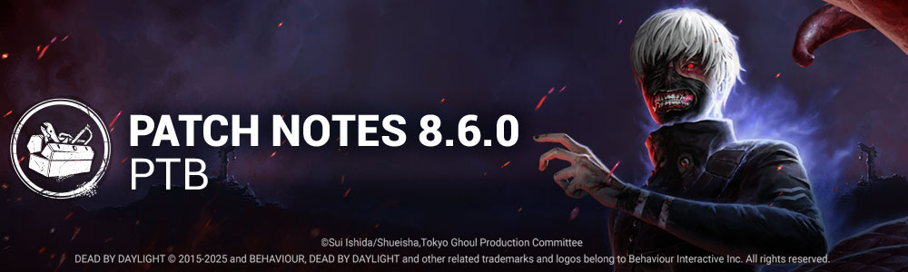

<!-- nav -->
&larr; [8.5.0 | PTB Patch Notes](488-8-5-0-ptb-patch-notes.md) · [Player Test Build (PTB)](../../index.md#player-test-build-ptb) · [8.7.0 | PTB Patch Notes](501-8-7-0-ptb-patch-notes.md) &rarr;
<!-- /nav -->

# 8.6.0 | PTB Patch Notes

## Important

- Progress & save data information has been copied from the Live game to our PTB servers on ***March 4, 2025***. Please note that players will be able to progress for the duration of the PTB, but none of that progress will make it back to the Live version of the game.
- Players will once again receive 12,500 Auric Cells on the PTB to explore Outfits and Characters in the Store. Both Auric Cells and purchases made on the PTB Build will not transfer to the Live Build.

## Content

### NEW KILLER - THE GHOUL

#### KILLER POWER - One-Eyed Terror

**SPECIAL ABILITY: Kagune Leap**

- Use the *Power button* to charge and launch the **Kagune**, tentacles that attach to any vertical surface within range and quickly pull The Ghoul forward.
- After completing a **leap**, The Ghoul has a window to perform a second consecutive **Kagune Leap** or put **Kagune Leap** into cooldown by using the *active ability button*.
- **Kagune Leap** enters cooldown once The Ghoul has consumed their **leaps**, if they **leap** over a vault or downed pallet, or if the **Kagune** grabs and **leaps** at a Survivor.
- If The Ghoul’s second consecutive **leap** targets a Survivor, they will perform a grab-attack. Grab-attacks damage Survivors if they are healthy; inflict **Deep Wounds**; and leave a **Kagune Mark**.
- Performing a grab-attack also triggers **Enraged Mode**.

**SPECIAL ABILITY: Enraged Mode**

- While **Enraged**, The Ghoul can perform up to three consecutive **Kagune Leaps** and can **leap** over vaults more quickly if they launch their **Kagune** at a Survivor.
- **Enraged Mode** remains active while there are Survivors afflicted with **Kagune Mark**. Marked Survivors will lose their mark if they are fully **Mended**, or if they are downed.
- The Ghoul cannot grab-attack marked Survivors.
- Once no marked Survivors remain, a **Countdown** begins. When the **Countdown** depletes, **Enraged Mode** ends. A perfectly timed grab-attack will add extra time to the **Countdown**. The **Countdown** is paused while carrying Survivors.

**NEW KILLER PERKS**

- **Hex: Nothing But Misery:**
  - After you damage Survivors **8/8/8** times with basic attacks, a dull totem becomes a hex totem, cursing all Survivors.
    - When you damage a Survivor with a basic attack, they gain **5/5/5% Hindered** for **10/12.5/15 seconds**.
      - *The effects last until the hex totem is cleansed.*
- **Forever Entwined:**
  - When a Survivor takes damage, gain 1 token, up to **6/7/8**.
  - For each token, you pick up, drop and hook Survivors **4%** faster.
- **None Are Free:**
  - When you hook a Survivor for the first time, gain **1**token, up to **4**.
  - When all generators are completed, for each token, all windows and upright pallets are blocked for everyone for **12/14/16 seconds.**

## Features

### Scratch Marks Improvements

- Made improvements to the Scratch Marks spawn logic. They should spawn on the ground more consistently.

### Surrender Option

Under specific scenarios, it will be possible to Surrender during a trial and retain some progress including:

- Bloodpoints
- Match XP
- Challenge progress
- Emblem scores

Surrendering in the following conditions does not incur a Disconnection Penalty, but will not count as a completed trial and still causes item/addon loss:

Killer:

- When all remaining Survivors are bots
- When no generator has been completed within the last 10 minutes

Survivor:

- When all other remaining Survivors are bots
- When all Survivors are in the Dying State

### Map

**Forsaken Boneyard**

- The Eyrie of Crows main building was modified; windows have changed position and drops from the exterior have been added to the balcony
- The content of the tiles has been revisited, to reduce the amount of small collisions that were reducing the quality of the navigations.
- New tiles have been created: double pallet tiles
- **An extension of the theme has been added:**
- **Dead Sands** is a new map added to the roster under the Forsaken Boneyard theme, it expends the lore and at the same time nerfs the realm offering
- The branches with large collisions that would appear between tiles have been removed

**Base Game**

- Exit Gate notifications are visible for 12 seconds when they are powered *(was 7 seconds)*

### Survivor Bloodpoint Balancing

- Increased Safe Hook Rescue score event to 1250 *(was 500)*
- Increased Heal (no Med-Kit) score event to 750 *(was 500)*
- Increased Heal (Med-Kit) score event to 1000 *(was 750)*
- Increased Heal (self) score event to 750 *(was 300)*
- Increased Dull Totem Cleansing score event to 1500 *(was 1000)*
- Increased chase escape score event to 750*(was 400)*
- Increased Repairs score event to 2000*(was 1250)*
- Increased Gate Open score event to 2000 *(was 1250)*
- Increased Chest Unlocked score event to 750 *(was 250)*
- Increased Killer Grasp Escape score event to 1250 *(was 500)*
- Increased Obsession Escape score event to 2000 *(was 1500)*
- Increased Chased score event to 50/s *(was 40/s)*
- Increased Good Wiggle Skill Check score event to 50 each*(was 25)*
- Increased Great Wiggle Skill Check score event to 100 each *(was 50)*

The following score events have been moved to a different category:

- Dropping a pallet now awards Survival points *(was Boldness)*
- Stunning the Killer now awards Survival points *(was Boldness)*
- Cleansing a Dull Totem now awards Survival points *(was Boldness)*
- Cleansing a Hex Totem now awards Survival points *(was Boldness)*

### Deep Wound

- Decreased the time it takes to Mend your own Deep Wound to **10 seconds*(was 12 seconds)*
- Decreased the time it takes to Mend another Survivors' Deep Wound to **6 seconds*(was 8 seconds)*

### Killer Updates

**The Legion:**

- Decreased fatigue duration to 2.5 seconds *(was 3 seconds)*
- Increased movement speed during fatigue to 2.3m/s*(was 2.07m/s)*
- Increased duration of Feral Frenzy to 11 seconds *(was 10 seconds)*
- Decreased Feral Frenzy cooldown to 15 seconds *(was 20 seconds)*
- Increased bonus movement speed gained per hit during Feral Frenzy to 0.24m/s *(was 0.2m/s)*

**The Legion Add-Ons:**

- The Mural Sketch add-on now grants an additional 0.08m/s movement speed per hit *(was 0.1m/s)*
- The Mischief List add-on now increased Feral Frenzy duration by 1 second *(was 2 seconds)*

**The Xenomorph:**

- Increased the Tail Attack charge time to 0.35 seconds *(was 0.2 seconds)*
- Increased the Tail Attack charge volume for Survivors.
- Decreased the missed Tail Attack cooldown to 2.5 seconds *(was 3 seconds)*
- Increased Killer Instinct range when exiting a tunnel to 16 meters *(was 12 meters)*
- Decreased the time it takes to exit a tunnel to 1.5 seconds *(was 2.25 seconds)*
- Increased the amount of fire required to burn The Xenomorph out of Crawler Mode to 175 *(was 100)*
- Increased the delay before heat begins to dissipate to 15 seconds*(was 1 second)*
- Decreased the rate at which heat dissipates to 2 per second *(was 25 per second)*

**The Xenomorph Add-Ons:**

- The Drinking Bird add-on now increases the duration of Killer Instinct after exiting a tunnel by 3 seconds *(was 2 seconds)*
- The Ash's Innards add-on now increases the respawn time of Remote Flame Turrets by 15 seconds *(was 10 seconds)*
- The Light Wand add-on now increases the downtime of Remote Flame Turrets after exiting a tunnel by 3 seconds *(was 1 second)*
- The Molted Skin add-on now caused Survivors who deploy a Remote Flame Turret to become Exhausted for 30 seconds *(was 3 seconds)* and no longer inflicts Hindered.
- The Harpoon Gun add-on now causes Survivors further than 16 meters*(was 24 meters)* to be revealed when hitting a Survivor within 30 seconds *(was 10 seconds)*of exiting a tunnel.
- The Emergency Helmet add-on now increases resistance to Remote Flame Turrets by 15% *(was 35%)*

**The Good Guy:**

- Decreased Hidey-Ho cooldown to 12 seconds *(was 14)*
- Decreased the time it takes to reach max speed at the start of Slice and Dice and after Scampering a window or pallet.

### Terror Radius

- Increased The Hillbilly and The Blight's Terror Radius to 40 meters *(was 32 meters)*
- Decreased The Pig, The Ghost Face, and The Skull Merchant's Terror Radius to 24 meters *(was 32 meters)*

### Killer Perks

**Alien Instinct:**

- Increased aura reveal duration to 8 seconds *(was 5 seconds)*
- Increased Oblivious duration to 40/50/60 seconds *(was 16/18/20 seconds)*

**Deathbound:**

- Decreased range to 12/8/4 meters *(was 16/12/8 meters)*

**Hysteria:**

- Increased Oblivious duration to 30/35/40 seconds *(was 20/25/30 seconds)*
- Decreased cooldown to 20 seconds *(was 30 seconds)*

**Knock Out*(Rework)*:**

- When a Survivor drops a pallet, if they move 6/6/6 meters away from it within 6/6/6 seconds, they gain 5/5/5% Hindered for 3/4/5 seconds.

**Nemesis:**

- Increased aura reveal duration to 8 seconds *(was 4 seconds)*

### Survivor Perks

**Quick and Quiet:**

- Decreased cooldown to 25/20/15 seconds *(was 30/25/20 seconds)*

**Deception:**

- Increased the time during which you leave no scratch marks to 5 seconds *(was 3)*
- Decreased cooldown to 25/20/15 seconds*(was 30/25/20 seconds)*

**Dance With Me:**

- Increased hidden scratch mark duration to 5 seconds *(was 3 seconds)*
- Decreased cooldown to 25/20/15 seconds *(was 30/25/20 seconds)*

**Red Herring:**

- Decreased repair requirement to 1 second*(was 3 seconds)*
- Decreased cooldown to 25/20/15 seconds *(was 30/25/20 seconds)*

### Loadouts

- Equipped elements now show units left counter.

### Bot Improvements

- Survivor bots now correctly strafe when aimed by a Killer's first ranged attack.
- Survivor bots are now less interested in Chests and won't try to steal the loot of another player.
- Survivor bots no longer repeatedly enter lockers trying to craft a Flashbang.

## Bug Fixes

### Audio

- Fixed an issue where the effect on the Unknown's Voice was missing in the lobby.
- Fixed an issue where Leon Kennedy's DSO Agent outfit would used Carlos Oliveira's voice.
- Fixed an issue where the ''Memory 1736'' entry from the ''Talbot Grimes'' journal was missing voice over.
- Fixed an issue that caused a dropped Flashbang to have no audio cue.

### Bots

- Fixed an issue where preventing Disconnect bots from properly using their perks.
- Fixed multiple navigation issues for all AI entities in Haddonfield.

### Character

- Fixed an issue that caused Survivors to clip into Killers during the pickup animation.
- Fixed an issue that caused Survivors to momentarily freeze when they stopped inputting movement.
- Fixed an issue that caused Survivor's camera to stutter and re-align when fast exiting a locker.
- Fixed an issue that caused part of the Deathslinger's reload animation to be skipped.
- Fixed an issue that caused the animation of missing a Basic Attack to fail to play properly during any trial as The Nemesis.
- Fixed an issue that caused the body of a carried Survivor to clip inside The Nightmare's camera during basic attack cooldowns.
- Fixed an issue which caused the Nightmare's Black Box Addon to block the exit area indefinitely.
- Fixed an issue that allowed the Nightmare to pass through Survivors by holding the Dream Pallet ability.
- Fixed an issue that caused Survivors to become injured by the Nightmare rupturing a Dream Pallet that was above/below the Survivor.
- Fixed an issue that caused the Skull Merchant's drone not to rotate when deployed after recalling a disabled drone.
- Fixed an issue that caused Survivors to be scanned by the Skull Merchant's Drones without having a scan line on them when the Drone is rotating in the South-West direction.
- Fixed an issue that caused the Cenobite's aim indicator to flicker when aiming at large collision stacks.
- Fixed an issue that prevented the Knight from drawing a patrol path under a hook.
- Fixed an issue that caused Killers to play the wrong animation when hitting a Nemesis zombie.
- Fixed an issue that can cause Nemesis' zombies to get stuck walking next to a hooked Survivor. Zombies will now take a wider route around the hook to avoid becoming stuck.

### Environment

- Fixed an issue in the Raccoon City Police Station where the Dream Snares failed to pass through walls
- Fixed an issue in Forsaken Boneyard where projectiles were blocked by a collision in the maze tiles
- Fixed an issue in the Blood Lodge main building where the Dream Snares could not go through the closed doors where the basement could spawn
- Fixed an issue in the Thompson House where the Dream Snares were blocked in the structure of the main building
- Fixed an issue in Ormond Lake Mine where the Killers could use their power to land in an unintended area while lunging
- Fixed an issue on Shelter Woods where Killers could land on top of lockers
- Fixed an issue on Forsaken Boneyard where characters would jitter when walking against a collision
- Fixed an issue on Forsaken Boneyard where the Trapper could hide traps inside of the ground
- Fixed an issue on Forsaken Boneyard where items could disappear in the ground when placed/dropped
- Fixed an issue on the Nostromo main building where the zombies got stuck at the top of a ramp
- Fixed an issue on the Temple of Purgation Mausoleum structure where zombies would get stuck walking around the structure
- On the map Disturbed Ward, fixed fences that would not allow the Nurse to blink through
- Some walls that previously prevented the Nurse from blinking through are now fixed in the MacMillan Estate
- Fixed an issue of items clipping in the ground failed to be picked back up around the Clock Tower in Midwich Elementary School
- Fixed an issue where the fence wall fades out during the Mori animation in the vat room of Gideon Meat Plant
- Fixed a collision issue on Grim Pantry where a Survivor can be stopped by a ground rock on the hill
- Fixed an issue of the camera clipping into assets during the escape animation before reaching the Tally Screen on Dead Dawg Saloon
- Fixed an issue on the Nurse that allowed her to blink in the small prison located behind the Exit Gates on Dead Dawg Saloon
- Fixed various issues with level of detail of dirt on Ormond Lake Mine
- Fixed an issue with flickering textures on the ground near the Escape in Ormond Lake Mine
- Fixed an issue which made flickering textures visible on a crate on Ormond Lake Mine
- Fixed an issue of various signs that were clipping through the fence on Ormond Lake Mine
- Fixed an issue with the level of detail on every Cement Bag pile found throughout the Ormond Lake Mine map
- Fixed an issue on a pile of snow that was clipping inside a conveyor belt inside the main building of Ormond Lake Mine map
- Fixed an issue of Survivors and Killers that can clip through all the pipes around the Mine Building of Ormond Lake Mine map
- Fixed an issue of a superfluous collision on a staircase preventing the Killer from moving freely on Ormond Lake Mine
- Fixed an issue of a seam visible between two Escape tiles on Ormond Lake Mine
- Fixed an issue of textures that were missing on Ormond Lake Mine
- Fixed an issue of textures on a pool of blood that were missing on Ormond Lake Mine
- Fixed an issue that caused The Nightmare's POV to go out of bounds on Ormond Lake Mine
- Fixed an issue of having the Dark Lord's pillars of Hellfire spawning outside of the Exit Gates with the Add-on "Alucard's Shield" on Ormond Lake Mine
- Fixed an issue of an invisible collision that hinders navigation for Survivors and Killers on the stairs of the Main Building in Toba Landing
- Fixed an issue of a gap available at the outer edge of the Escape tile on Borgo map
- Fixed an issue in Farm where The Dark Lord can stand on the doorframe of the Farmhouse when using his Bat Form
- Fixed an issue where hooks failed to fade out during a Mori animation on Badham Preschool
- Fixed an issue with the Nightmare's Dream Snares that fail to go through most the walls of the closed classrooms in the Main Building on Badham Preschool
- Fixed an issue for the Shrine landmark ground that fades out during Mori animation on Yamaoka Estate
- Fixed an issue for the Nurse that allowed her to blink behind a wall on tile East Wing of Raccoon City Police Station
- Fixed an issue of collision that allowed players to walk onto a mop trolley on Raccoon City Police Station.
- Fixed an issue for the Nurse that allowed her to blink through a wall of the Nostromo Wreckage and become stuck
- Fixed an issue on the basement floors and walls on Badham Preschool that was fading out during the Mori animation allowing to see out of the world
- Fixed an issue in which the walls and roof of the office of the Exit Gates have a one-sided texture on Ormond Lake Mine
- Fixed an issue of collision that was allowed the player to walk on a sofa on Ormond
- Fixed an issue of foliage that fails to fade out during Mori animation throughout the map of Dead Dawg Saloon
- Fixed an issue where we could see out of world on the entrance to the Killer Shack during Mori animation on Midwich Elementary School
- Fixed an issue with the level of detail visible on Stairs sign in West Wing of Raccoon City Police Station
- Fixed an issue of characters hovering above ground on the garden of Yamaoka Estate
- Fixed an issue of Killer projectiles that can pass through a Vault Location in the Main Building on Ormond Lake Mine
- Fixed an issue for a basement rock wall that has a missing texture on Temple of Purgation
- Fixed an issue of the level of detail that can be seen from a distance on 2 sets of stairs outside the Temple of Purgation
- Fixed an issue of the level of detail on the Cobwebs and the loculi on the Killer Shack's wall on Forsaken Boneyard
- Fixed an issue of superfluous collision prevents smooth navigation along fence walls located on 6 Fence tile of the Forsaken Boneyard
- Fixed an issue on Eyrie of Crows that had visible level of detail issues on the floor of the Killer Shack.
- Fixed an issue with a sliced stone that was suspended in the air in front of the Clock Tower's main entrance on the Forsaken Boneyard
- Fixed an issue of openings that were visible in some parts of the edge assets of multiple fence tiles on Garden of Joy
- Fixed an issue of a seam that can be seen between the tiles of a fence on the Decimated Borgo
- Fixed an issue with sand and roots' color that appears different around the shack of Forsaken Boneyard
- Fixed an issue with multiple levels of detail on the broken brick walls on various tiles of Forsaken Boneyard

### Perks

- Fixed an issue that caused a Killer to be blinded while looking away from a Flashbang.
- Fixed an issue that caused Survivors with Shoulder The Burden not to become infected when unhooking a fully infected Survivor.
- Fixed an issue that caused the Struggle skill checks not to reset when a Survivor is unhooked by a Survivor with Shoulder The Burden.
- Fixed an issue that caused Eyes of Belmont not to extend the aura reading of 2 seconds to other aura reading perks.
- Fixed an issue that caused the aura of broken pallets to be displayed when equipped with Power Struggle.
- Fixed an issue that caused Save The Best For Last tokens not to be removed when injuring the Obsession with a throw from Virulent Bound.
- Fixed an issue that caused the tokens not to be consumed from several perks when injuring a Survivor with Flight of the Damned.
- Fixed an issue that caused the tokens not to be consumed from several perks when injuring a Survivor with a Dream Pallet.
- Fixed an issue that prevented the Nightmare from placing Dream Pallets in places where a pallet was destroyed by Spirit Fury.

### Platform

- Fixed an issue that showed an incorrect message when Steam is down.
- Fixed an issue that caused a crash randomly because of RTM on PS.

### UI

- Fixed an issue where the epilepsy warning warps.
- Fixed a potential crash issue in the lobby.
- Fixed an issue where arrow buttons in the Tome collection was not working after zooming in on the illustration.
- Fixed an issue where the Survivor's mending bar appears where it has previously been mended if gets deep wound status while sprinting.
- Fixed to display trial character when the owned filter is applied.
- Fixed an issue where the name of the killer fails to update while looking for a match.
- Fixed an issue where the wrong perks' reveal animation appears while spectating the player in the custom game.

### Misc

- Fixed an issue that caused Killer Perk "Shattered Hope" to not appear when searching for "General".
- Fixed an issue that caused the "Kill" interaction from the Finisher Mori to be unlocalized in every language except English.
- Fixed an issue that caused the Adept Knight achievement/trophy to unlock when the Killer disconnected after completing the unlock requirements.
- Fixed an issue that caused the Death of Ignorance achievement/trophy not to progress when using the Artist's Silver Bell add-on.
- Fixed an issue that caused a debug blue square to be visible when breaking a wall as a Killer.

## Known Issues

- Blast Mine might not always blind the Killer.

<!-- nav -->
&larr; [8.5.0 | PTB Patch Notes](488-8-5-0-ptb-patch-notes.md) · [Player Test Build (PTB)](../../index.md#player-test-build-ptb) · [8.7.0 | PTB Patch Notes](501-8-7-0-ptb-patch-notes.md) &rarr;
<!-- /nav -->
