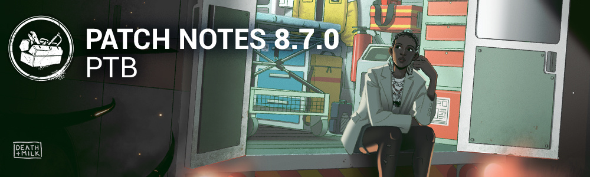

<!-- summary -->
## AI TL;DR

Orela Rose joins the roster as a new survivor, bringing three unique perks—Do no Harm, Duty of Care, and Rapid Response—that modify healing speed, grant nearby haste on protection hits, and tie exhausted status to aura visibility. The PTB also launches a unified Quest System, a Killer surrender option after the final generator, revised rarity tags, rebalanced Haste/Hindered stacking, and bot camera and flashlight tweaks. Various audio, character, map, perk and UI bugs were addressed, including terrain SFX fixes, Knight power stability, collision issues on several maps, and UI notification and tally screen glitches.
<!-- /summary -->

<!-- nav -->
&larr; [8.6.0 | PTB Patch Notes](495-8-6-0-ptb-patch-notes.md) · [Player Test Build (PTB)](../../index.md#player-test-build-ptb) · [9.0.0 | PTB Patch Notes](509-9-0-0-ptb-patch-notes.md) &rarr;
<!-- /nav -->

# 8.7.0 | PTB Patch Notes

## Important

- Progress & save data information has been copied from the Live game to our PTB servers on ***April 7, 2025***. Please note that players will be able to progress for the duration of the PTB, but none of that progress will make it back to the Live version of the game.
- Players will once again receive 12,500 Auric Cells on the PTB to explore Outfits and Characters in the Store. Both Auric Cells and purchases made on the PTB Build will not transfer to the Live Build.

## Content

### New Survivor: Orela Rose

#### New Perks

- Do no Harm:
  - When you heal another Survivor, for each hook state they have, heal **30/40/50% faster** and gain **+3/3/3%** progress for succeeding great skill checks.
- Duty of Care:
  - When you take a protection hit while healthy, all other Survivors within **16/16/16 meters** gain **25/25/25% Haste** for **4/5/6 seconds**.
- Rapid Response:
  - When you do a Fast Locker Exit, you suffer from the Exhausted status effect for **30/30/30 seconds**.
  - When you gain Exhausted, you see the Killer's aura for **1/1.5/2 seconds**.
  - Exhausted prevents one from using perks that cause Exhausted.

### Killers

#### The Doctor:

- Added a cooldown to interrupting Unhooks with Shock Therapy repeatedly.

#### The Houndmaster:

- Decreased the Dog's vault speed during Chase Command to 0.65 seconds *(was 0.45 seconds).*
- Doubled the Bloodpoint rewards of all her Deviousness Scoring Events.

#### The Oni:

- Removed the turn rate limit during the open phase of Demon Strike.

### Perks

#### Survivor Perks

- **Boon: Dark Theory:**
  - Increased the Haste effect to 3% (was 2%).
- **Breakout:**
  - Increased the Haste effect while near a carried Survivor to 6/8/10% (was 5/6/7%).
- **Champion of Light:**
  - Increased the Haste effect while using a Flashlight to 70% (was 50%).
- **No One Left Behind:**
  - Now increases the Haste effect for unhooked Survivors by 10% instead of applying a separate Haste effect.

#### Killer Perks

- **Furtive Chase:**
  - Increased Haste effect after hooking the Obsession to 10% (was 5%).
- **Hex: Pentimento (Rework):**
  - You see the aura of cleansed totems and can Rekindle each Totem once.
  - While a Totem is Rekindled, Survivors Heal and Repair **15%** slower **+3/4/5%** for each additional Rekindled Totem.
  - If all five totems are Rekindled simultaneously, all Totems are permanently blocked by The Entity.
  - Survivors cursed by this perk see Rekindled Totems' auras within **16m**.
- **Unbound:**
  - Increased the Haste effect after vaulting a window to 10% (was 5%).

## Features

### Quest System

- Introducing a unified place for all Quest, which will include daily, event, rift quests and much more.

### Base Game Adjustments

- Added a protection to Survivors when their teammates spam the Unhook interaction without ever Unhooking.
- Added a protection for failing Skill Checks that trigger right when the interaction is stopped.

### Haste & Hindered Stacking

- The effects of Haste and Hindered no longer stack with themselves.
- While multiple Haste or Hindered effects are active, the largest percentage for each is used.
- The speed bonus/penalty of Haste and Hindered are now shown on their respective status effect icons.
- Perks which affect movement speed now mention Haste or Hindered in their descriptions.

### Surrender Option

- Added a new Killer scenario: 10 minutes after the last generator is completed, the Killer has the option to Surrender.

### Rarity Rework

- Rarity levels have been revised to better surface different tier value and adding a new tag-based system that allows to surface extra information to players.

### Bot Improvements

- Smoothened the camera direction of Bots while they are turning corners.
- Survivor Bots are no longer trigger-happy with their Flashlights.

## Bug Fixes

### Audio

- Fixed an issue where the wrong terrain type SFX would play when walking in the Grim Pantry's big Cabin.
- Fixed an issue where the wrong terrain type SFX would play when walking on the balcony of the mine tower in the Ormond Lake Mine map.
- Fixed an issue where the wrong terrain type SFX would plat when walking on parts of the ramp inside the mine building in the Ormond Lake Mine map.

### Bots

- Fixed an issue where survivor bots revealing The Ghost Face and clearing their Weakened status against The Unknown from normally impossible locations.

### Character

- Fixed an issue where the Knight would be stunned at the Guard's spawn location.
- Fixed an issue where the Knight's power could break when being stunned at the start of a summon.
- Fixed an issue where the Knight could stay in the Patrol Path creation speed due to latency.
- Fixed an issue where Deep Wound would not stop depleting when a Survivor is grabbed by the Houndmaster's Dog.
- Fixed an issue where there was no Cancel interaction prompt when the Trickster was in Main Event.
- Fixed an issue where the Nurse could briefly see Survivors in a locker when blinking through a nearby wall.
- Fixed an issue where the Ghoul's hair and mask would briefly appear off his head when reaching the tally screen.
- Fixed an issue where Survivors could bleed out during a Mori.

### Environment/Maps

- Fixed an issue Midwich Elementary School error in the script created slowdowns.
- Fixed an issue on Temple of Purgation adding new collision to let zombies reach the arch base.
- Fixed an issue on Treatment Theatre by hiding a yellow collision box visible on a chair.
- Fixed an issue on Father Campbell's Chapel by removing an Invisible Collision present between 2 assets on Carnival section.
- Fixed an issue on Disturbed Ward by reworking collision to avoid zombies that can get stuck on the ramp leading inside the Asylum.

### Perks

- Fixed an issue where Teamwork: Collective Stealth would show a second cooldown after exiting the perk's range.
- Fixed an issue where the reduced action speed color and icon were missing on the progress bar when co-oping Invocation: Treacherous Crows.

### UI

- Fixed an issue where the Tally Screen would leave the Bloodpoints Earned page before displaying all bonuses.
- Fixed an issue where toast notifications would disappear when transitioning to the main menu.
- Fixed a visual glitch with equipped add-ons in the loadout menu.
- Added audio feedback when hovering collected nodes in the Bloodweb.
- Added audio feedback when hovering items in the offering sequence.
- Added audio feedback when hovering items in the Tally Screen Match Consequences page.

### Misc

- Fixed an issue where the What Lurks Beneath achievement/trophy would gain progress when the damage source was caused by a Survivor perk.
- Fixed an issue where the Demogorgon could perform actions while inside portals after pressing F11 throughout the Traverse charge.

<!-- nav -->
&larr; [8.6.0 | PTB Patch Notes](495-8-6-0-ptb-patch-notes.md) · [Player Test Build (PTB)](../../index.md#player-test-build-ptb) · [9.0.0 | PTB Patch Notes](509-9-0-0-ptb-patch-notes.md) &rarr;
<!-- /nav -->
